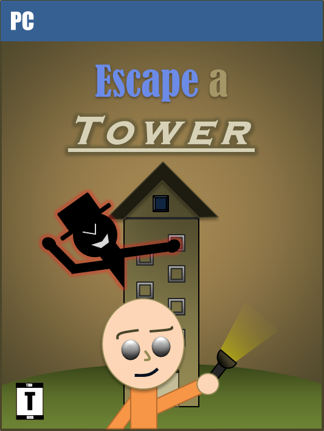
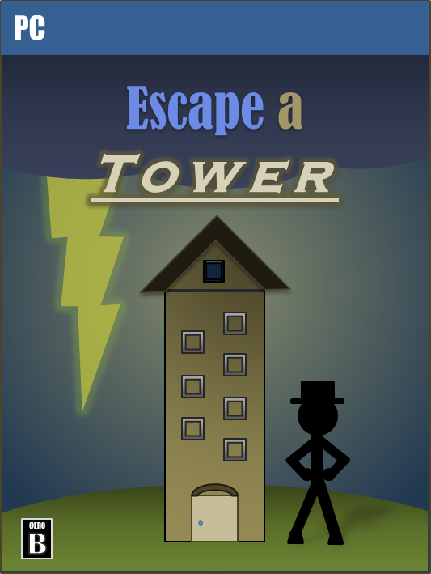

**UPDATE (2020):** Before the 2020 site overhaul, project listings appeared as blog posts. Because I removed those posts, this is no longer the 100th blog post. (It wasn't actually the 100th blog post anyway since I forgot to count deleted blog posts from earlier years.)

***

For a Psychology assignment, I chose to study the effects of video game box art and how it can persuade people to purchase games. To illustrate my research, I decided to take one of my own games, Escape a Tower, and draft potential box art for it. Below are the two covers, one which appeals more to Americans and the other to the Japanese.

Escape a Tower Box Art (US)

Escape a Tower Box Art (JP)

The idea is that Americans prefer visual action in box art to better stimulate their brains, while the Japanese prefer artistic representations of games. That's why the US version features a more evocative kidnapper and a determined protagonist while the JP version puts the environment at center stage.

My class audience during my presentation looked attentive, which probably means these self-created images brought the point effectively. Coincidentally, they also serve as an excellent way to celebrate the 100th blog post on this site. Thank you guys for motivating me to reach this far!