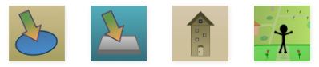

I finally got around to updating the About page so it refers to _Games by Tim_. For old time's sake, this was the previous About page:

***

Welcome to my slideshow.

"Tim's Slideshow Games" is a showcase of games and projects I have created over the years. I started making games back in October 2010 using Microsoft PowerPoint. Now, I have expanded to programming and release games and projects for Web browsers and other platforms. The reason I made this blog is because it's more convenient to post my games onto a website rather than e-mailing them out to people.

So how does this blog work? Well, let me explain.

* I will post any game or project I make into the **Projects** page.
* When you find a game or project that you find interesting, click on **More Info** to the right of the name of that project.
* You will then be taken to a page with a description of the game. From here, you can choose to **download** or **play** the game (if it's playable on a Web browser). _Make sure you have a compatible Web browser or version of PowerPoint before opening the game._
* Every single game in this blog is **FREE**.

If you want to, you can **post a comment** on the games or projects you've tried out just below the description of the game. The comments page is best used to post about what you liked/disliked about the game, suggestions, construtive criticism, and if you found any bugs in the game. Please note that abuse to the comments system may result in the administrator (me) regulating the messages.

Another thing worth noting is that sometimes, **I update my games**, so definitely check back or **subscribe** to this blog to see if I have made any improvements. I will post the release notes of every update I make each time they are released.

Oh, and sometimes, a game is **open for public prototype testing.** Prototypes are games that are not finished, intending to only show off a game concept(s). These games will have "Prototype" appear to the right of the game's name. If you want to participate in prototype testing, simply download or open the game, play through it, and post a comment when you're done, explaining about your experience, bugs, and suggestions.

I hope you enjoy this presentation.