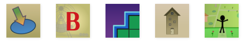

As part of the ongoing site renovation, I've replaced the **About** page with an **About Me** page that focuses more about who I am rather than how the blog works. I'll explain my reasons behind the change in a later post.

For archival sake, here's the About page that was live from September 2018 to April 2019. [You can find the March 2015 to September 2018 version here.](/blog/about-page-march-2015-september-2018/)

***

Welcome to Games by Tim.

I'm Tim, and I like to make games. Here, you will find plenty of games and projects I've worked on over the years.

I launched this site in 2011 as _Tim's Slideshow Games_. Back then, I made PowerPoint games and wanted to share them online. Over the years, I've shifted my focus towards Web (HTML5) games. Thus, I renamed the site to _Games by Tim_ in 2018.

So how does this blog work? Let me explain.

* Find all my active projects in the **Projects** page.
* You can see a description of each project on their **More Info** pages.
* From there, you can **download** or **play** the game (depending on if it's a PowerPoint or Web game).
* Every project in this blog is **FREE**.

I appreciate **comments** on my games and projects. Feel free to leave one on the project's More Info page for feedback, suggestions, bug reports, and/or constructive criticism.

**I also update my games**, so definitely check back or **subscribe** to this blog to see what improvements I've been working on.

Sometimes, a game is **open for prototype testing.** Prototypes are games that are not yet finished. They're a great opportunity to voice your feedback as the game is actively being developed. In some cases, I may offer to put prototype commenters' names in the game credits. You can find any current prototypes in the bottom of the Projects page.

I hope you find something you enjoy at _Games by Tim!_

\~ Tim the Writer