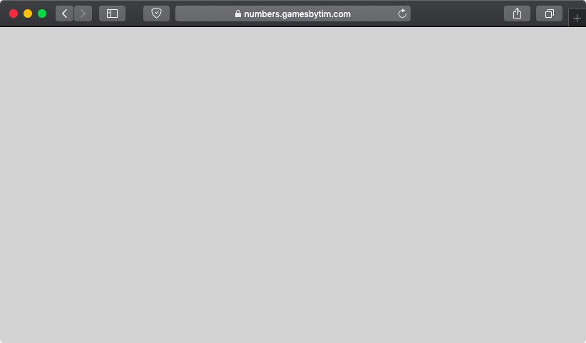

**UPDATE (Mar 13):** Read the follow-up post [here](/blog/how-a-lambda-school-student-resolved-my-pwa-update-nightmare/).

I've received reports that players couldn't load So Many Numbers after I pushed a minor update last week. All they get is a blank screen, no matter how many times they refresh.

It turns out the cause of this blank screen is more complicated than I thought, What's worse, I may not fully be able to patch what I call the "blank screen of death." Allow me to explain.

(Warning: technical jargon ahead! Skip to "What you should do" if you just want to know what to do if you're affected.)

## Why the blank screen of death happens

For starters, last week's update on its own did NOT cause the blank screen of death. All I did there was change some text.

What really triggers it is how the game _reacts_ to an update. Whenever you load So Many Numbers, it caches a copy of the game to your device so you can play offline. Whenever I push an update, the game has to recreate the cache so it can load the updated version offline.

That's where things get awry.

While the game itself can properly download the updated files to cache, the browser's service worker, which tells the game which cached files to load, isn't always on the same page. At times, the service worker still thinks it should load the old version's files even though they no longer exist on the device. The result? A blank screen, with a confusing JavaScript console error \`unexpected token '<' \`.

## My efforts to fix

Although I knew the main cause of the blank screen of death, I had a hard time reproducing it. Sometimes, the game would update properly. Other times, the game would load the update at first but get the blank screen on the next load. And in some cases, the blank screen would strike and not load the update.

Debugging also proved aggravating, as the only way I knew to test was to repeatedly deploy dummy updates through a remote server.

Eventually, I've deduced two possible blank screen of death triggers.

### 1) The updater

Since So Many Numbers loads from the offline cache by default, it doesn't immediately get updates as soon as they're released. That's why the game has a built-in updater in case the player wants to receive updates ASAP.

However, the updater had a flaw.**It only cleared the game's service worker, not the old cache.**That meant due to weird inconsistencies beyond my knowledge, the "updated" game would still load the ghost of the old version.

After [updating the updater to clear the game cache](https://github.com/TimTree/so-many-numbers/commit/72962346b8d909e4d2f8af308806168aa7c78409), I noticed that I no longer got blank screens when running the updater. That said, blank screens still persisted particularly in Firefox, even when I didn't run the updater at all. There had to be something else.

### 2) The cache header

Frustrated, I searched all over the web about the caching problem. Fortunately, I stumbled upon [this Netlify page](https://www.netlify.com/blog/2018/09/21/international-service-worker-caching-awareness-day/) which seemed to address the exact problem I had.

Their solution was to set a cache-control header for the service worker file such that the browser always revalidates the service worker on reload.

[That's what I did](https://github.com/TimTree/so-many-numbers/commit/6c8144568fe5b71b892be08c42b2234def155008), and the blank screens seemed to disappear in Firefox afterwards.

At this point, I thought I finally fixed the blank screen of death for good. Unfortunately,**I'm still able to trigger the blank screen on desktop Safari in rare cases.**I'm currently unable to consistently reproduce it or determine why it still happens here, so the blank screen of death may never get a full fix.

That said, I'm confident that it's less likely to get a blank screen now, so I consider the issue \~90% fixed.

## What you should do

**IF your game has the blank screen of death**, you'll need to delete your browsing data for gamesbytim.com to reload the game. Deleting your entire browsing history also works if you're willing to go that route.

Alternatively, the game might fix itself if you wait 24 hours to reload it. I haven't tested this, however.

**IF you don't have the blank screen of death but played So Many Numbers before,** run the updater twice.

* Click "Updates" in the main menu.
* Click the purple "Force update" button.
* When the game reloads, click "Updater".
* Click the purple "Update now" button.

Once you've done that, you should be as protected from the blank screen as I can get it.

## Personal aftermath

As much as I like the ability to load games offline, I'm not sure if it's worth the hassle of dealing with blank screens, people not getting updates immediately, and the complexity of service workers in general. I have no plans to remove offline support for projects that already have it, but I may consider omitting it in future projects, potentially in favor of [standalone Electron apps](https://electronjs.org/) (unconfirmed).

If you're a Web developer with experience with service workers, I'd love to hear how you've dealt with caching problems.