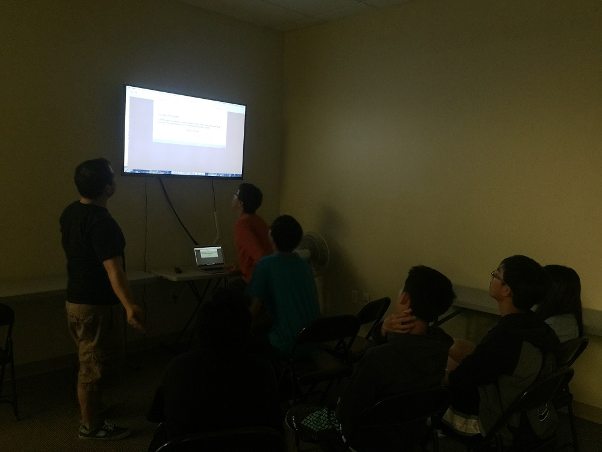
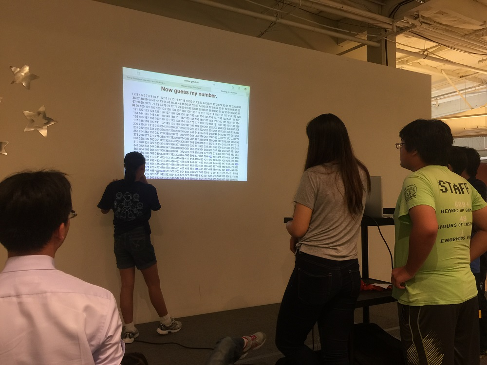

Just moments ago, I was thrown into a special surprise party run by Everglow Youth. This momentous event would prove to greatly enhance my confidence.

It all started when the youth group escorted me to a group of tables, cheering wildly for my high school graduation. We then partook a pizza dinner which was well planned out. I knew this would be a fantastic party, but little did I anticipate what would happen next.

After the dinner, Arthur, the youth counselor, announced that we'd be playing _my own games_ for the rest of the night! At first, I felt concerned about how my games would turn out upon masses of people. However, the games turned out to be a wild hit, and with so many youth members enthralled, I almost shed a tear.

Here's the youth group playing **Button Masher**, which evolved into a fierce competition.

This is the **Escape a Tower** station. Jeremy (who's in the game's credits) manages the game.

**I am Thinking of a Number.** What is it? The youth investigates.

Overall, the party taught me a lot about myself. For one, it demonstrated how powerful my game development talent can be. I'm also more compelled to develop knowing there's an audience who's willing to devote their time to my works. If you enjoy developing your games, chances are there are people out there who enjoy it too, whether you know them or not.

Thank you Everglow Youth!