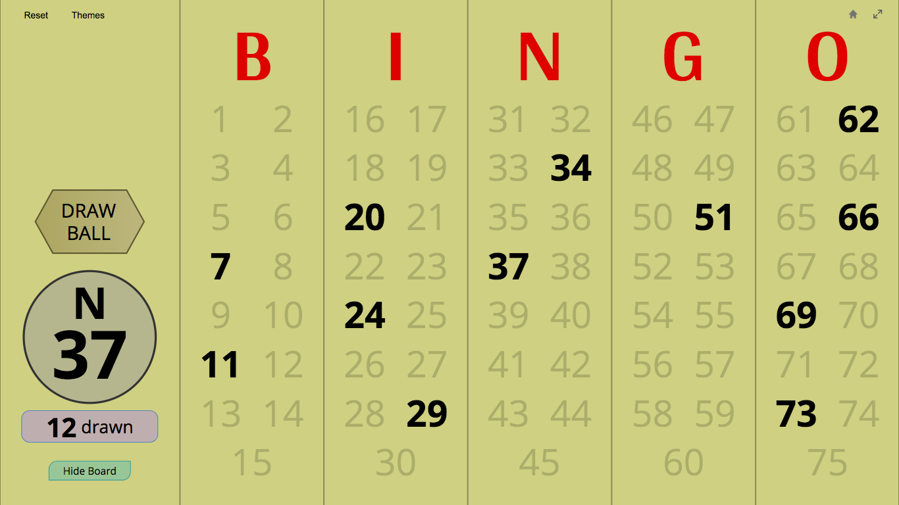

Here's a new commit I'm quite proud about.

* **You can now change the Bingo number style.**

  For those who preferred the bold black numbers from the original Master Board, you're in luck. In Themes, there's a new setting that brings back the classic Bingo number look.

  
* **Bingo Master Board now crypto-randomly draws Bingo balls.** Hear me out.

  It turns out there are different ways to generate seemingly random numbers. PowerPoint VBA's _Randomize/rnd_ and JavaScript's _math.random()_ can generate numbers efficiently, but they are NOT cryptographically secure. This means that someone skilled enough could predict what numbers will be generated.

  For a Bingo game with tangible prizes, this poses a problem.

  Enter [crypto-random](https://developer.mozilla.org/en-US/docs/Web/API/Crypto/getRandomValues), a method to generate random numbers using the Web crypto API. Along with using a more advanced algorithm, crypto-random bases its randomness on your computer's voltage, cursor movements, keyboard timings, and much more. This makes guessing the next random numbers incredibly difficult, if not impossible.

  I hope this change helps you feel more comfortable using Bingo Master Board in a competitive environment. Remember that you can check the new code on GitHub to your satisfaction.

For reference, VBA's _Randomize/rnd_ [uses a linear congruential generator](https://en.wikibooks.org/wiki/Visual_Basic_for_Applications/A_PRNG_for_VBA#Microsoft%2527s_Rnd()_algorithm), and JavaScript's _math.random()_ [uses XorShift128+](https://hackernoon.com/how-does-javascripts-math-random-generate-random-numbers-ef0de6a20131) in most browsers. Feel free to research the pros and cons of these algorithms if you're interested.