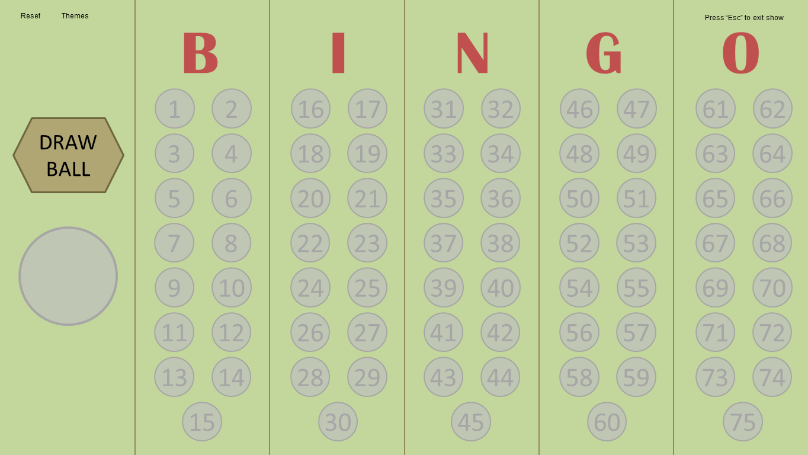
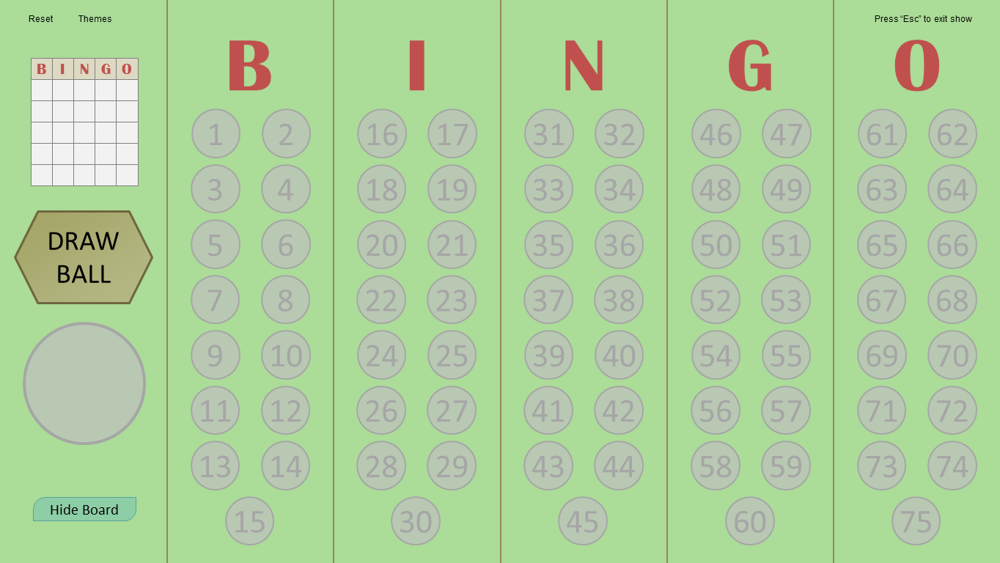
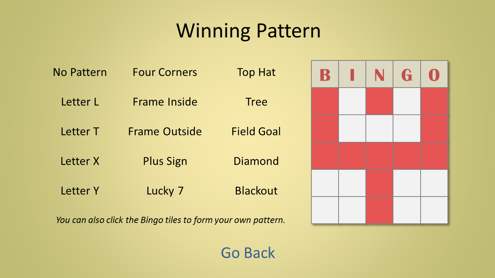
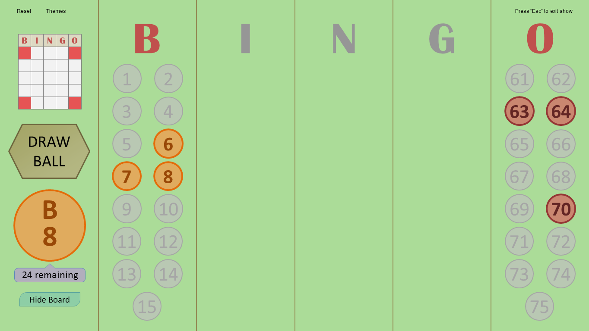
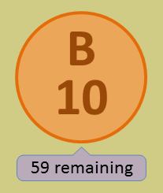
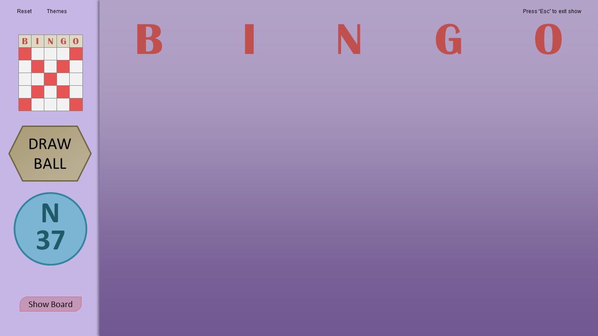

I'll admit, the first release of Bingo Master Board PLUS was rushed. The code was a mess, it only had one distinguishing feature, and it was all built up within less than a day. That's why version 2.0 is ready to roll, addressing the sloppiness from v1.0 and introducing a plethora of new useful Bingo features. Let's take a look, shall we?

## What's Changed

* **Alignment corrections**

  The previous version used eyeball alignment to place the Bingo letters/balls. While this could get pretty close, various UI elements end up being pixels away from the perfect alignment due to human error. To address this, I have switched to _mathematical alignment_, meaning I had to whip out a calculator to figure out exactly where to align objects. The result? The UI looks a bit more organized now, especially with the O column.
* **I fixed the themes**

  Let's face it: the themes from the previous version were embarrassingly bad. The colors were so light and pale, they couldn't even light a candle against the more vibrant ones from the original Master Board. Something HAD to be done about the colors, so I took action. Take a look at the green theme monstrosity from previously and the new "fixed" version:

    
  
Bad...

    
  
...better.

  Speaking of which, did you notice those new buttons on the left side? That's what we're going to discuss next.
* **Show the winning pattern**  
  Ok, so that new Bingo card on the left side is pretty important. You know how in most Bingo games, you're trying to form a specified pattern with your Bingo card to win, like the letter L, four corners, or blackout? Now you can display what the winning pattern is straight from the master board! To edit the winning pattern, simply click on the Bingo card to access the new Winning Pattern slide:  
    
    
  Here, you can select a pattern using the premade selections, or you can create your own by clicking the Bingo tiles. When you go back, the pattern you chose will be properly displayed. Alright, I'm going to pick Four Corners and see what I get..  
    
    
  Ta-daa! Hey wait a second, what happened to the I, N, and G Bingo balls? Well, you don't need them for Four Corners, right? And so, the Bingo drawer will ONLY randomly draw Bingo balls from the B and O letters! You can also manually **toggle which Bingo balls are used** by clicking on the appropriate letter.
* **How many Bingo balls are remaining?**  
  If you click the big Bingo ball, you can toggle displaying the number of Bingo balls that haven't been drawn yet. Useful for anyone who's curious.  
    
  
* **Quick! Hide the master board!**  
  Last but not least, have you ever wanted a challenge where you COULDN'T see which past Bingo balls have been drawn? Well now you can. Click the Hide Board button on the bottom, and this is what you'll see:  
    
  
* **Other minor changes**
  * The reset board animation has been changed back to the original Master Board's.
  * Minor color adjustments for the G and O Bingo balls
  * Removed the Standard VS PLUS comparison slide. That was kind of useless.

Now you can do more with Bingo Master Board PLUS. And I can confidently say that the PLUS lives up to its name. Supports PowerPont 2007 or newer, and PowerPoint for Mac 2011 or newer.