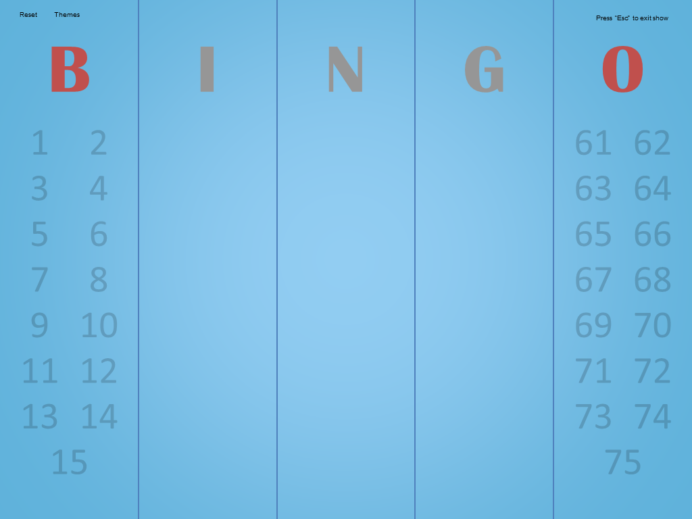

johnr from PowerPoint Creative promptly informed me of a mistake in the credits. While Hugh J. Ward launched the modern 75-ball version of Bingo, he did NOT create Bingo altogether.

This meant I had to update Bingo Master Board (PowerPoint) and Bingo Master Board PLUS. As I opened the original Bingo Master Board, something felt special about it. With the text-only Bingo numbers, 4:3 ratio, and the lack of PLUS macros/buttons, the original Bingo Master Board had a nice, simple vibe.

As such, I felt compelled to do more than simply re-credit Hugh J. Ward. Here it is, a Bingo Master Board update after nearly three years!

## New to Version 1.7

* **Visual improvements (again)**  
  While the previous version made a considerable effort with visuals, it was far from perfect. Since all faded numbers used the same color, the numbers on the edge of the slide (where the background is darker) were harder to read than the numbers in the middle.  
    
  That's why starting with this release, faded numbers are semi-transparent. This means all the numbers look legible regardless where they are!  
    
    
  I can't believe I'm saying this, but the Rainbow theme actually looks good now.  
    
  
* **Adds the ability to hide/show Bingo numbers**

    
  This is a backport from Bingo Master Board PLUS. If you click a Bingo letter, you can toggle the visibility of all of that letter's Bingo numbers. This is useful if you're running, say, a four corners Bingo game.  
    
    
  Unlike Bingo Master Board PLUS, the original Bingo Master Board implements this feature without macros. It makes use of a PowerPoint shape with background fill. (Thanks johnr for introducing this to me.)
* **Adds Creative Commons License**  
    
  The original Bingo Master Board now has a license, and I bet you're gonna like it: **Creative Commons Attribution 4.0 International.  
    
  **That's right, I'm using the least restrictive Creative Commons license. You are free to distribute and modify this project for commercial and non-commercial purposes as long as you credit Tim's Slideshow Games for the original work. Have at it!
* **Adds promotional slide for Bingo Master Board for Web**
* **Re-credits Hugh J. Ward as the creator of 75-ball Bingo**

***

Question for you guys: Do you prefer the text-only Bingo numbers here or the Bingo balls from Bingo Master Board PLUS/Web? I may consider bringing this style to the Web version if there's enough demand.

Bingo Master Board PLUS will be updated soon to re-credit Hugh J. Ward.