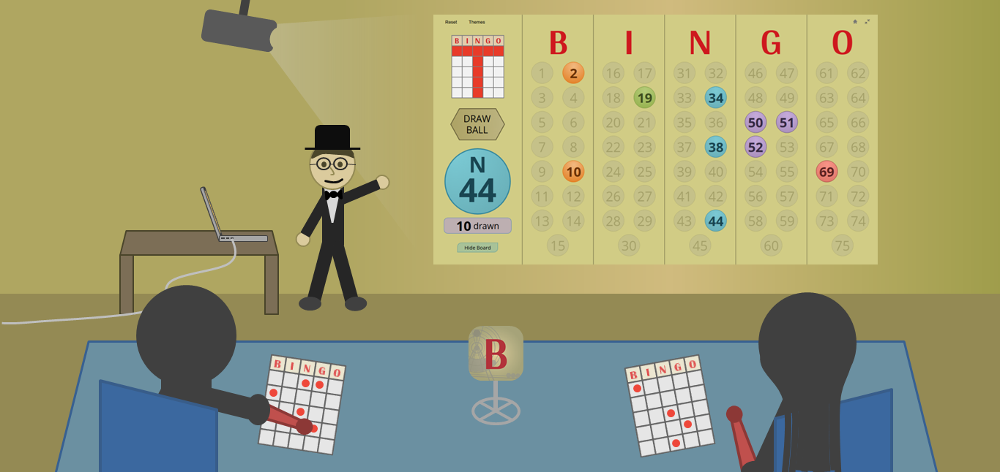
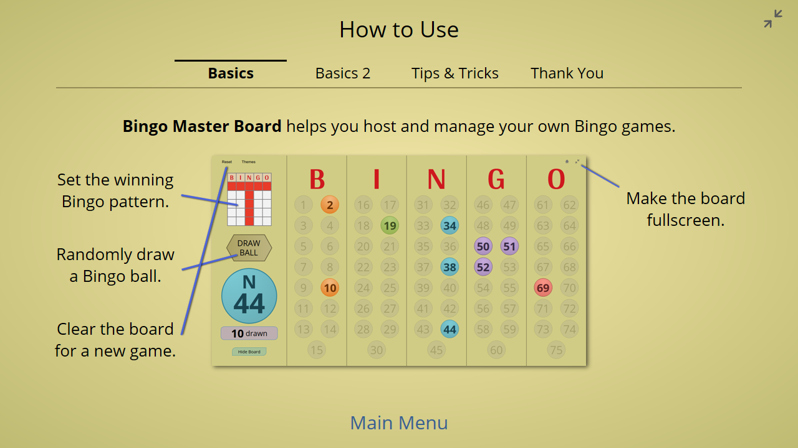

**It's finally here!** After weeks of continuous commits, I am proud to announce the stable release of Bingo Master Board's reincarnation.

**It's completely rewritten for Web.** It gains features I could've only dreamed for in PowerPoint. It merges two projects into one. It's Bingo Master Board, reborn!

## Why version 3.0?

You may be wondering why I'm using version 3.0 instead of 1.0 for the Web release. Here's my logic:

* The original Bingo Master Board uses version 1.x.
* Bingo Master Board PLUS uses version 2.x.

Since the Web releases merges the two PowerPoint versions into one, it made more sense to continue counting up the version number than to start over with 1.0 (implying this is something separate).

## Benefits of the Web compared to PowerPoint

* **Vastly more accessible.** No need to own paid software, and for the first time, Bingo Master Board could run on devices like the iPad.
* **No downloads necessary.** Just click the link to play.
* **No more macro security warnings.**
* **No more weird PowerPoint frustrations**, such as force-redirection to the first slide after five minutes of inactivity.
* **Ability to add features not possible in PowerPoint.** The rest of the release notes will focus heavily on this.

## Version 3.0's new features (from Bingo Master Board PLUS)

Naturally, a complete rewrite would have numerous changes. Let's get started, shall we

### Onboarding

When you load Bingo Master Board for the first time, you'll see a Welcome page that introduces you to the project. This is known as onboarding, which you may have seen before with other apps. I'm proud one of my projects finally has it.

### Title page

Once you click Begin, you'll find the brand new title page.

Quite different from Bingo Master Board PLUS, would you say?

Aside from the new Bingo roller backdrop and the fullscreen button, you may notice two other changes:

* **Mouseover effects.** Hovering over clickable buttons now changes their colors. This makes the UI more expressive, and it wouldn't have been possible with PowerPoint.
* **The fonts have changed** from Britannic Bold/Calibri to Arya/Open Sans. This is because Britannic Bold and Calibri are not free to distribute online, and I think the new font combination looks more modern anyway.

### How to Use page

The How to Use page has been overhauled. There are now four sections: one for the essentials, one for the extras, one for tips and tricks, and one for additional links.

Note that you can use your arrow keys to navigate the sections. This is an example of a **keyboard shortcut**, which will become important for the next page. Once again, this wouldn't have been possible with PowerPoint.

### The Master Board page

This is the new master board:

and this was the old one:

* **The Bingo balls look more three-dimensional and ball-like.** That's because I've added circular radial gradients to the balls.
* **The big Bingo ball is bigger** so it's easier to read.
* **The balls drawn/remaining pop-up is bigger** so it's also easier to read.
* **The balls drawn count is now shown by default.**

### Master Board keyboard shortcuts

I've added a bunch of keyboard shortcuts here to make the master board experience a lot more efficient. For instance, try drawing Bingo balls with the **space bar**, and try resetting the board with the **r key**.

Other keyboard shortcuts can be found in the How to Use page.

**Themes page**

The Themes page has an additional option to change the look of the Bingo numbers. If you preferred how the Bingo numbers looked from the original Bingo Master Board, you're going to like this.

### Other changes to version 3.0

* **Bingo balls are now crypto-randomly drawn.** For more info, see [this commit post](/blog/bingo-master-board-for-web-commit-2018-09-10/).
* **The Bingo card in the Winning Pattern page is now on the left side** so your cursor doesn't have to move as much.
* **Autosave** - If you leave the board and come back, all your drawn Bingo balls remain in tact. Previously with PowerPoint, you'd have to confirm saving the file.
* **The reset animation now works consistently.** It had issues before with PowerPoint for Mac.
* **If the master board is hidden, changing themes no longer unhides it.** This was a PowerPoint limitation that's no longer the case on the Web.
* **Revamped About/Credits page**
* **Integrated with GitHub.** You now get to see my commits and work in progress with future versions of this project. You'll find my latest commits in the Develop branch.

## The Board Reborn

Bingo Master Board version 3.0 marks several milestones in my developmental life.

* It's my first project to use Git extensively (commits, branches, merging, etc.)
* It's my first project to use ES6 (a new JavaScript standard)
* It's my first project that uses scalable vector graphics (SVG)
* It's my first project that proves I could move on from PowerPoint.

I hope you reap as many benefits from the new Bingo Master Board as I spent working on it.