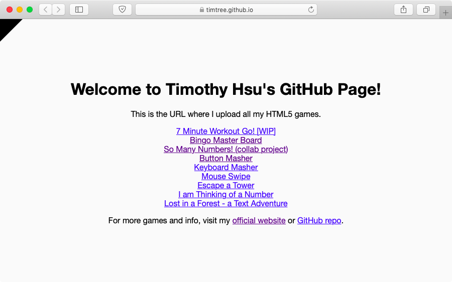
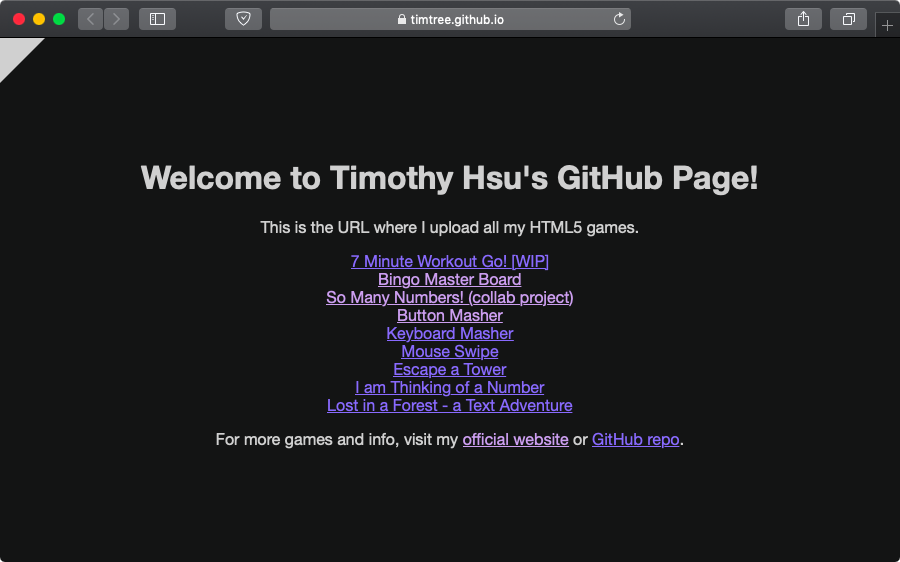

Ever since Dark Mode arrived in macOS Mojave, I knew it marked the future of UI design. Now that iOS, Windows 10, and all major browsers also support dark mode, it's time for my projects to embrace the dark side!

You may wonder, [haven't you tried a dark theme before](/blog/i-am-thinking-of-a-number-version-3.0-released/)? That's true, but the user had to manually toggle it for his or herself. Now that browsers can detect whether you're on light or dark mode, webpages have the ability to automatically enable dark themes. A win, win for everyone!

Here's how I intend to handle dark mode on my future dark-enabled projects:

* **By default**, set the theme to light or dark based on the systemwide theme.
* **The user can toggle** light or dark themes via a button on the project. This means the user can use the project's dark theme while on their system's light mode, and vice versa.
* **If the browser does not support dark mode**, use the light theme by default. The theme toggle should still work, though.
* **If JavaScript is disabled**, use the light theme by default, and hide the theme toggle if possible since the toggle won't work.

To practice dark mode, I edited my [GitHub homepage](https://timtree.github.io/), a basic landing page with links to my projects.

I hope to one day enable full dark mode support on my other games, such as I am Thinking of a Number and So Many Numbers. In the distant future, I may add a dark theme to the Games by Tim site as well.