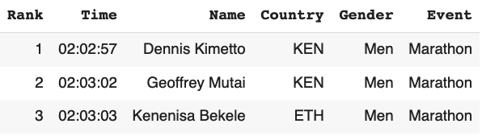
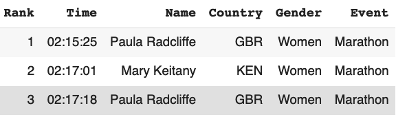
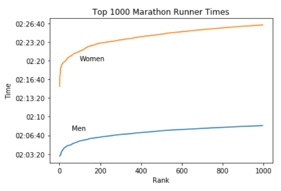
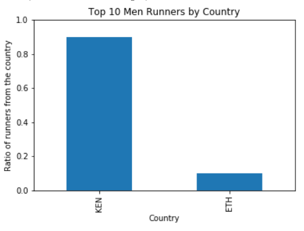
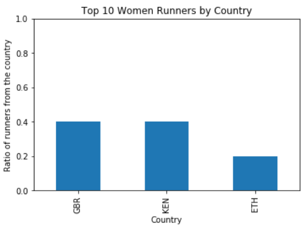
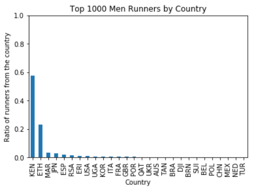
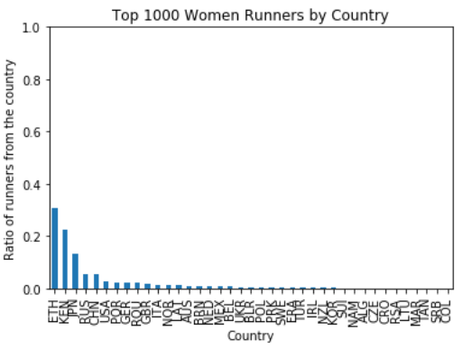

And now for something different: **data science**! Here you'll find a write-up that explores a dataset of top marathon times. **Originally published September 26, 2019** on a different site, I'm porting the post here for posterity's sake.

***

When we hear about marathons, we often focus on the top elite runners. For instance, the top three marathon runners (men/women) as of 2017 were:

While this info is great to have, it doesn’t tell a complete story about top marathon runners as a whole. For instance, how close are other elite runners’ times compared to the top three? What other countries, if any, hold promising elite marathon runners?

That’s where it’s useful to analyze not just 3, but the top 1,000 marathon runners (men and women). I will use the [Top Running Times dataset from Kaggle](https://www.kaggle.com/jguerreiro/running) to conduct the report.

## The Top 1000 Marathon Runner Times

Below is a graph of the top 1000 marathon times for men and women, based on their rank.

Both of the graph lines appear **logarithmic**. That is, the higher your rank, the shorter the distance between two times are.

For men, the time differential between 1st and 1000th place is **5:28**. For women, the differential is **10:59**. This shows that top men have more consistent times compared to the top women and that being a top runner has a tougher point of entry for men than women (not factoring the overall difference in times).

## Which Countries Hold the Marathon Rankings?

From the top 3 list, we can tell that Kenya and Great Britain hold the top elite runners. Let’s see if their domination continues the more runners we add to the list.

Here are the countries that hold the top 10 runners for men and women:

And here’s what it looks like when we add the other 990 runners for each group:

Here we can tell that Kenya retains victory for the men’s group, but Kenya holds a much lower majority when we have 1000 runners compared to 10. On the women’s side, Great Britain falls down to 10th place, and Ethiopia takes the lead.

The lesson learned? Just because a country has a top runner does not mean the country objectively have the best runners.

## Future Ideas

* It would be cool to create a regression line for the runner times by rank to predict rank given someone’s running time.
* It’s interesting that women have more variance in countries in the top runners compared to men. Perhaps one could research if that’s correlated to their greater variance in running times.

### [Jupyter notebook (contains the code used to explore data)](https://github.com/TimTree/ds-portfolio/blob/master/Top_Running_Times.ipynb)