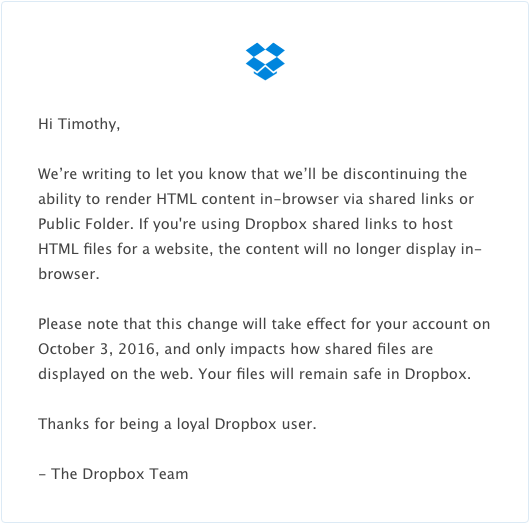

Today, I received the following email from Dropbox:

In other words, we can no longer upload Webpage files to Dropbox for hosting purposes.

As older readers may recall, I used to host my HTML5 games (The Masher Series, Escape a Tower) on Dropbox. Then in 2014, I shifted to Github Pages so I can have a nicer looking domain. While I am thankful I have made this change, I still occasionally post pre-releases on Dropbox due to its convenience. This means I'll either need to start uploading multitudes of commits to Github, which I'd rather not do, or find another free Web host. **~~If anyone can suggest a good free Web host, I'd love to hear your suggestions.~~**

**UPDATE:** I've already found a decent web host alternative: Netlify.

Dropbox, thank you so much for being the first reliable site I could find when I started making HTML5 games. It's sad to see your Web hosting feature go, but know you've made your mark for beginner Web developers like me.