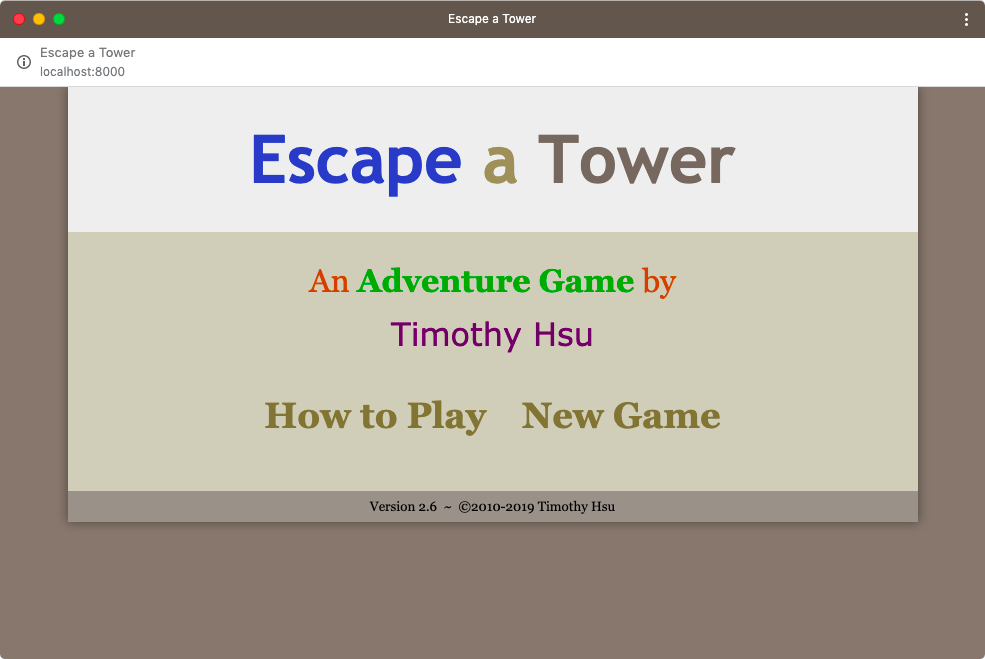

Escape a Tower version 2.6 is out! For this update, I focused on under-the-hood adjustments that help the game adapt to newer Web standards.

## Offline support is back!

Previous versions of Escape a Tower would save the game to the hard disk so it can reload without Internet access. However, the method I used [became deprecated](https://developer.mozilla.org/en-US/docs/Web/HTML/Using_the_application_cache), so I reluctantly removed this functionality in version 2.4.3.

That's why I'm excited to announce that offline functionality is back, using a modern Web standard called [service workers](https://developer.mozilla.org/en-US/docs/Web/API/Service_Worker_API/Using_Service_Workers). Service workers offer more robustness than before and should remain future proof for years to come. Special thanks to [UpUp.js](https://www.talater.com/upup/) for making service workers easy to set up!

## "Install" Escape a Tower

Chrome users may notice the new + button on the right of the address bar.

"Installing" Escape a Tower will launch the game in a dedicated window that functions like a native app on the computer. It'll appear on the start menu, taskbar, dock, etc!

Chrome does all of this because Escape a Tower is now a [progressive web app](https://developers.google.com/web/progressive-web-apps/) (PWA). PWA's are a recent Web initiative that bridges the gap between Webpages and native apps.

## New app icon

To adhere to Chrome's [PWA guidelines](https://developers.google.com/web/fundamentals/app-install-banners/), I needed a larger-sized app icon. That's why I resized and enhanced the icon a bit, which you can see the result above.

## Still supports ancient browsers

Despite these new Web standards, Escape a Tower maintains its top-notch backwards compatibility, going as far back as IE5 from 1999. Those curious can [download](https://github.com/TimTree/escape-a-tower/releases) the game files and see for themselves (virtual machine highly recommended).

For everyone else, click the link below to enjoy Escape a Tower's new offline and install features.