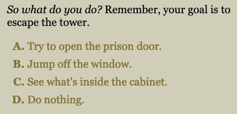
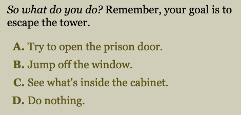

Today's Escape a Tower update addresses a major accessibility issue: **text contrast**.

Naturally, it's hard to read something when the text color's close to the background color. As it turns out, there's a contrast test known as the [Web Content Assessibility Guidelines (WCAG)](https://webaim.org/resources/contrastchecker/), and a lot of Escape a Tower's text didn't pass even the minimum tests.

I've therefore darkened the majority of Escape a Tower's test to pass WCAG AA for normal text. Have a look for yourself.

Old text (does not pass any contrast tests)

New text (Passes WCAG AA for normal text)

Although I can read the old text just fine, I was surprised to find out not everyone may feel the same. I hope the improved contrast enables more people to experience the game.

In addition, this update runs the source code through a formatter for better code readability and changes the link from the GitHub pages URL to [tower.gamesbytim.com](https://tower.gamesbytim.com/).