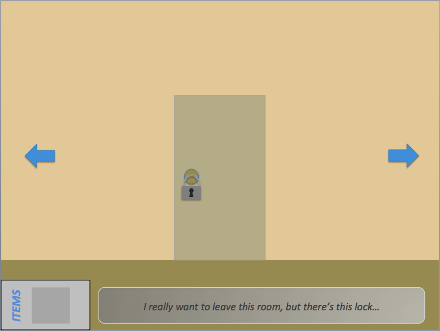

**Size:** 126 KB

## [Click here to Download](https://drive.google.com/uc?export=download&id=1LTuKX0YxsviNDyMhGit21rb-XFeu5_5i)

### Description

My first prototype! Inspired from JonBro's Riddle School/Transfer series, this game concept involves using a graphical interface to navigate your way around a room while solving a puzzle. In the prototype, you must find a key somewhere around the room in order to open the door. What's so cool is that it's done on PowerPoint. Go try for yourself! Let me know what you think in the Comments.

### Compatible With:

* Microsoft PowerPoint 2007 or later
* PowerPoint for Mac 2008 or later
* PowerPoint Viewer 2007 or later