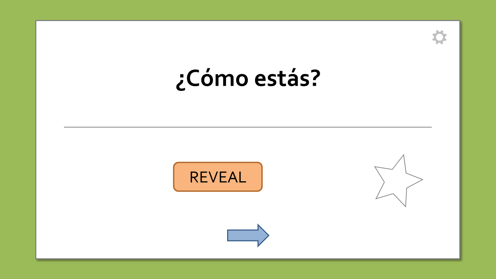
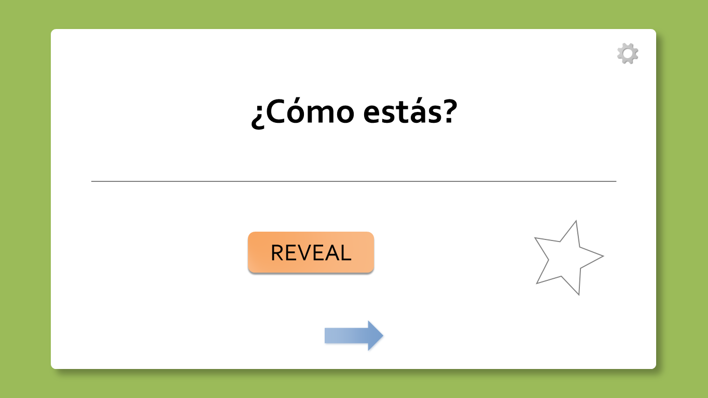
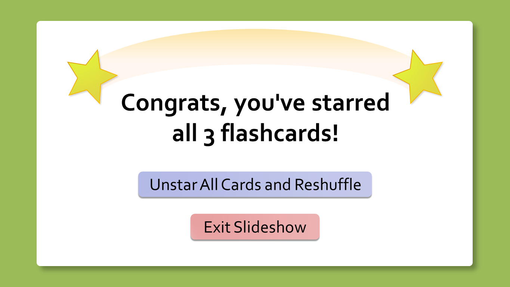
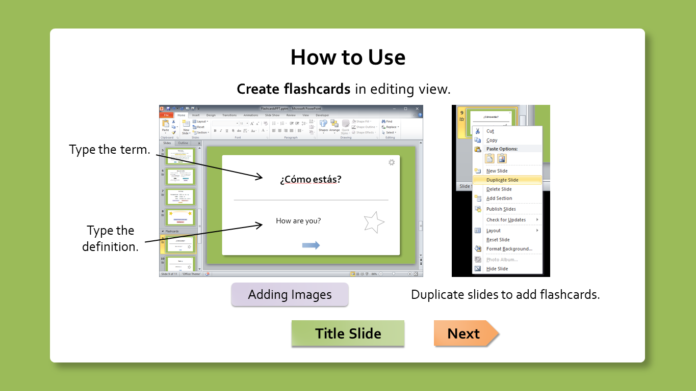
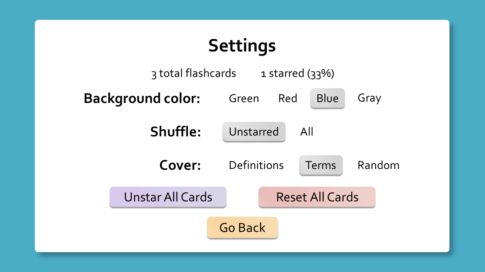

Amid incoming midterms and final exams, a friend of mine told me she needed to study for a geography test. Just before she was about to purchase note cards, I casually brought up that I've made a flashcard tool in PowerPoint.

Her eyes lit up and her mouth lifted a grin, as she typed her entries and starred her flashcards. Not only did I feel rewarded that Flashcards for PowerPoint went to good use, I also noticed some usability/UI issues as my friend worked through the file. The result? Another update to Flashcards for PowerPoint: **version 1.2**!

## Your Flashcards have a New Look

Introducing a new modern-looking flashcard design, replacing the boring solid outlines with fresh shadows and gradients.

Old...

...new!

Shadows help make the buttons pop out more and appear more clickable. Gradients allow the UI to present a watercolor-like appearance.

Not only have I retouched the buttons/cards, the stars appear more spiffy than ever. Check out the new congratulations slide when you've starred all your flashcards.

In addition, the arrow that takes you to the next flashcard now fades in/out, so you have a better idea when you've reached your next card.

## How to Use Slides are Easier to Follow

When I saw my friend squint at the How to Use images, I knew I had to do something about it. Here's a sample of the new How to Use slides, with bigger images and some slight rewording.

## 

## Other Changes/Fixes

In the last update, I added the ability to view the amount of starred flashcards, rather than a percentage, in Settings. After realizing how silly it was to toggle amounts and percentages, **Flashcards for PowerPoint now shows the amount AND percentage of starred flashcards in one place.** I've also rounded down the percentage to the nearest percent because the tenth of a percent may have overwhelmed some people.

I've also **partially fixed display issues when starting the slideshow in a flashcard slide (excluding PowerPoint 2007).** Previously, your flashcards wouldn't autohide its terms/definitions if you directly started the slideshow on a flashcard. This has been resolved UNLESS you haven't shuffled your flashcards at least once each time you open the file, which I cannot fix due to PowerPoint limitations. What's more, this partial fix is not applied to PowerPoint 2007 because the fix causes cards to briefly reveal its terms/definitions in that version.

You may notice that **Flashcards for PowerPoint is now hosted on GitHub.** Since goo.gl will shut down in less than a month, I need another way to track download counts, which GitHub Releases supports. I will also upload the VBA to the GitHub repo for easier viewing/auditing.

Have fun preparing for your next exam!

***

## PowerPoint 2007/2011 for Mac Announcement

As it's becoming increasingly difficult for me to access PowerPoint 2007 and 2011 for Mac, **version 1.2 is the final release to officially support these PowerPoint versions.** (PowerPoint 2010 is not affected by this change.)

This doesn't mean future versions won't work on these PowerPoint versions; I just won't be able to test on them moving forward. I also won't go out of my way to remove any compatibility code for 2007/2011 for Mac unless the code impedes my ability to implement new features.