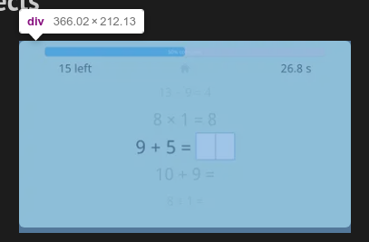

A few weeks ago, [I upgraded Games by Tim's static site generator to Gatsby v3](/blog/games-by-tim-upgrades-to-gatsby-v3/).

As part of the upgrade process, I rewrote parts of the codebase to adapt to the new Gatsby v3 standards. However, I couldn't fully complete the changes due to a bug with the new Gatsby image plugin, `gatsby-plugin-image`, that added unwanted padding to all images.

Now that [the Gatsby team addressed the image padding bug](https://github.com/gatsbyjs/gatsby/pull/31497), I've migrated the site's image plugin from the old `gatsby-image` to `gatsby-plugin-image`, effectively completing the Gatsby v3 upgrade process. According to [the Gatsby docs](https://www.gatsbyjs.com/plugins/gatsby-image), images on this site should load faster with the new plugin. I also noticed that the rendered images look slightly better than before.

In addition to applying the new image plugin:

* I fixed a bug that prevented the site from generating an instant preview in the Forestry CMS.
* I fixed a bug that caused the latest blog post on the homepage to not update properly.

I hope these changes help improve the quality of the site for visitors and developers who intend to [use the Games by Tim template for their own website](https://github.com/TimTree/games-by-tim). As always, if you notice something broken about the site, post a comment on this post, [email me](/contact/), or [submit an issue](https://github.com/TimTree/games-by-tim/issues) to the GitHub repo. Thanks again!