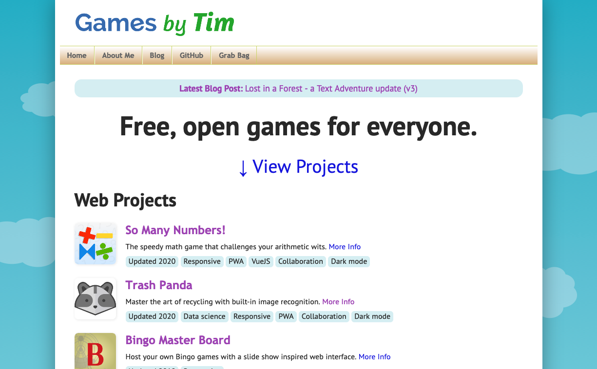

I recently updated my homepage, which now features a photo of me and a short blurb about myself front and center.

Old

New

## Why make this change?

A portfolio site reviewer (yes, I'm preparing for the job search) got confused about my goals based off the previous homepage. For instance, am I into game development, web development, data engineering, or perhaps something else?

To clear up the ambiguity, I replaced the top banner with a personal statement that better describes my ambitions. The new statement clarifies that I'm not all about dedicated games, but rather software as a whole with gamification where it helps.

The photo of me address two issues. For one, it adds a more personal flair to the site. It also fixes the image that appears when linking Games by Tim in sites like Facebook or Slack. Previously, it'd show the So Many Numbers app icon since that's the first image on the homepage. Now it'll show my photo, which is more appropriate.

In addition, I've made minor adjustments to font sizes and capitalization.