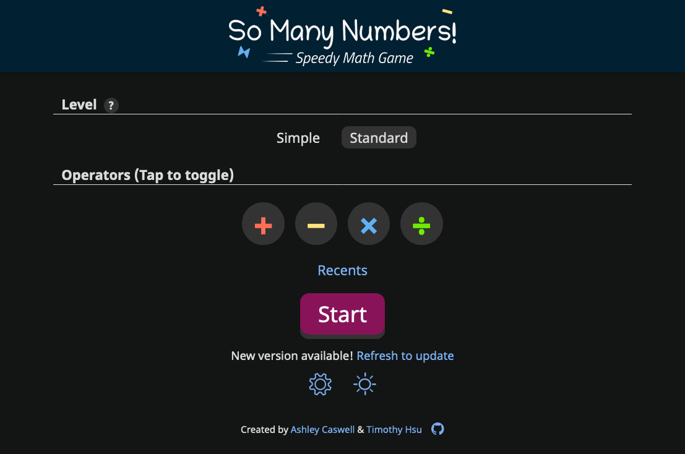

As a web game developer, I desire for my projects to work offline. This is possible with [progressive web apps (PWAs)](https://developer.mozilla.org/en-US/docs/Web/Progressive_web_apps), which promotes a offline native-like app experience for websites.

To make a PWA, you need a [service worker](https://developer.mozilla.org/en-US/docs/Web/API/Service_Worker_API), which, in a nutshell, is a script that tells the browser what files to download and persist for offline use. On the user's initial load of a PWA, this service worker kicks in to ensure the app's fully downloaded. Thus, if the user goes offline and loads the page, the app appears rather than "page cannot be found".

Now what happens when you write an update to the app? In theory, you simply adjust the service worker's list of files, and everyone will see the latest version on next reload online. However, that's not how it works out of the box. On top of that, a misconfigured service worker can cause users to never receive app updates, or worse, unexpectedly break the app. [I dealt with these frustrations](/blog/addressing-the-so-many-numbers-blank-screen-bug/) with my PWA [So Many Numbers](https://numbers.gamesbytim.com/), which led me to detest PWAs as a whole.

Fortunately, Lambda School student [Mark Halls](https://github.com/mark-halls) pointed me towards the right direction. When we worked on the PWA [Trash Panda](https://thetrashpanda.com/), Mark managed to write its service worker in a way that updated the app seamlessly. Flabbergasted, I had to know how it worked, and as a result of our conversation, I've not only resolved all my PWA update problems with So Many Numbers, I can now confidently endorse PWAs as a whole.

To best explain how it all came together, I'll explain the root causes of the update problem and how the adjustments rectified the situation. Although I'll try to explain in layman terms, **this will get technical!**

## Why PWAs don't update instantly (out of the box)

PWAs strive for an offline-first experience. When the user loads the PWA, the app by design should be ready to use right away without having to wait for any network requests.

That's why when the app's updated, **existing users always see the older version first.** By default, a PWA will check and download updates in the background. But even when the update's downloaded, **refreshing the app's page will not update the app.** The user has to close all browser tabs related to the app before the update installs.

See how this becomes a problem? I can announce a shiny new update to my game, only for users to get confused as to why they don't see the new features. Since refreshing the page does nothing either, they question if I even wrote an update in the first place.

## Why PWAs can unexpectedly break

With So Many Numbers, I misconfigured my service worker in two different ways, both of which caused the game to unexpectedly load a blank screen. Due to me not knowing I had two underlying issues, the hassle of testing service workers (ie: constantly deleting browsing data to clear the downloaded app), and the unhelpful development error messages, it took ages to sort everything out.

### Issue 1: Caching the service worker

While you want to download and persist (cache) the app's files, you don't want to cache the service worker itself. If you do, it wrecks havoc on the app when an update's released because the out-of-date service worker attempts to download files that no longer exist. Since some websites register nonexistent files as 404 pages, there's no error when downloading since a 404 page is indeed a file. Thus, all the downloaded files become 404 pages, which the app cannot parse properly when it applies the "update".

For more information on this issue, read [this Netlify post](https://www.netlify.com/blog/2018/09/21/international-service-worker-caching-awareness-day/).

### Issue 2: Resetting the service worker, but not cached files

In response to the frustration I felt with updating PWAs, I added an "Update now" button to So Many Numbers. Clicking "Update now" reset the service worker, forcing the app to load the latest version on refresh.

Problem is, the "new" service worker as no idea about the cached app files. Thus, on next reload, the app breaks. The exact reasons go beyond my knowledge.

What's worse if that **if the user's app broke, it was forever broken to them unless they cleared their browsing data.** Although some sources say that a broken PWA can fix itself after 24 hours, I've yet to see that happen in practice.

## How I fixed broken PWAs

In January, I rolled out a series of changes for So Many Numbers to ensure users will never encounter a blank screen again. I've already explained it [here](/blog/addressing-the-so-many-numbers-blank-screen-bug/), but to summarize:

* I configured the web server to never cache, and always revalidate the service worker.
* I made "Update now" button also clear the entire app cache.

The fixes reduced blank screens in 90% of my test runs. Unfortunately, I still occasionally encountered blank screens on desktop Safari, and those who already got blank screens had to clear their browsing data. Although I've resolved a major PWA pain point then, I still wasn't happy with the PWA update process.

That's where Trash Panda's code and the conversation with Mark kicked in.

## How I fixed the PWA update process

Recall that by default, refreshing a PWA after an update downloads will not update it. Turns out there's a setting in Workbox, the service worker tool most developers use, that overrides this behavior:

### skipWaiting

As the [documentation](https://developers.google.com/web/tools/workbox/reference-docs/latest/module-workbox-core#.skipWaiting) states, enabling skipWaiting in a service worker forces a service worker to install immediately instead of "waiting" for all tabs to close. That way, refreshing the page will indeed update the app!

What's more, **skipWaiting applies retroactively to older versions.** As such, **it fixes previously broken PWAs** so users no longer need to clear their browsing data! I can confirm this with my dad, who dealt with a blank screen on his So Many Numbers app until I applied the skipWaiting patch.

Although skipWaiting is awesome, it doesn't directly solve the problem of existing users seeing the app's older version first. So how can I let them know an update exists?

### Update notifier

As it also turns out, the Workbox service worker includes JavaScript hooks that run when an updated version of the app's downloaded. I used this hook to inform users that they should refresh to update So Many Numbers.

Updates usually just take a few seconds to download, so most users should see the update notice.

Other ways to solve the old version problem involve programmatically triggering a refresh on download and configuring the service worker to use a [network first strategy](https://developers.google.com/web/ilt/pwa/caching-files-with-service-worker#network_falling_back_to_the_cache). I opted for the update notifier for the most seamless app loading, online and offline.

## Personal aftermath

I gotta say I'm more than satisfied with PWAs now that I know how to properly handle updates. Unlike my previous statement, you can now expect most future projects of mine to ship as PWAs. I may still explore standalone Electron apps, but they're not as much of a priority since PWAs already provide a solid offline experience.