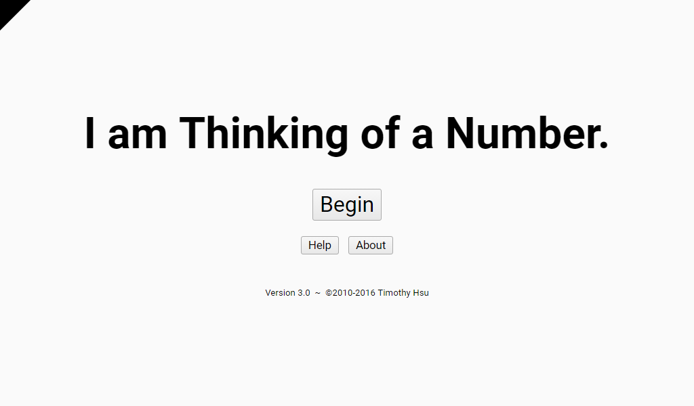
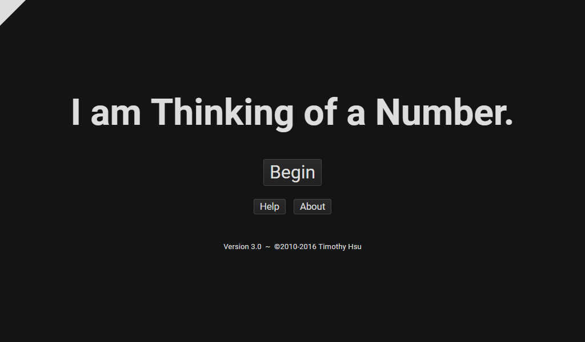
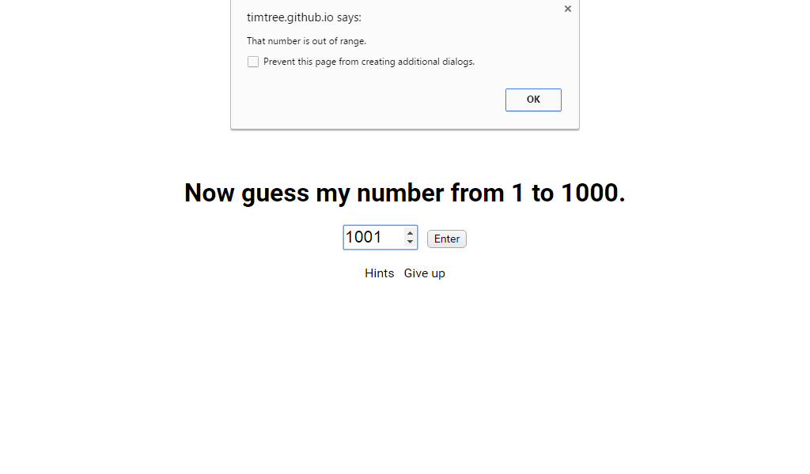
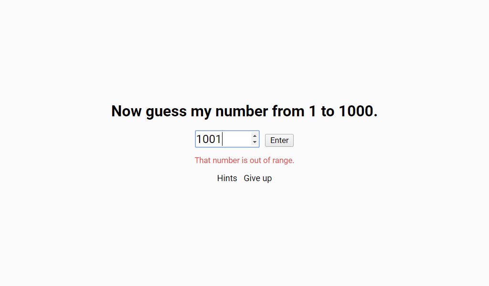
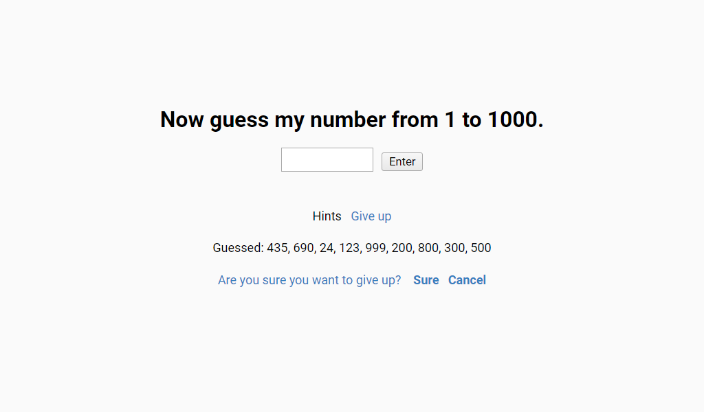
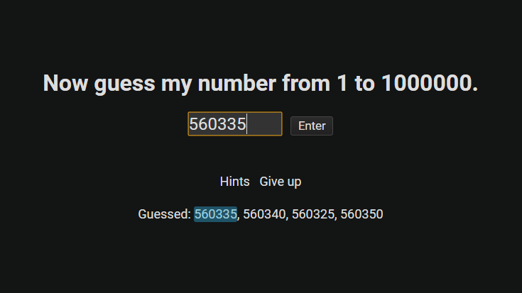
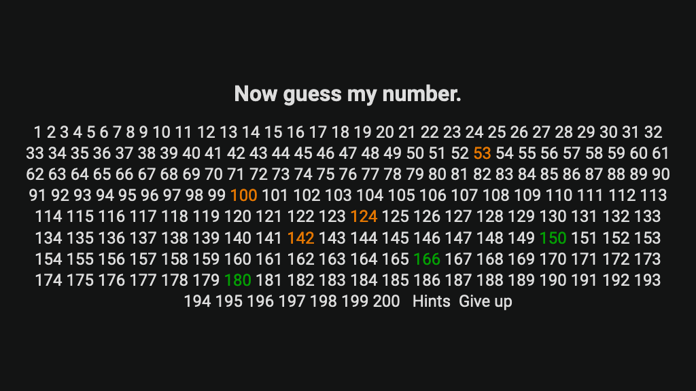
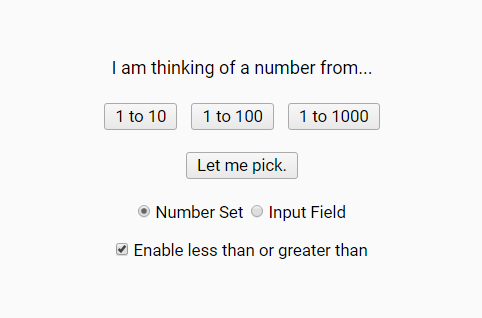

It's been a while since my last blog update, so how about I come back with a new pristine update to our most sophisticated number guesser?

Welcome to _I am Thinking of a Number_, version 3.0. That's right; not 2.7.2 or even 2.8. This is serious business. Lots of changes are abound, visually AND functionally. And we are about to delve into each of these improvements right here in our always-detailed release notes!

(Note: If you're the the type of person who prefers discovering the changes for yourself, stop reading now and [click here to play](https://timtree.github.io/i-am-thinking-of-a-number/). Knock yourself out.)

So are you ready? Let's get rolling!

## Preface: Version 2.7

Before I even begin talking about version 3.0, I have a confession to make: **version 2.7 was supposed to have a lot more features.**

Say what? Yeah, I was lazy. Back around that time, I was itching to give this game's interface a face-lift. But I kept telling myself, "Save the new layout for a massive release. Otherwise, it won't be as exciting." You see, I DID have some ideas to supplement the new look at the time, but I simply didn't want to code it. All I wanted to do was take a nice stroll remedying CSS to satisfy my temptation, and ultimately I did just that.

The redesign, [if you can recall](/blog/i-am-thinking-of-a-number-version-2.7/), was primarily focused on new fonts, and new buttons. Since I wanted to make the game stand out for all sorts of operating systems, I had an idea to specify individual fonts depending on what operating system the player is using. As for the buttons, I just wanted to step away from the boring default ones. In the end, I was satisfied. I was so proud my game featured Apple's brand new San Francisco font at the time.

But now, looking back, **I realized how much of a disaster the redesign really was.** For one, it made the game look inconsistent. Different fonts have their own shades and dimensions, and I had to create CSS that attempted to suit every type of need. That's not really a good way to design, especially since I was leaning more heavily towards the San Francisco font than all the others. Also, the buttons. While I did fix the buttons considerably in version 2.7.1, they still looked off-putting, perhaps due to their roundness and how modern operating systems are moving AWAY from that design standard.

That's when it came to me that **I needed to redesign the game again.** And the good news was that since I didn't add any other changes to version 2.7.x, I had a second chance at building a massive release, filled with the functional improvements I had in mind AND a confident new look and feel. And what you see here is the final result. Allow me to walk you through all the changes that I'm sure will enhance your guessing experience!

## Version 3.0 Release Notes

The first thing you'll notice is that **the font and buttons have been redesigned once again:**

  
To save myself from the fonts nightmare of version 2.7, **I have a chosen single font to rule them all.** The winner? Google's Roboto font. While it's not San Francisco due to Apple's font license terms, Roboto is still a fantastic choice. It's modern, it's sleek, it's simply an all around performer.

**The buttons, as you can see, are less round and less in-your-face.** And that's a good thing. Buttons should blend in with the interface, not act as the class clown. I believe the changes I've made here suit those optimal needs.

If you're eagle-eyed, you may notice that **the background color now has a slight gray tint.** While it's an ever-so-slight change compared to complete white, it's definitely an improvement. Input boxes stand out more, and since there's SOME color now, the game looks more professional. (Fun fact: I was inspired to do this when using the Brackets code editor, as its background color is similar to this.)

But wait, there's more. What the heck is that weird black triangle on the top-left corner? Well it turns out it's not some rendering glitch. Try clicking on it, and when you come to...

WHOA, what in the world? **A DARK THEME??!!** That's right! Have you ever wanted to play _I am Thinking of a Number_ during the night, but you couldn't because the screen was too bright and your wife was irritated by the glow as she was trying to sleep? Or do you simply prefer black interfaces like I do? Well this right here is your antidote. Enjoy exercising your brain's incredible guessing power AND keep your significant other at bay! (But really, you should get her into this game if you haven't tried already.) To re-spawn back to the world of light, simply click the top-left tab again.

Moving further, you'll notice several other nifty interface tweaks. Here's one: **the fonts are slightly bigger.** If the dark theme wasn't enough, this should enhance the legibility of the game. Here's another: **there are various line height adjustments.** The previous version had various issues with in game elements clashing with each other, but that should be all tidied up now.

But this, by far, is the granddaddy of the interface tweaks. Didn't you hate it when you got one of these annoying alert boxes? (Screenshot from version 2.7.1)

They interrupt your flow. They halt your progress. They're the bullies that strangle you and won't let go of you until you cry "uncle!" Ok, perhaps that's going too far, but I'm not kidding about how poor of a design this really is. According to Programmers Stack Exchange, [end users tend to associate alert boxes with evil](http://programmers.stackexchange.com/questions/106031/javascripts-prompt-confirm-and-alert-considered-old-fashioned/106039).

That's why with this release, **I've gotten rid of all alert boxes** and incorporated any messages from them straight into the game's interface. Let's try guessing a number out of range again and see what happens:

Now that's much better. It's a gentle reminder, and you, the end user, don't have to go out of your way just to keep playing the game. Simply correct your typo and move on.

I've also done away with the prompt boxes. Here's what the "Give up?" prompt has evolved to:

You may have also noticed that **the input field has gotten wider.** Now you can guess larger numbers more easily than before.)

That's all for the aesthetic differences, so let's move on to the new functional improvements. As we all know, it's the functional upgrades that really transform the way we guess, allowing us to become more efficient each release. So what do we have in store this time?

The first improvement is devoted to Number Set mode. (Don't worry, Input Field lovers. Your turn is next.) Number Set players enjoy using one hand to click on numbers rather than getting both hands dirty with the keyboard. Unfortunately for them, they were quite limited with how many numbers they could guess from. In Google Chrome for instance, guessing from 1 to 10,000 already introduced lag, and good luck having even a remotely usable experience when hitting 25,000+.

Something _had_ to be done about this, and luckily, I found a solution. Without being too technical, there happens to be a particular character that acts just like a space that seems to load faster in some browsers. So I tried that, and I am proud to state that **number sets load dramatically faster on Google Chrome and Safari!** Now, if you use one of those browsers, you can finally use a number set to guess number ranges up to 100,000+ without freezing or pounding your desk with agony.

Now for the Input Field improvement. Have you ever tried guessing using large numbers (like 1 million or 10 million) and found it a pain in the fingers to type the same five or six digits over and over again as you narrow down the answer? (Ex: 560350? 560325?) Well your fingers can relax now, because starting with this release, **you can click on a guessed number for it to appear in your input box.**

So instead of typing the same numbers again, simply click on your last guessed number and backspace the last digit or two, Now you only have to type the new digits to guess! Guessing large numbers has never been more efficient than before.

Now that we've covered that, here are some functional improvements that apply to both Number Set and Input Field. From here on out, **the game no longer lets you guess numbers you've already guessed.** You may be wondering, why wasn't this a thing in the first place? It's because back in the day, I was dedicated to supporting this game with ancient browsers, and Firefox 1.0 didn't support the code that makes this possible. Now I will move on from the past. It's better to innovate with the new than to cling with the old, right?

Speaking of which, this also means I've incorporated basic save support to this game. For instance, **the game now remembers the last method of guessing you've used when you reload the game.** So if you're a die-hard Input Fielder, you don't have to re-toggle it every time you play! You're welcome.

**The game now knows each individual hint you've used.** Before, it would only keep track of if you've used any hint, or none at all. That meant if you've just used one of the hints, you'd feel cheated by the commentary you'd receive. So begone with that! You and/or your peers will now feel slightly more proud of you when the game regards that you've used only one of the hints. Or it could go the other way, as it'll also mention if you've used all three of them.

Speaking of hints, I've made some helpful modifications for less than or greater than, the most commonly used hint in the game. Starting now, **if you enable the less than or greater than hint, your guessed numbers will be color coded.**

Green numbers are greater than the secret number, while orange numbers are less. It's a more intuitive way to utilize this hint, as you no longer have to worry about remembering which numbers are which!

**There is also a new checkbox to pre-enable the less than or greater than hint.** This toggle appears once you use this hint in-game at least once.

### Grab-bag: Other Miscellaneous Changes

* **It is now harder to cheat.** Ok, this change is actually pretty big. In previous versions, all the variables in the game were public, so you could simply go to the Javascript console, type the secret number variable, and out it went. Guess every number correctly on your first try.  
  Well, not anymore! If you peek into version 3.0's source code, you'll notice that I've made heavy modifications to the game's variable structure. The secret number variable is now nested, so you can no longer access it through typical methods. Hopefully this new form of code will improve the game's overall integrity.
* **The Help page now includes tips to succeed.** Rather than listing the list of compatible browsers (which wasn't very useful in the first place), the help page provides pointers on how to maximize your game experience.
* **The About page has a makeover.** Check it out if you so desire. I kind of like this new style, and I hope you do too.

## Conclusion

It all started with an infamous PowerPoint game. Then, it was converted to HTML5. As more and more updates came along, the less sadistic and more sophisticated this project really became. With the ability to use hints, guess from numbers other than 1000, guess with an input field, mobil  
e device support, keyboard shortcuts, a redesign, a dark mode, save support, and time-saving functionality, this is by far the best version of _I am Thinking of a Number_ yet and, in my opinion, the best number guesser in existence.

Of course, this doesn't mean I'm done with it yet. You never know if version 3.1 will contain even more improvements, and perhaps another massive update like 4.0 could potentially be in the works. Let me know in the comments what YOU want to see, and I'll see if I can make your number guessing dreams a reality!

But before you do that, you should actually give this update a try. Hopefully my excitement here made you feel that way too as you experience the improvements hands-on.

**tl;dr:** This is massive release to the sophisticated number guesser. Lots of aesthetic and functional improvements are included, such as a dark mode, number set loading performance, typing shortcuts in input field, and more. Be sure to give the update a try.

For more formal release notes, [here is the Github commit](https://github.com/TimTree/TimTree.github.io/commit/c6665a5dea251ce7d01a1b49a3ae714dcb876a97).