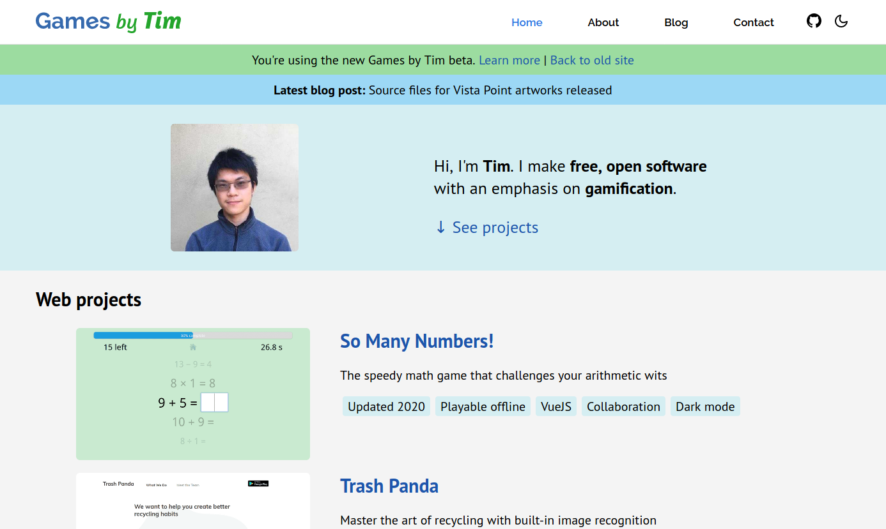
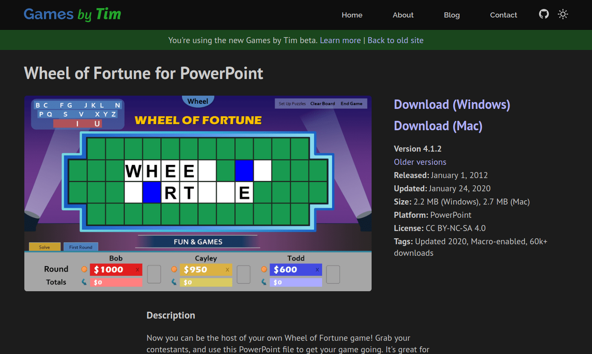

**UPDATE (June 15):** The new Games by Tim is out of beta!

***

Since 2011, I've ran Games by Tim on Blogger, Google's free blogging service. Back then, I hardly knew anything about web development. Now with seven years of web dev experience and an extensive portfolio of web projects, it's about time I remodel this site to something more modern, more flexible, and more representative of my abilities. Introducing the new Games by Tim!

The new Games by Tim is:

### **Fast**

Thanks to modern web techniques like [code minification](https://www.cloudflare.com/learning/performance/why-minify-javascript-code/), [link preloading](https://www.gatsbyjs.org/docs/gatsby-link/), and [image lazy loading](https://developers.google.com/web/fundamentals/performance/lazy-loading-guidance/images-and-video/), the new site feels quicker to browse and navigate.

### Responsive

The new site scales seamlessly, whether you're on an smartphone or a 30 inch monitor. There's no more separate mobile site, and desktops get blessed with larger images and font sizes.

### Optimized

Each project gets a dedicated page, rather than a blog post. In addition, links and blog posts are now properly structured and formatted without Blogger workarounds, potentially boosting search engine optimization (SEO).

### Sleek

Vector graphics, animations*, and gaussian blur** spruce up the new site's appearance. And of course there's a dark mode too!

* Animations are disabled if you've enabled "reduce motion" on your device. ** Gaussian blur does not currently work on Firefox. Firefox will instead use slight transparency for the time being.

## The tech stack

The new site's hand-coded with [Gatsby](https://www.gatsbyjs.org/), a static site generator designed to build fast, modern blogs. Gatsby incorporates [React](https://reactjs.org/), a JavaScript library used to build user interfaces.

For writing blog posts, the new site uses [Forestry](https://forestry.io/). Typically, the blog editor you use is tied to a specific platform (ex: the Blogger editor can only be used on Blogger sites). Editors like Forestry on the other hand can be used for multiple platforms, especially custom-made sites. This type of editor is known as a headless CMS.

Whenever I submit blog posts, Forestry converts my writing to markdown files. Gatsby then reads markdown files to dynamically build new webpages with the blog posts. The resulting "compiled" webpages are uploaded to [Netlify](https://www.netlify.com/), a static web hosting service.

Since Gatsby-built sites are static, meaning the content does not change based on who visits the site, I don't need to pay extra for hosting services. This offers a significant advantage over alternate platforms like Wordpress and Squarespace.

## What's left to do

As the new site's still in beta, there's still several steps I need to work on before taking it to production. These include:

* ~~Transferring all existing blog posts to the new site~~ Done!
* ~~Adding a new commenting platform (existing comments sadly won't survive the transition)~~ Done!
* ~~Adding contact info~~ Done!
* ~~Writing redirects from the old site's project links to the new format~~ Done!
* ~~Further optimizing for SEO~~ Good enough for release
* ~~(If feasible) adding an email subscribe option to get notified about new blog posts (subscribers of the old site would need to resubscribe)~~ Not feasible for now, using RSS feed as an alternative
* Making adjustments to the site based on user testing and feedback

In the meantime, I plan to dual-post new blog posts to the old site and new site. Note that timestamps will slightly differ for these posts due to the time it takes to reformat posts from Forestry to Blogger.

## Any feedback?

Now's the best time to provide feedback as I'm still working out the new site's kinks. Feel free to share your thoughts in the comments below.

I look forward to working with the new Games by Tim, and I hope you'll enjoy the refreshed experience.