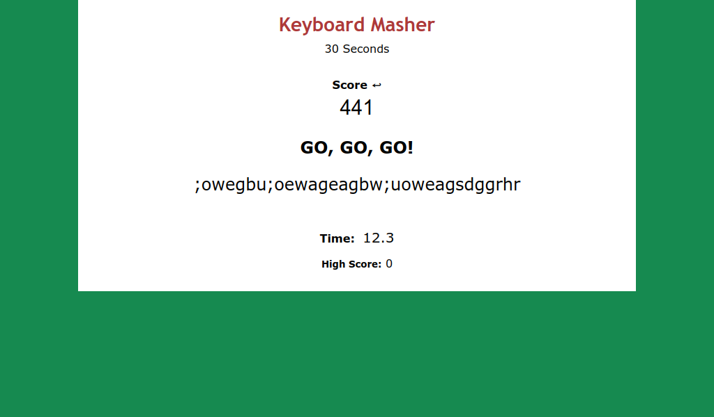
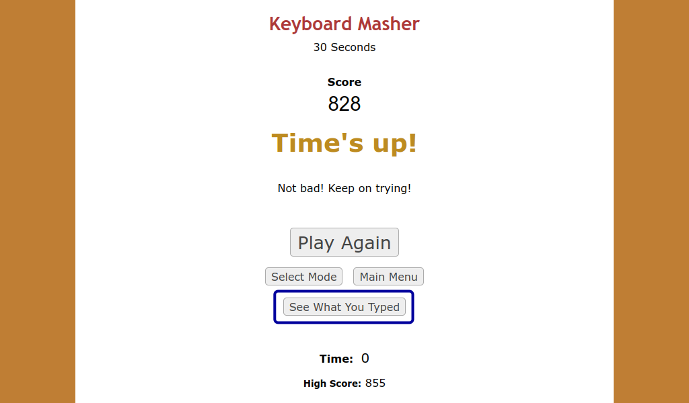
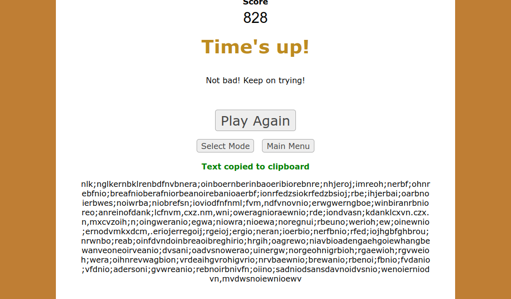
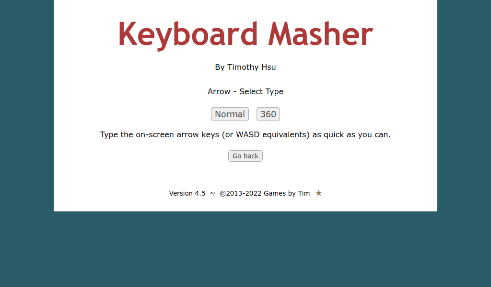
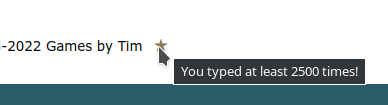

It isn't often I revisit projects I haven't touched in years. But after replaying the Masher Series games with friends last week, I knew there were a few loose ends I had to tie.

So here we have it: **the first meaningful update to Keyboard Masher since 2016!**

By no means is this a major overhaul; the UI and coding conventions remain vastly outdated compared to my modern works. In fact, I deliberately not updated these aspects to remain the classic nature of the game. The goal was to implement features in a way I could have conceivably written 6+ years ago, and let me tell you: that was a blast from the past revisiting old code!

So without further ado, let's reveal those loose ends.

## See what you type!

Ever wonder _what_ you're mashing on your keyboard? Now, in addition to the good ol' **GO, GO, GO!**, you can see for yourself in real time!

The last 32 keys pressed are shown in-game. After each game, you can reveal the whole shebang with the new button: **See What You Typed**.

From there, you can quickly copy your work of art to your clipboard for pasting pleasure. Send it to your friends! Make it a copypasta! It's your baby!

## WASD in Arrow mode

In addition to the arrow keys, you can now use WASD keys in Arrow mode. Perfect if you prefer using your left hand, are more used to WASD from other games, or have no arrow keys at all (I'm looking at you, 60% mechanical keyboard owners)!

## Additional tweaks

* On Firefox, mashing the ' or / keys no longer opens Quick Find, which would disrupt the game.
* An issue with the game changing position when starting a mode on various browsers/operating systems has been fixed.
* Hovering over an achievement star now reveals a tooltip describing what you accomplished.  
  
* The copyright author has changed from Timothy Hsu to Games by Tim.
* The license has changed from GPLv3 to MIT.

In addition, I updated the [Keyboard Masher Strategy Guide](/blog/the-keyboard-masher-strategy-guide/) with additional info on mechanical keyboards, n-key rollover, and WASD support.

***

**Happy mashing!** I encourage you to post what YOU typed in the comments.