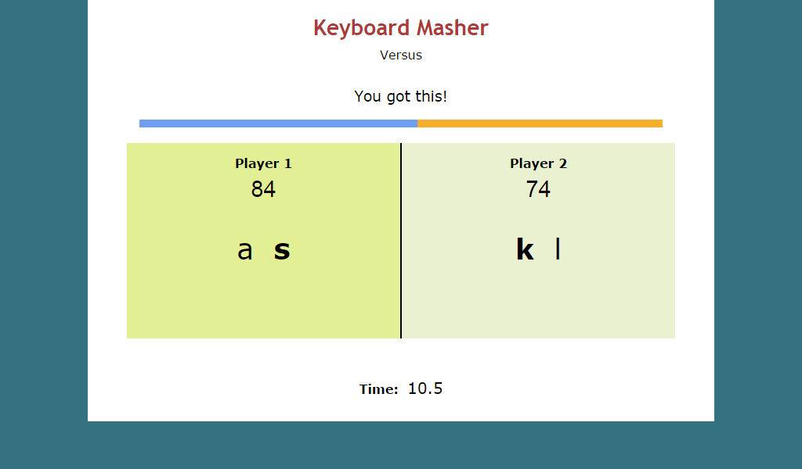

**FINALLY!** After procrastinating for over two years, Mouse Swipe has officially released to Tim's Slideshow Games!

Back in Summer 2013, my friend Kaizad Taraporevala suggested that in addition to Button Masher/Keyboard Masher, there should be a game about moving your mouse back and forth. I thought it was a fantastic idea at the time, and while I attempted to develop the game, I kept losing focus and motivation. And whenever I DID have a spark of motivation, I ended up supplying updates to Button Masher/Keyboard Masher instead, leaving Mouse Swipe in the dust. After feeling a tinge of guilt enough times whenever I see the "Mouse Swipe" folder on my computer, I figured now's the time to take action. I promised a game, and now I'm willing to deliver it once and for all!

Mouse Swipe features four different game modes:

* **Freeform** - Swipe your mouse across the vertical line as swift as you can! Play in 10 seconds, 30 seconds, or a custom time.
* **Square** - Swipe within two fixed squares. There's a normal and hard mode, which shrinks the squares over time.
* **Triangle** - Swipe clockwise within three fixed triangles. Just like Square, there's a normal and hard mode.
* **Motion** - Swipe within two moving squares. If you liked Button Masher Oscillation, you'll feel at home with this mode.

### [Click here to play Mouse Swipe!](http://timtree.github.io/mouse-swipe/)

***

In addition to Mouse Swipe, **Keyboard Masher** receives a substantial update (version 4.3). As you can see in the screenshot, Battle mode has been renamed to Versus, which I think is a much more fitting name. There is also a new gauge bar to view at a glance who's winning and by how much. This should make Versus matches more compelling to compete in and watch!

### [Click here to play Keyboard Masher!](http://timtree.github.io/keyboard-masher/)