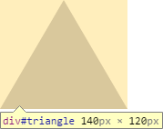
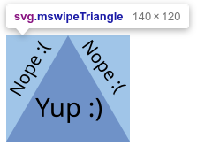

Following [the smashing Keyboard Masher update](/blog/keyboard-masher-v4.5-holy-s-i-typed-that/), we got Mouse Swipe, also receiving its first meaningful update since 2016!

Since the initial release of Mouse Swipe, there was always something that bothered me with Triangle mode. You see, the triangles were only triangles in looks. The hover zones were actually invisible squares surrounding the triangles.

Why was that? Simply put, I didn't know how to adjust the hover zones back then. That all changes now. **Introducing triangles that are triangles.** Now you _actually_ have to move your cursor to the triangles to score points!

As this change affects gameplay, I re-calibrated my Beat the Creator scores for normal and hard Triangle mode. I did not, however, reset _your_ high scores, so you may be in for a treat! :)

Mouse Swipe also receives the **additional tweaks** from Keyboard Masher v4.5. To reiterate:

* An issue with the game changing position when starting a mode on various browsers/operating systems has been fixed.
* Hovering over an achievement star now reveals a tooltip describing what you accomplished.
* The copyright author has changed from Timothy Hsu to Games by Tim.
* The license has changed from GPLv3 to MIT.

In addition, I updated the [Mouse Swipe Strategy Guide](https://www.gamesbytim.com/blog/the-mouse-swipe-strategy-guide/) with a different strategy for Triangle mode.

## Button Masher also updated

I also released [**Button Masher v4.4**](https://timtree.github.io/button-masher/), which contains the additional tweaks to uplift with the rest of the Masher Series. Besides that, there are no gameplay changes to Button Masher at this time.