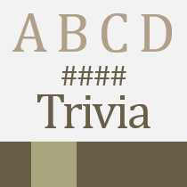
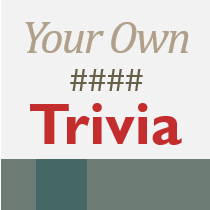

I'm still migrating files out of MediaFire, but in the meantime, I thought it was a good idea to add icons to all my PowerPoint games on the **Projects** page. Yes, even the ancient projects I've abandoned years ago have been given icons. Here's a glance of what I've made.

