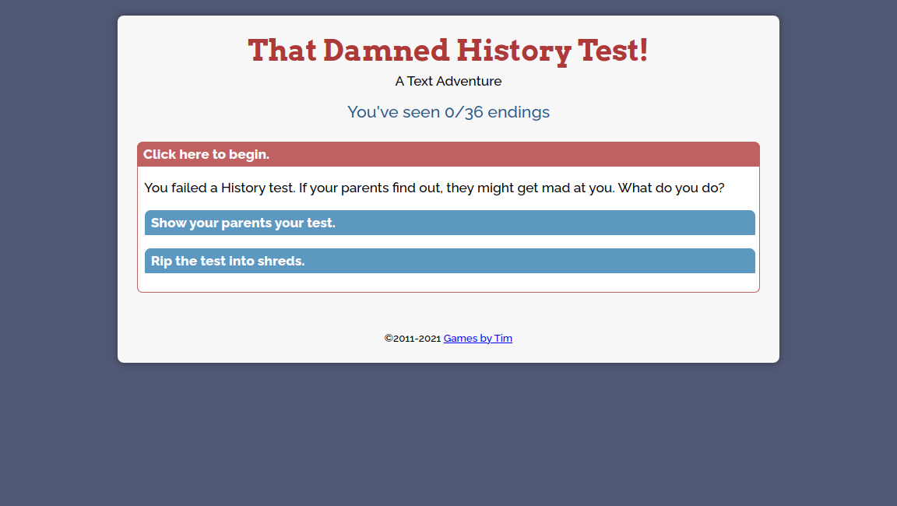
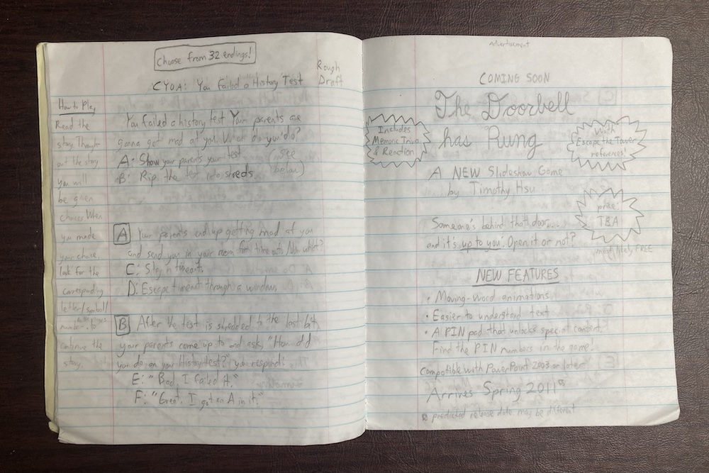

In an effort to return to creative writing, I am thrilled to release **That Damned History Test!** - a text adventure.

The game format is similar to [Lost in a Forest](/lost-in-a-forest-a-text-adventure/), with a completely different story. There are no "right" or "wrong" choices; it's all in the name of entertainment. See if you can uncover all 36 endings!

## Fun fact

This text adventure was originally written in 2011 on a writing notebook for a creative writing school assignment.

I've wanted to convert the text adventure to a digital format for a long while,  and I'm happy it's done ten years later. In addition to the digitization, the story has some changes over the 2011 original.

* The total endings increased from 32 to 36.
* Every ending that leads to punishment now has a punishment associated with it, rather than just saying something bad happens.
* Most endings with corporal punishment have been replaced with bizarre alternatives.
* Various grammatical corrections