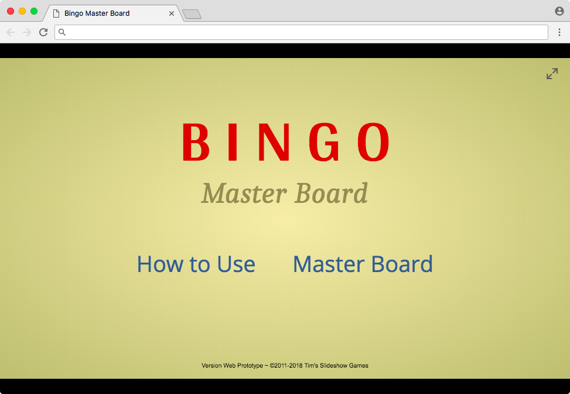

Longtime readers may recall my [PowerPoint to Web initiative](/blog/changes-coming-to-this-site/) back in 2013. During this period, I managed to port **Escape a Tower** and **I am Thinking of a Number**. Thanks to that platform transition, these projects gained features not possible with PowerPoint, including save data and mobile device support.

Today, I am pleased to announce that **I am porting my more-advanced PowerPoint projects to the Web.**

My other PowerPoint projects are more than text-based. As such, I lacked to knowledge to port them a few years ago. The good news is that after researching more about HTML5 canvas, I believe I have what it takes to complete the transition.

The first project I will port to HTML5 canvas is **Bingo Master Board**. Here's a sneak peek of my progress:

As you can see, this looks and acts just like the PowerPoint version. The game scales to fit the browser window, and it can expand to full screen. Just like my previous Web efforts, you can expect new features that would have never been possible with PowerPoint. Mouseover effects, anyone?

Note that Bingo Master Board for Web is based on Bingo Master Board PLUS. Since we won't need to worry about macros anymore, we're back to just one version of the game: Bingo Master Board.

I really look forward to present a working demo to you guys. But given the scale of this project and how busy I am elsewhere, **don't expect a release anytime soon**. Also, I'm not done with PowerPoint just yet; I still have a few updates previously planned before sunsetting the platform for good.

I wanted to let you guys know about this early because I'm really excited about it. **I hope you too look forward to the next era of Tim's Slideshow Games.**