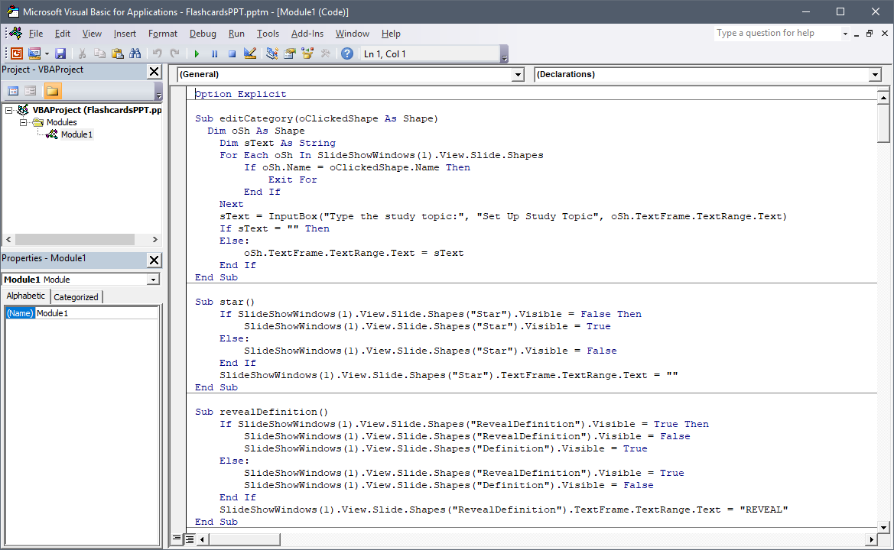

If Bingo Master Board PLUS, Flashcards for PowerPoint, or Wheel of Fortune for PowerPoint doesn't work for you, chances are that macros and/or active content are disabled. Macros are the code that let these games keep score, randomize values, and much more.

Fortunately, Microsoft has handy guides to help you enable them.

* If you use **PowerPoint for Windows**, [use this guide](https://support.office.com/en-us/article/enable-or-disable-macros-in-office-files-12b036fd-d140-4e74-b45e-16fed1a7e5c6) to learn how to enable macros.
* If you use **PowerPoint for Mac**, [use this guide](https://support.office.com/en-us/article/Enable-or-disable-macros-in-Office-for-Mac-c2494c99-a637-4ce6-9b82-e02cbb85cb96).

Macros won't run on PowerPoint Viewer, PowerPoint Online, or PowerPoint Mobile.

***

With all the security alerts, it's natural to feel cautious about macros. Fortunately, you don't have to trust me because all my VBA (the programming language for macros) is open source.

To view the VBA code:

### PowerPoint 2010 or newer (Windows)

* Click the **File** tab -> **Options**
* In the **Customize Ribbon** section, check **Developer**.
* With the new Developer tab that appears, click **Visual Basic**.

### PowerPoint 2011 for Mac

* Click the **PowerPoint** menu -> **Preferences**
* In the **Ribbon** section, check **Developer** under Customize.
* With the new Developer tab that appears, click **Editor**.

### PowerPoint 2016 for Mac

* Click the **Tools** menu -> **Macro** -> **Visual Basic Editor**

_If you don't see the Visual Basic Editor, you may need to update Office with Microsoft AutoUpdate._

Feel free to inspect to your heart's content!

If the PowerPoint game still has problems, and you know for sure macros are enabled, please leave a comment on the game's blog post. Make sure to describe what specifically doesn't work and your version of PowerPoint. If possible, video footage will help me troubleshoot more effectively. Thanks!If the PowerPoint game still has problems, and you know for sure macros are enabled, please leave a comment on the game's blog post. Make sure to describe what specifically doesn't work and your version of PowerPoint. If possible, video footage will help me troubleshoot more effectively. Thanks!