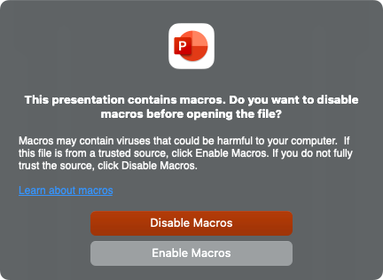

_Last updated August 6, 2022_

If Bingo Master Board PLUS, Flashcards for PowerPoint, or Wheel of Fortune for PowerPoint doesn't work for you, chances are that macros and/or active content are disabled. Macros are the code that let these games keep score, randomize values, and much more.

Here's how you can enable macros, depending on your version of PowerPoint.

### PowerPoint (Windows)

When opening the PowerPoint file, a banner should appear below the ribbon.

If the banner looks like this:

Click **Enable Content** to enable macros. You'll only have to do this once per file.

If the banner looks like this:

You'll need to **right-click** the file from the desktop or File Explorer, choose **Properties**, and check the box to **unblock** macros. Once you mark the file unblocked, close and reopen PowerPoint. More info is [here at Microsoft's website](https://docs.microsoft.com/en-us/DeployOffice/security/internet-macros-blocked#guidance-on-allowing-vba-macros-to-run-in-files-you-trust).

If you do NOT see a banner:

Check your macro settings in **Trust Center**. Make sure it's set to "Disable all macros with notification" or "Enable all macros (not recommended; potentially dangerous code can run)". Once set, close and reopen PowerPoint. For more info on the Trust Center, [use this guide from Microsoft](https://support.office.com/en-us/article/enable-or-disable-macros-in-office-files-12b036fd-d140-4e74-b45e-16fed1a7e5c6).

### PowerPoint for Mac

When opening the PowerPoint file, a pop-up should appear:

Click **Enable Macros** to enable macros. You'll need to do this every time you open the file.

When running the presentation, you may encounter additional prompts asking whether to run specific macro subroutines. If this happens, allow the macro to run and check the box to stop showing these prompts.

If the pop-up does NOT appear:

Check your macro settings in Preferences -> **Security & Privacy**. Make sure it's set to "Disable all macros with notification" or "Enable all macros (not recommended; potentially dangerous code can run)". Once set, close and reopen PowerPoint. For more info, [use this guide from Microsoft](https://support.office.com/en-us/article/Enable-or-disable-macros-in-Office-for-Mac-c2494c99-a637-4ce6-9b82-e02cbb85cb96).

### PowerPoint Viewer, PowerPoint Online, PowerPoint Mobile

Unfortunately, macros will NOT run on these versions of PowerPoint.

***

With all the security alerts, it's natural to feel cautious about macros. Fortunately, you don't have to trust me because all my VBA (the programming language for macros) is open source.

To view the VBA code:

### PowerPoint 2010 or newer (Windows)

* Click the **File** tab -> **Options**
* In the **Customize Ribbon** section, check **Developer**.
* With the new Developer tab that appears, click **Visual Basic**.

### PowerPoint 2011 for Mac

* Click the **PowerPoint** menu -> **Preferences**
* In the **Ribbon** section, check **Developer** under Customize.
* With the new Developer tab that appears, click **Editor**.

### PowerPoint 2016 or newer for Mac

* Click the **Tools** menu -> **Macro** -> **Visual Basic Editor**

_If you don't see the Visual Basic Editor, you may need to update Office with Microsoft AutoUpdate._

Feel free to inspect to your heart's content!

If the PowerPoint game still has problems, and you know for sure macros are enabled, please leave a comment on the game's blog post. Make sure to describe what specifically doesn't work and your version of PowerPoint. If possible, video footage will help me troubleshoot more effectively. Thanks!