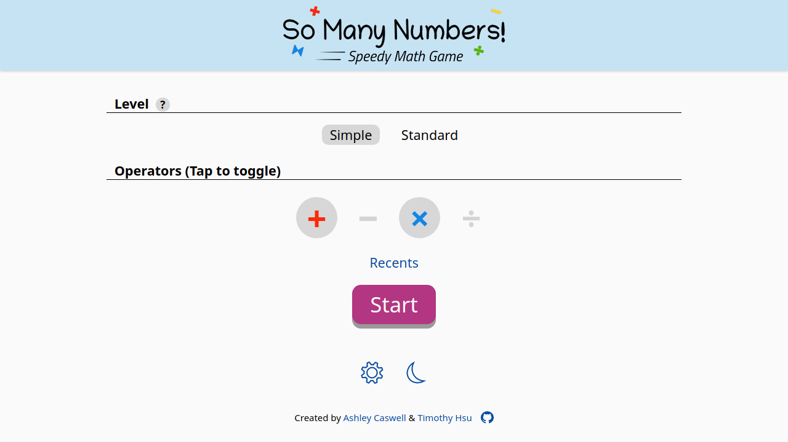
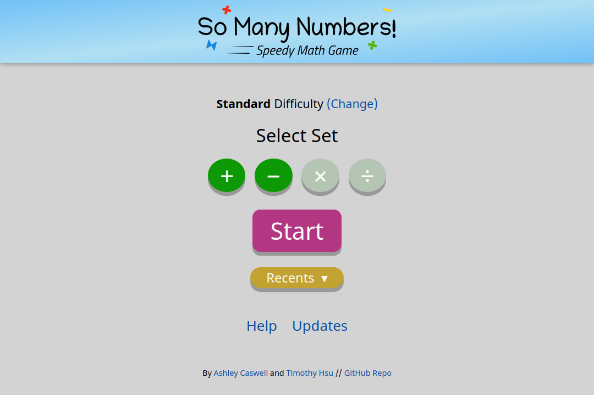
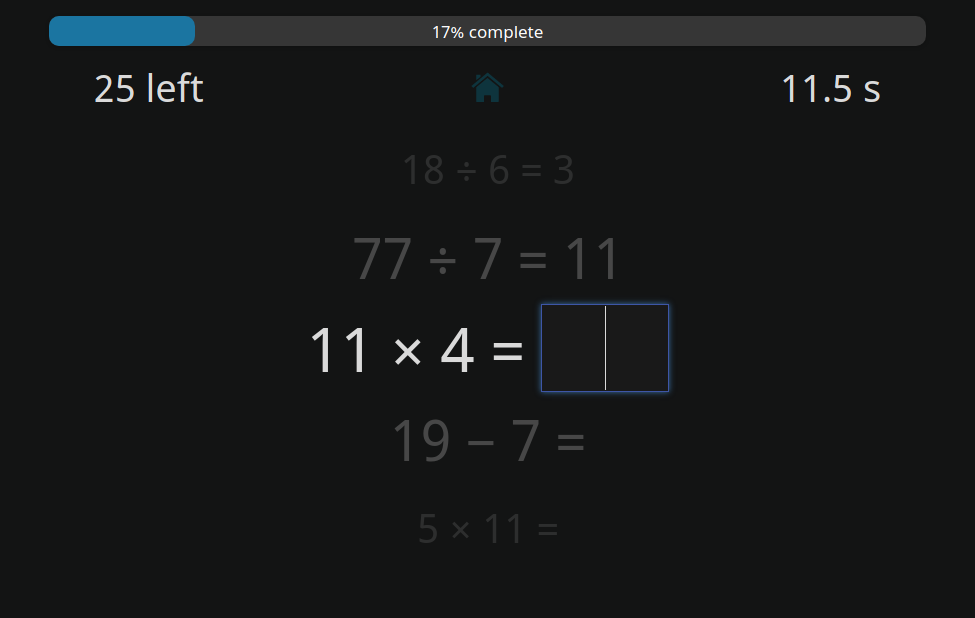

Time for another So Many Numbers update, and this one won't disappoint.

In the last feature update, I added a way to customize the operators to use for the game. It was by far the most requested feature, and users called it essential to improve on the game.

Since that update released, however, I noticed that **people played the game less**. I scratched my head hard on this one. How can adding, and not removing, ways to play a game cause people to not want to play as much?

As it turns out, it's not as much of a mystery as it seems.

* **The original game, with only one game mode, was quick to set up.** Back then, new players simply pressed Start to get a game up and rolling.
* **The updated game places roadblocks on players.** Now on top of pressing Start, they have to actively choose a difficulty and set of operators to use. This added friction felt like a hassle to new players, even if they would have appreciated the customization down the line.
* **The original game had a competitive vibe.** With only one mode, players kept at it with the same game. The more they played, the better their scores, and the more likely they'd show the game to their peers as a challenge. This feedback loop, in my opinion, made So Many Numbers fun.
* **The updated game lacks a centralized focus.** Since there's no longer a "go-to" mode, players played with varying different rulesets. Thus, they felt less motivated to achieve better scores as they are enclosed in their own bubble anyway.

Given these reasons, it's easy to conclude that customization's actually a bad thing. But how could that be the case, given that it's the most requested feature and that players for the most part appreciate its existence?

After some deliberation, I think I know the root cause: **I incorrectly predicted the user flow.** You see, the players who want customization are those who played the original game enough times, not new players who have no idea what potential the game offers. Thus, I need to restructure the game in a way that gets new players up and rolling, while unraveling the customizability when they're ready for more.

And I believe I've achieved the goal with the...

## Main menu redesign

(Old main menu below for comparison)

**By default, the game selects standard level (renamed from difficulty) with all operators.** This was the original game's ruleset, tried and tested. Now players have a game right off the bat and can get others to do so more efficiently. When they want a change of pace, the level/operator toggles are at their fingertips. **Players now customize the game because they want to, not because they have to.**

Other notes about the redesign:

* The level toggles now appear directly from the menu instead of a separate screen.
* The new underlined headers help make the UI feel more fleshed out for larger displays.
* The new colored operator toggles provide better contrast and make the UI appear more clean and playful. It also adheres to the logo design more.
* The header nixes gradients, offering a cleaner appearance. A UX designer from Lambda School suggested not to use gradients without a good reason, and I definitely didn't have a good reason for the header's gradients.
* Switching between the operator toggles and recents no longer jumps all other buttons. Consistency!
* Utility functions (like data management and updating) have merged into one settings page.
* Auxiliary buttons are now expressed as glyphs for a sleeker look.
* It's now possible to view the onboarding page again if needed (I know I do for presentation purposes).

Now a main menu redesign's cool and all, but there's something arguably more important in this release:

## Dark mode!

That's right, folks. Now you can churn out those numbers late at night, covered under your blanket without blowing your eyes out! It works in tandem with your systemwide theme (unless you override it with the themes toggle).

## Other tweaks and refinements

* Fixes a background inconsistency when playing on a phone in landscape mode
* Preloads essential images so they don't blink in on slow network connections
* Slightly increases the max width for the mobile view in preparation for future smartphones
* Adds Google Analytics, with IP anonymization and cookies disabled to track views with minimal impact on privacy
* Refactors multiple lines of code for a cleaner codebase

## How to update

Since So Many Numbers is an offline-first progressive web app, it may take some time before your device automatically applies the update. Here's how you can grab the update immediately.

1. In the main menu, click **Updater** (or Updates in older versions)
2. In the page that appears, click **Update now** (or Force update in older versions).

If you get a blank screen after updating, [click here](/blog/addressing-the-so-many-numbers-blank-screen-bug/) for further instructions.

## Looking forward

Now that I believe I've addressed most of the game's usability issues, I can focus on new gameplay features and quality-of-life enhancements. You can [view my feature backlog here](https://github.com/TimTree/so-many-numbers/projects/1), and of the current list, I'd like to prioritize the Stats page next. Don't forget that you can always send me feature requests as well. Thanks for your support playing the game!