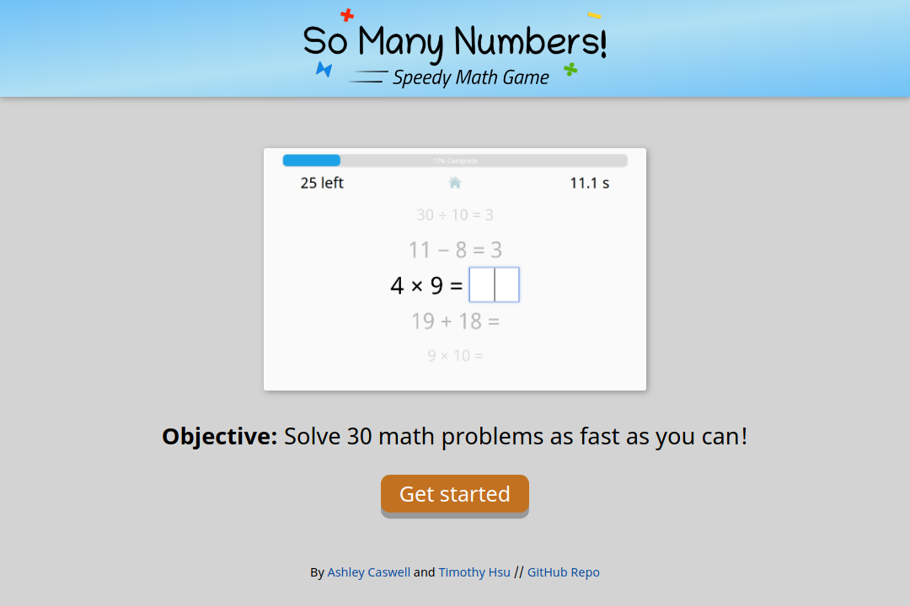
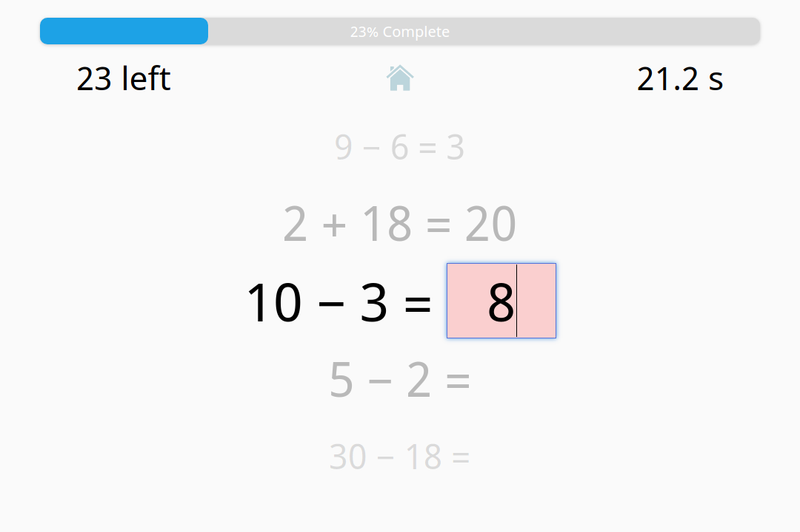

So Many Numbers has a brand new update, and it's a huge one. From redefining new gameplay features to a complete rewrite, let's get this changelog up and running!

## New Logo, New Identity

So Many Numbers has a new logo and icon, portraying a more colorful and playful appearance. Above is the logo. Below is the icon.

The new logo and icon better define our vision for the project: an energy-packed math game welcoming to children, adults, and competitive enthusiasts!

## Introducing Sets

The original game generated math problems of all types. While that's fine for most purposes, many of you, including us, wondered how well we'd do with just multiplication. Or addition/subtraction only.

That's why we're thrilled to introduce Sets. On the all-new home screen, you'll find plus, minus, multiply, and divide buttons. Select any set of operators to practice/compete with! Each set has its own high score, so find out your strongest sets, and identify which ones to improve on.

## Simplifying the Difficulty

Starting with this release, you can adjust how difficult the math problems will be. We currently offer two difficulties: Simple and Standard.

* **Simple** generates a basic set of problems. Ideal for younger kids and those whose math isn't their strongest suit (yet).
* **Standard** generates a wider variety of problems. Ideal for those fairly comfortable with their math skills. (This was the difficulty of the original game.)

We intend to release more difficulty options in the future, so let us know what other problem variants you'd like to work with!

## Make it an App

So Many Numbers is now a progressive Web app. This means the game **fully functions offline**, and iOS and Android users can **add the game to the home screen** so it works like a native app.

## Completely Rewritten with Vue

As So Many Numbers expands, it becomes cumbersome to maintain with vanilla JavaScript. Clearly, it was finally time to learn a JavaScript framework. After some hardcore YouTube tutorial watching and Stack Overflow searches, So Many Numbers has a full rewrite with [Vue](https://vuejs.org/)!

The Vue rewrite not only revamps the development workflow; it introduces several user benefits that would have been infeasible before. Here's a few:

* Because So Many Numbers is now a single-page app, **it no longer refreshes or lags** each time you start a game.
* **Page transitions are more fluid**, thanks to a wider scope of fade-in effects.
* The more efficient workflow means **it's easier to distribute updates**.

(Other JavaScript frameworks/libraries include Angular and React. I chose Vue for this project since it looked easier to grasp.)

## Tweaks and Refinements

* A new onboarding screen properly introduces new players to the game.  
    
  
* The game's input box now highlights red if you type the wrong answer and wait a second.  
    
  
* There's a slightly modified Congrats screen, particularly for if you get a new high score.
* The game now uses actual subtraction and multiplication symbols, instead of dashes and x's.
* The game no longer generates repeat problems.
* Buttons now depress when clicked on.
* Buttons now animate properly on iOS Safari.
* The timer now starts exactly when you see the problems, resulting in at most a 0.1 second time save for players.
* There's now an option to delete your save data.

## A New Domain

So Many Numbers now lives at [numbers.gamesbytim.com](http://numbers.gamesbytim.com/)! The old URL will eventually notify users to switch to this link.

The new domain means that your save data will not transfer. But since the game algorithm changed (no more repeat problems), the old scores are technically null and void anyway.

There's also a [new GitHub repository](https://github.com/timtree/so-many-numbers) with a fully-written README and a project roadmap.

## Thank You

We'd like to thank everyone who helped test So Many Numbers in the past, including family/friends, the Make School Summer Academy 2018 community, and a third grade after-school math class. Thanks to you guys, So Many Numbers can expand to the state it stands today.