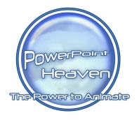
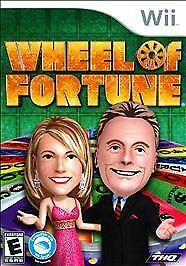
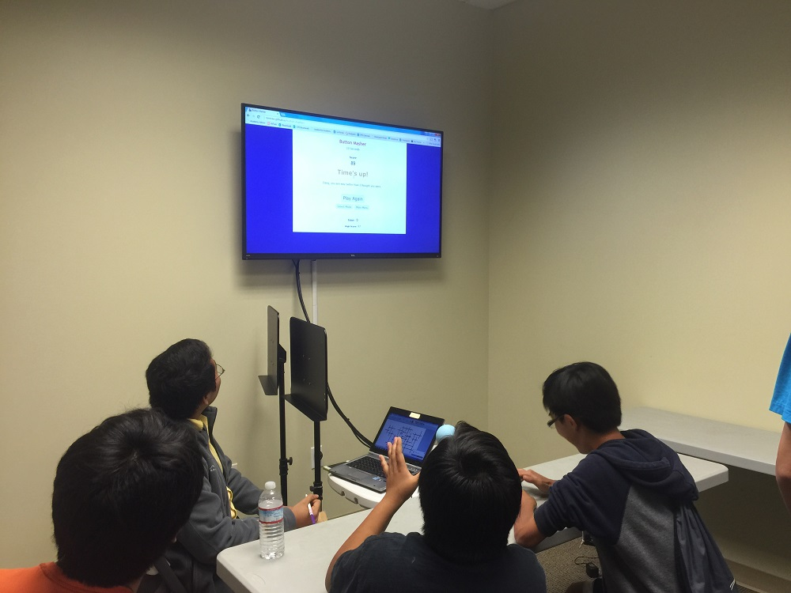
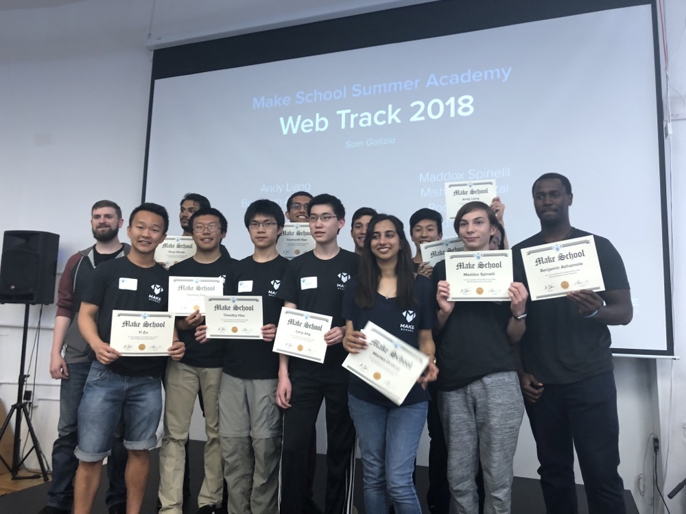

On August 23, 2011, I started a Blogger website and uploaded [its first blog post](/blog/blog-under-construction/).

Little did I know that 10 years later, I'd still maintain that very website. That houses 20+ projects and 180+ blog posts. That 3,000+ people visit per month. That has opened numerous doors to unprecedented experiences and communities.

I would like to thank the moments and people who, over the past 10 years, helped me grow developmentally and evolve Games by Tim to the powerhouse it is today.

## Neopets - the catalyst

The online game [Neopets](https://www.neopets.com/) is the reason I got into game development and web development in the first place.

Neopets is more than just a virtual pet simulator. It's got a ton of activities that foster creativity and coding skills.

One of these activities, [Neoadventures](https://www.jellyneo.net/?go=adventure_generator), lets you build your own text-based games with choices, dead ends, and finish lines.

As someone filled with youthful creativity who enjoyed writing stories, I LOVED writing my own Neoadventures. I found it fun to design crazy scenarios and to come up with funny outcomes to all the choices. Neoadventures would later inspire my first game on this site, [Escape a Tower](/escape-a-tower/).

Neopets also lets you create your own webpages for each of your pets, known as petpages. Petpages were my first ever foray into HTML, which would later motivate me to pursue web development in high school and college.

Although I had to delete my account due to addiction, Neopets is a game I will forever hold deeply in my heart. Without Neopets, I may have never produced any of my projects, let alone started Games by Tim.

## PowerPoint Heaven - the first PPT community

When I first started developing in PowerPoint, I thought I had to be the only one crazy enough to make games with presentation software. The [PowerPoint Heaven](http://pptheaven.mvps.org/) community proved otherwise.

PowerPoint Heaven featured a trove of insane PowerPoint games with high-polygon graphics, animations, sound effects, and much more. These projects, especially [Pointer's Way](http://pptheaven.mvps.org/fikree.html) by Mohammad Ahmed Fikree and [Infiltration](http://pptheaven.mvps.org/jerry.html) by Jeremiah Lee, taught me the tools and tricks to catapult my own games.

When I joined the forum on December 2011, I developed connections with a fantastic, tight-knit group of people, and we pushed each other to utilize PowerPoint beyond our imaginations. I even hosted a game contest there that received several submissions.

PowerPoint Heaven was the first place I felt I made a genuine impact with. Although the website and forum appears abandoned now, its lasting memories will stay with me.

## Wheel of Fortune for Wii - the bargain bin hero

For Christmas 2011, I received Wheel of Fortune for the Wii from the bargain bin.

I still remember playing this game back then, constantly thinking to myself how cool it would be to host Wheel of Fortune with my own puzzles. Thanks to PowerPoint, a projector, and a [YouTube video](https://www.youtube.com/watch?v=iz6QoGeUwjI) that taught me how to edit text in a slideshow, I was able to make it happen by New Year's Day the following year.

Little did I know this would become [the most popular project](/wheel-of-fortune-for-powerpoint/) on Games by Tim, and how much of an impact it would make for hundreds of thousands of people.

## Everglow Youth - the game-changing event

At the end of my senior year of high school, [Everglow Youth threw a surprise party](/blog/an-extraordinary-event/) dedicated solely to my games.

I have my blog post on the event linked above, but long story short, I almost shed a tear. For the first time, I witnessed a large group of people happily enjoying what I made without any intervention from me. It demonstrated that I have in fact made a positive impact on others with my works, which would further convince me to continue game development for years to come.

## Mike Rusnak and Reid Powell - the "competitors"

Occasionally, I search "wheel of fortune powerpoint" to see where my project stands on search engines.

At some point, I noticed two other Wheel of Fortune PowerPoint projects in the results: one by Mike Rusnak of [Rusnakcreative](https://www.rusnakcreative.com/) and the other by Reid Powell of [Youth Downloads](https://www.youthdownloads.com/games/wheel-fortune-powerpoint-game/).

Intrigued, I gave them a try, and yes, they were both well made. That's when I knew I faced competition and had to step up my own game.

Without the "pressure" from my "competitors," Wheel of Fortune for PowerPoint wouldn't evolve to where it's at today. For example, the Set Up Puzzles feature, which lets you store puzzles to load on the template, was a direct response to Mike's puzzle creation process at the time. I know Mike also responded to some of my new features with his template updates. You can say that together, we pushed each other to produce the best Wheel of Fortune PowerPoint templates for the world.

(By the way, I by no means try to shoot down other templates in favor of my own. In fact, I gladly recommend other Wheel of Fortune templates when they better fulfill someone's use cases.)

## PowerPoint Creative - the second PPT community

Speaking of Mike Rusnak, he also runs the forum [PowerPoint Creative](https://powerpointcreative.forumotion.com).

I'll admit I signed up primarily to speak with the "Wheel of Fortune guy," only to end up with way more.

At PowerPoint Creative, I learned things about PowerPoint I wouldn't dare to touch back in the PowerPoint Heaven days, such as macros and VBA. I also got to meet an entirely new group of PowerPoint users, who helped me uncover a new perspective on the potential PowerPoint really has.

PowerPoint Creative is still open to this day and is the PowerPoint forum I would recommend to join at this time.

## Make School Summer Academy - the impactful hackathon

On Summer 2018, I attended the [Make School](https://makeschool.org/) Summer Academy at San Francisco.

The Make School Summer Academy was a 6-week experience where you could learn about iOS or web development. I chose the web development cohort, as I wanted to expand my knowledge to create more compelling projects in this field.

The Summer Academy not only introduced me to a barrage of modern web concepts, it led to the release of [my first cross-collaboration web project](/so-many-numbers/). So Many Numbers, originally built for a week-long hackathon, would receive many new features into the following year, become utilized in math classrooms, and serve as my first project to use a JavaScript framework.

## College Technical Writing class - the new direction

Originally intended for a degree requirement, the Technical Writing class I took at college impacted how I approach working on my Games by Tim projects.

The first revelation was user testing. The idea was to observe how someone else uses your project without any intervention from you the creator. This was huge because prior to the class, I would always tell people directly to try features for feedback. Now I could evaluate whether people can actually find and use desired features and determine how to improve visibility and ease of use.

The second revelation was the personal website assignment, learning how to better design a website to also improve navigation and accessibility. That's when I realized how limiting my [original Blogger website](https://old.gamesbytim.com/) was to satisfy the requirements, which motivated me to code an entirely new Games by Tim website in 2020. To this day, I am happy with how my website looks and feels.

## Trivia with Budds and Magical Memories Entertainment - the pandemic livestreams

Speaking of 2020, I noticed a download surge for Wheel of Fortune for PowerPoint throughout the lockdowns. Turns out Wheel of Fortune's a pretty good game to play over video chat.

In fact, there were professional trivia hosts [hosting their own games](/blog/i-joined-someone-s-wheel-of-fortune-for-powerpoint-livestream/) using Wheel of Fortune for PowerPoint.

I felt greatly honored to join in on the games ran by [Trivia with Budds](https://www.triviawithbudds.com/) and [Magical Memories Entertainment](https://www.mme123.com/). During that rough stage in my personal life, watching others enjoy my creation put a much-needed smile on my face.

## You - the viewers

I know it's cheesy, but seriously, you the viewers are what makes Games by Tim worthwhile to work on. From your downloads and views to your comments and emails, I am forever grateful for all your contributions and feedback. Even for those just browsing the site, thank you from the bottom of my heart.

Cheers for the 10 years, and for what's next to come!

_\~ Timothy Hsu - Creator of Games by Tim_