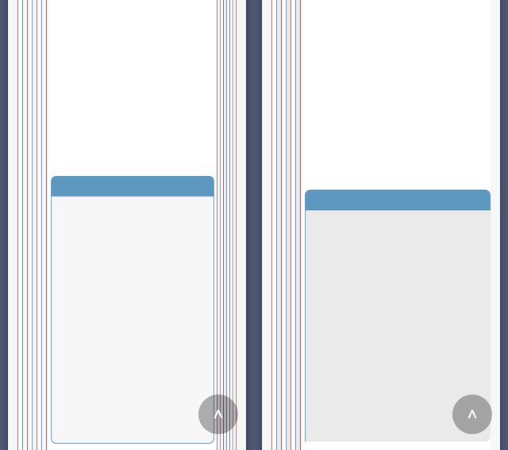

You know that feeling when you release something, and immediately after you're like "man, I wish I did this and that instead"? 

That's exactly how I felt with That Damned History Test!, a text adventure I released last week. So here we have it: v2 released way earlier than anticipated with these changes.

## An updated look

The text adventure UI has been reworked so it looks less cramped on mobile devices.

On the left is v1, and on the right v2 (text hidden to prevent spoilers).  Right-justifying the choice boxes leads to a cleaner look and more breathing room for text, especially for deeply-nested choices!

## Reworded endings

Two endings have minor rewording for clarity. They don't alter the outcome of those endings.

## Bug fixes

The following bugs have been fixed in v2:

* The "scroll to top" arrow was not center-aligned on some browsers.
* The "scroll to top" arrow font was inconsistent across browsers.
* The "scroll to top" button was not fading out when the page scrolls to top.
* The choice box borders occasionally didn't touch their choice toggles on mobile devices.
* One of the choice box's text was not properly formatted as a paragraph.