Now that the [final feature update](/blog/wheel-of-fortune-for-powerpoint-v6.4-refinements-fixes-and-the-future/) to Wheel of Fortune for PowerPoint is out, I thought it would be fun to reflect on the project’s developmental journey, starting from the very beginning.

Throughout this 3-part series, I will discuss in-depth the backstory of each version and how I grew as a developer each step of the way. It might surprise you how and why I put together certain features. It's going to be a heck of a ride, so buckle up and let us begin!

## Prologue: My childhood dream

I fell in love with game shows as far back as my early childhood. In fact, I would watch game shows (almost) as much as the cartoons from Nickelodeon.

I watched **Jeopardy** and **Wheel of Fortune** the most. They aired weekdays like clockwork: Jeopardy from 7-7:30pm, and Wheel of Fortune from 7:30-8pm. I may not have understood how either game worked at first, but I enjoyed seeing people’s scores go up and down. Jeopardy was great for that and all, but Wheel of Fortune’s big, colorful wheel easily won me over. For that reason, Wheel of Fortune rose to my favorite game show of my childhood.

I recall back in 2nd grade how much I wanted to be the host of Wheel of Fortune when I grew up. My parents took notice, and that Christmas, I received the **Wheel of Fortune board game**.

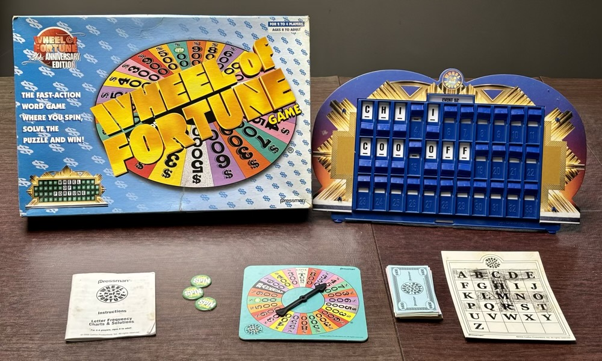

I hosted a couple Wheel of Fortune games with the board game, and while fun, I could not help but want to use my own puzzles aside from the included ones. Oh well, it was just a passing thought…

## The bargain bin hero

Fast forward to the end of 2011. By this point, I fell off watching game shows and was instead deep into making PowerPoint games. I also recently launched my website, [Tim’s Slideshow Games](/).

That Christmas, my aunt gifted me **Wheel of Fortune for the Wii**. She remembered how I liked the show way back, and it was on sale, so why not, right? Little did she know the significance of this one gift…

Playing Wheel of Fortune for the Wii reignited my interest in the show. It also reignited my interest to host the game with my own puzzles. Only this time, I had a technical know-how to make it happen.

## Beta 1 – The rough draft

I searched Wheel of Fortune PowerPoint templates online to see what already existed and found one from [SuperNikestar on YouTube](https://www.youtube.com/watch?v=iz6QoGeUwjI).

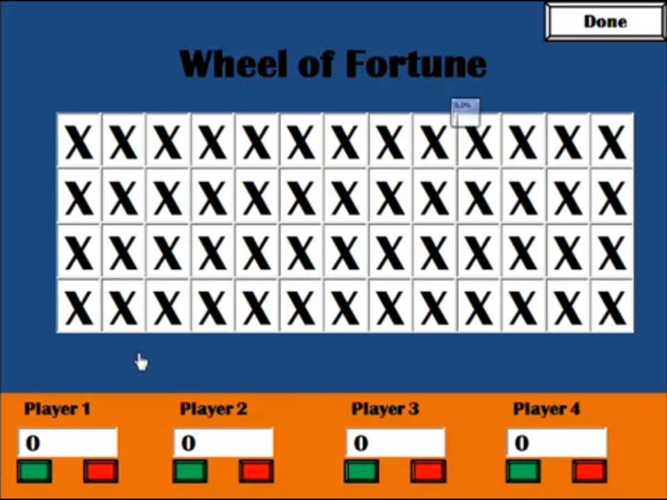

<i>Image credit: SuperNikestar on YouTube</i>

When I downloaded the template, my mind blew away at how it can directly type text on the puzzle board in slide show view. This was possible using a **Text Box ActiveX Control**, available in PowerPoint’s hidden **Developer** tab.

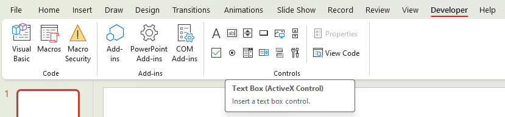

Sure, ActiveX Controls only work on PowerPoint for Windows, but I was just happy to learn this feature existed.

Now I needed a way to randomly spin the wheel. I grabbed a Wheel of Fortune wheel image and added a **Spin** animation to it as a trigger. I then added another trigger to have the wheel **Appear** to see what would happen.

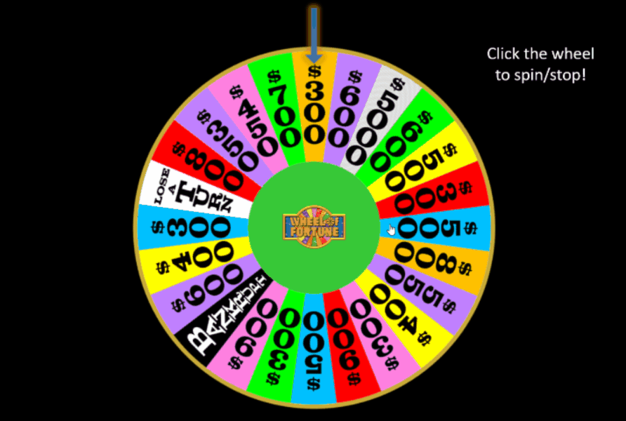

To my surprise, the wheel stopped mid-spin. So, I made the wheel spin ludicrously fast so it was hard to tell where the wheel would stop. The result: a (seemingly) random two-click wheel!

(I will explain the seemingly in a later part...)

With my newfound knowledge, I spent the rest of the night building what would become **Wheel of Fortune for PowerPoint Beta 1**.

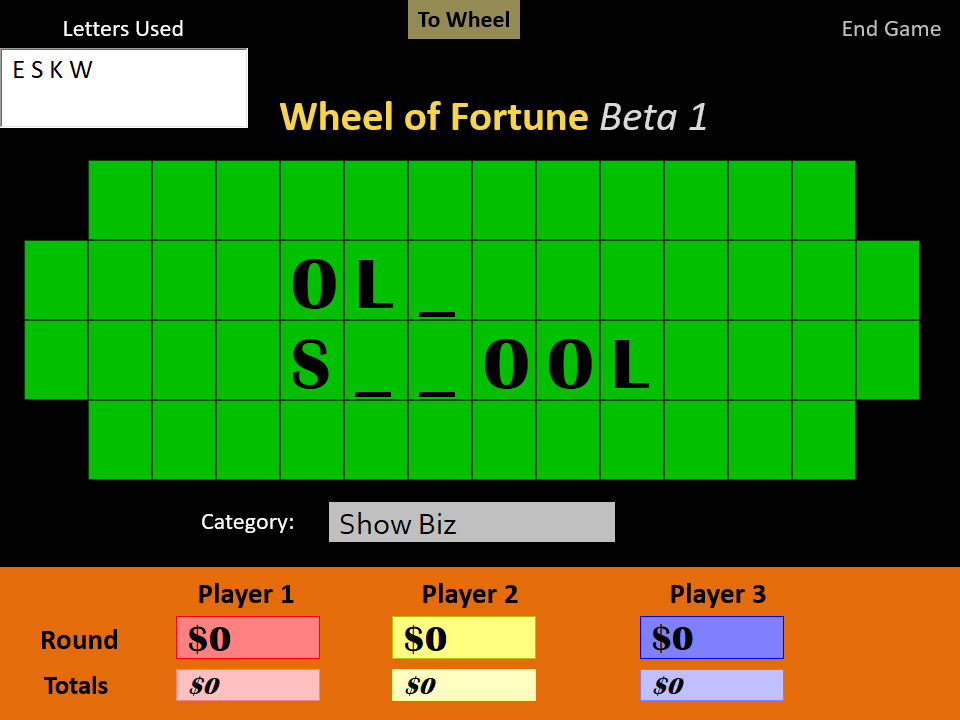

To run Wheel of Fortune game for PowerPoint Beta 1, hosts filled the puzzle board with underscores. When players call letters, they replaced the underscores or added the letter to the Letters Used box. Scorekeeping worked manually, but it sure beat allocating paper money to players like in the board game!

I started Beta 1 using SuperNikestar’s template as a base and made the following modifications:

*	The X’s were removed from the puzzle board tiles.
*	The puzzle board tiles turned green and were structured per the actual show.
*	The player count changed from four to three.
*	Each player score box became colored based on the actual show.
*	Totals score boxes were added to each player to track score across multiple puzzles.
*	The Category box was added.
*	The Letters Used box was added to track letters that were called but not in the puzzle.
*	A link to the wheel was added to the top of the slide.
*	The background changed to black.

So, while the end product differed a lot from SuperNikestar’s template, there were still some remnants, most notably the Britannic Bold fonts.

I knew I was not ready for a full release yet, which explains why I labeled the project as Beta 1. I also did not release Beta 1 online until [I added the Archive](/blog/introducing-the-archive/) to my website years later.

## Beta 2 – Widening horizons

Beta 1 was a good start, but it still had a long way to go. On January 1, 2012, I released **Wheel of Fortune for PowerPoint Beta 2** on my website.

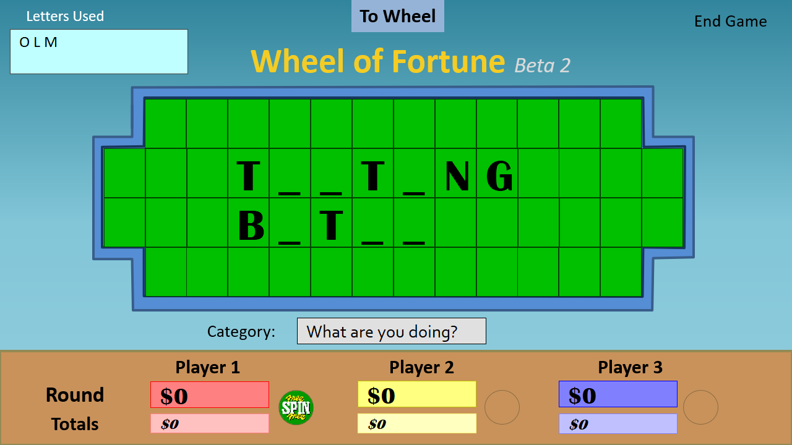

Right off the bat, I made the template **widescreen** because I knew that was the future. It took a while to resize everything to the new aspect ratio.

With the extra space on the score board, I expanded the score boxes and added a **Free Spin** button toggle, a gameplay element from the actual show. Finally, I changed the theme so the new beta looked different.

Beta 2 was the first version I hosted a Wheel of Fortune game with. I hooked my laptop to the family projector and played with my family. We even switched around hosts, so everyone chipped in a puzzle that night. It was a lot of fun!

## Version 1.0 – Lights, camera, action

On January 13, 2012, equipped with lessons from the Beta 2 play test, I made the [first formal release](/blog/wheel-of-fortune-is-out-of-beta/) of Wheel of Fortune for PowerPoint.

It started with the definitive theme. This time, I took the kid gloves off and designed the first iteration of the **Studio** theme, equipped with stage lights.

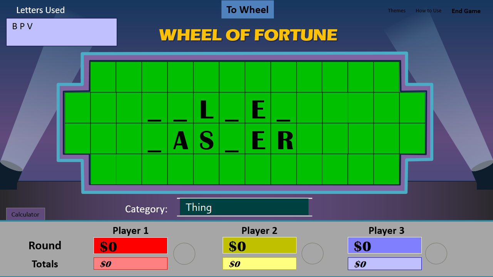

Fun fact: The original Studio theme is based on Wheel of Fortune for Wii’s puzzle board.

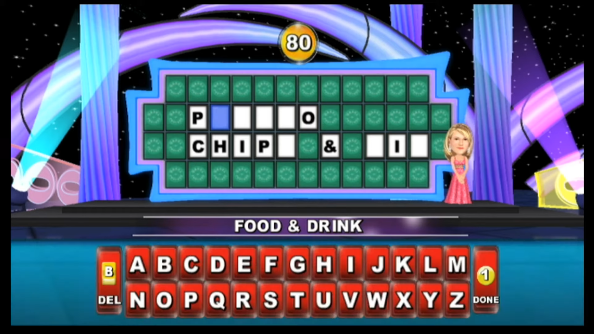

<i>Image credit: Overdrivesinlp on YouTube</i>

The Beta 2 and Beta 1 themes were also available for use.

Because I often struggled with the mental math for scorekeeping, I added a **Calculator** tab, which would open the Windows calculator for use during the slide show.

Lastly, I added a **How to Use** section, opting to use a screenshot with arrows pointing and explaining each function. I cannot recall why I chose this approach, but I would continue to use this style for every future variant of How to Use.

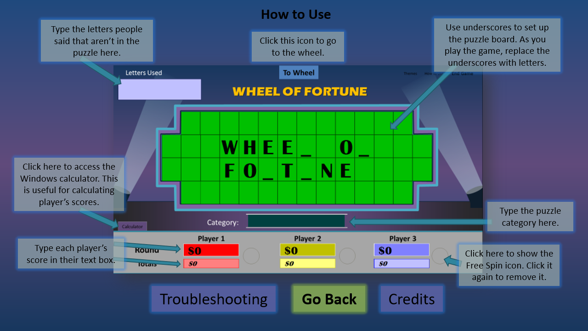

## Version 1.1 – Pure bliss

By March 2012, I noticed that Wheel of Fortune for PowerPoint received noticeably more downloads on my MediaFire than any of my other projects. I think it had roughly 100 downloads compared to my second top project with 50, but I do not recall the exact numbers.

Regardless, I felt primed to release [the next version](/blog/wheel-of-fortune-version-1.1-released/) of Wheel of Fortune for PowerPoint. I was really into theming and Windows XP at the time, so I proudly designed the **Bliss** theme, complete with clouds! It replaced the Beta 2 theme and remains the most serene Wheel of Fortune for PowerPoint theme I ever made.

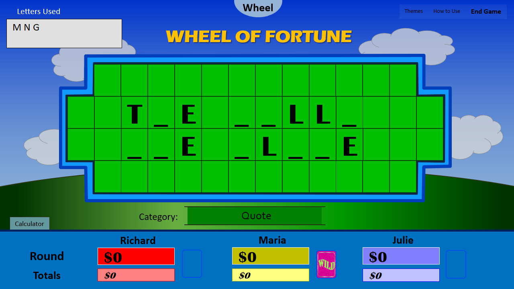

Also new to version 1.1 was making the wheel button circular (a duh moment), centering the category name (a bigger duh moment) and the ability to edit player names (an even bigger duh moment).

I found out the Free Spin button was replaced with **Free Play** and the **Wild Card** from the actual show, so I changed things accordingly. This frustrated me to no end since I liked Free Spin, which leads to the next version…

## Version 1.1.1 – You pick the wheel

On October 2012, I regained sanity. I added a toggle that switches if the wheel should use the Free Spin or the Wild Card.

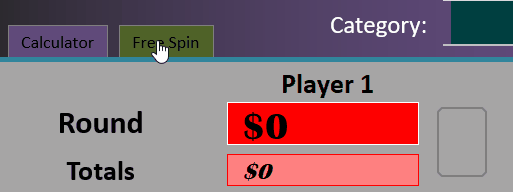

That is all this version changed. Though it is worth noting I had to create an extra wheel slide per theme to make this happen. The early versions of Wheel of Fortune for PowerPoint had separate puzzle boards and wheels for each theme because I did not know how to restyle a specific slide on the fly. This meant this version had three puzzle board slides and six wheel slides!

Around this time, I announced that Wheel of Fortune for PowerPoint received [over 1,000 downloads](/blog/wheel-of-fortune-1000-downloads/).

## Version 2.0 – Key functionality

At this point, Wheel of Fortune for PowerPoint had three major problems:

*	It was inconvenient for the host to mentally subtract $250 whenever a player buys a vowel.
*	Transferring the winning player’s round score to totals took a while to calculate.
*	To start another puzzle, you had to backspace every puzzle board tile.

I searched online for solutions. I knew each ActiveX Control had an ID and a subroutine on the Visual Basic editor, so something had to work. Sure enough, I found basic VBA snippets that, when clicking on an ActiveX Control, interact with other controls!

This made it possible to:
*	Add a **Buy Vowel** button to subtract $250 from a player’s score.
*	Add a **Transfer Totals** button that merges a player’s round score with their totals.
*	Add an **X** button that zeros out a player’s score (for Bankrupts).
*	Add a **Clear Board** button that resets the puzzle board.

I called these new buttons **functionality keys**.

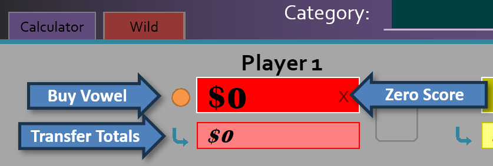

Up to this point, I only used Text Box ActiveX Controls. So, I learned how to use **Label ActiveX Controls** to create clickable controls that do not edit text.

Using a Label ActiveX Control as a button is like a native shape, but it has major restrictions:
*	The cursor when hovering over the control cannot be a mouse pointer.
*	The control must always stack above native shapes.
*	The control cannot be transparent.
*	The control’s outline thickness cannot change.
*	The control’s text cannot have text effects.
*	To make the control appear anything other than a rectangle, you must upload a JPEG image.

At the time, I did not know it was possible to use native shapes to run VBA. Heck, I did not even know how macros worked. So, I rolled with it and did my best to make the functionality keys look as good as they could.

I finished the functionality keys for one theme before I stopped development. This took place the end of 2012, when I announced on a now-defunct forum that I quit making PowerPoint games in favor of Web games.

It took until January 2015 for me to [release version 2.0](/blog/wheel-of-fortune-for-powerpoint-version-2.0-officially-released/), after I made a new year’s resolution to clear my game dev backlog. In addition to the functionality keys, I made other changes I did not think of in 2012. This included a new title slide, a UI font change from Calibri to Corbel, a puzzle board font change from Britannic Bold to Arial, and an updated wheel layout.

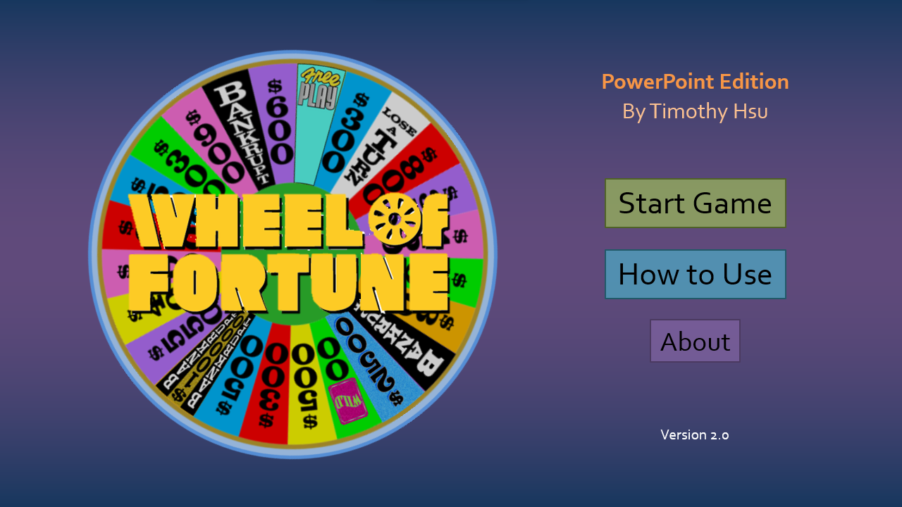

I beta tested version 2.0 with a behavior interventionist and her supervisor, which was the second known time I hosted a Wheel of Fortune game. Everglow Youth also hosted version 2.0 as part of [a surprise party](/blog/an-extraordinary-event/).

Version 2.0.1, released November 2015, removed **By Timothy Hsu** from the title slide and revised legal text. It is otherwise identical to version 2.0.

---

By the time I released version 2.0.1, I thought I was done with Wheel of Fortune for PowerPoint. After all, I was not really working with PowerPoint anymore, and I could not think of further ways to improve the template within PowerPoint's limitations. In fact, I put in the old Archive page that version 2.0.1 would be the final version.

Little did I know that would all change, and I would soon discover way more of what PowerPoint has to offer. Stay tuned for Part 2 when I discuss versions 3 and 4 of Wheel of Fortune for PowerPoint!