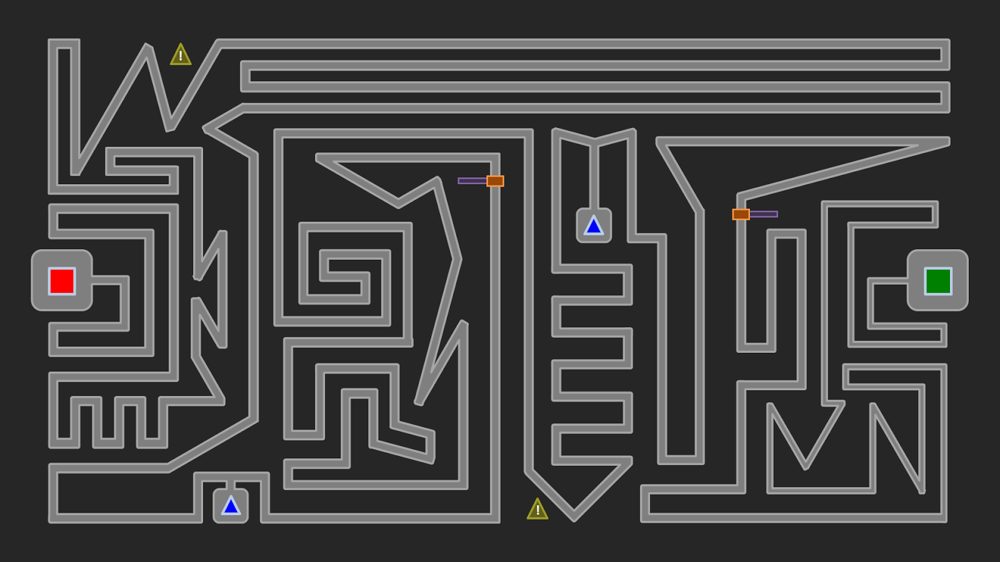

_So you've managed to complete the first level...wait, **did you?** If you haven't, get your cursor back to the first level_ [_right now_](/blog/the-worst-mouse-maze-ever/) _before embarking on this even crazier challenge._

So it turned out my Worst Mouse Maze Ever accrued some unanticipated feedback. I didn't think it would happen, but some people actually attempted the challenge. Believe it or not, I even watched someone with my own eyes complete the stage! Upon viewing that feat, I attempted to beat my level for the first time, and sure enough, I too was able to pull it off after a few tries. Realizing how surprisingly simple my original level was, I knew I had to step things up a notch, perhaps even add some additional obstacles. Behold, The Worst Mouse Maze Ever - **Level 2**!

Some key differences worth noting:

* The path is **longer**, **narrower**, and contains **more arbitrary turns**.
* See those **yellow caution signs**? Bad things will happen once you get past those...
* The **blue trigger triangles** open up barriers, which you'll have to cross before they rudely close on you!

Ready to prolong your nightmare? You should give level 2 a shot!

## [Click here to download.](https://drive.google.com/uc?export=download&id=1XwWgkPdkOcAzfhwtIKWekJTyGF51gCds)

Requires PowerPoint 2007 or newer, excluding 2008 for Mac