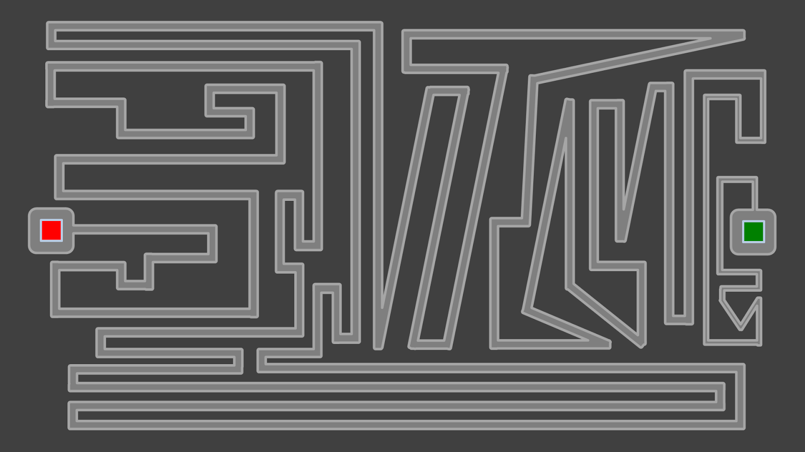

What happens to a crazed game developer when he's still awake at 2 AM? That's what you're about to find out.

It was July 27, 2014, and I was bored out of my mind. Being the middle of summer break, I'd stay up fairly late playing a variety of PC games in my room, doors closed (yeah, I know). Normally, I'd fall asleep on midnight, but this particular day was different.

I was playing Super Meat Boy, which, if you haven't played that game, is a hard-as-nails platformer featuring a fragile slab of meat as the main character. The game's difficulty spike is insane; later levels (not including the alternate dark world) contain loads of chainsaws, targeted projectiles, and spikey walls begging for you to succumb to them. Anyway, when midnight passed, I was stuck in [this particular level](http://supermeatboy.wikia.com/wiki/The_Guy!), mindlessly attempting to jump at the precise moments to dodge each and every conveniently-located spike. I was so determined to complete this warp zone that for the first time, I decided to extend my play time past midnight.

Two hours passed, and I still couldn't get past the first section.

Furious, I ragequitted the game, pounding my desk. At that given moment, I was realizing what I have done with my life. I invested TWO extra hours of my life to get past a specific subsection of a game, yet I STILL couldn't do it. That meant I essentially was in a net loss.

But I couldn't sleep. Anger still seeped through my mind, keeping me awake. I had to release this anger somehow, but how exactly? I had to share my anger to others.

So I opened up PowerPoint and began to craft a mouse maze level. With what was going through my head, I sought to create the worst level experience anyone can have, just so they too can rage away. With the level's ridiculously narrow paths and abstract turns, I've felt like I'm accomplished the goal.

Think you can handle the pain? Good luck!

## [Click here to download.](https://drive.google.com/uc?export=download&id=1rgZfZH2Cv51mxmpNgT2Kk7ucEIexz0uo)

Requires PowerPoint 2007 or newer, excluding 2008 for Mac