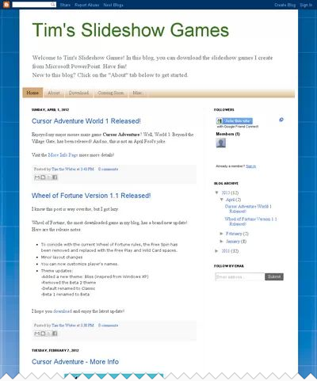
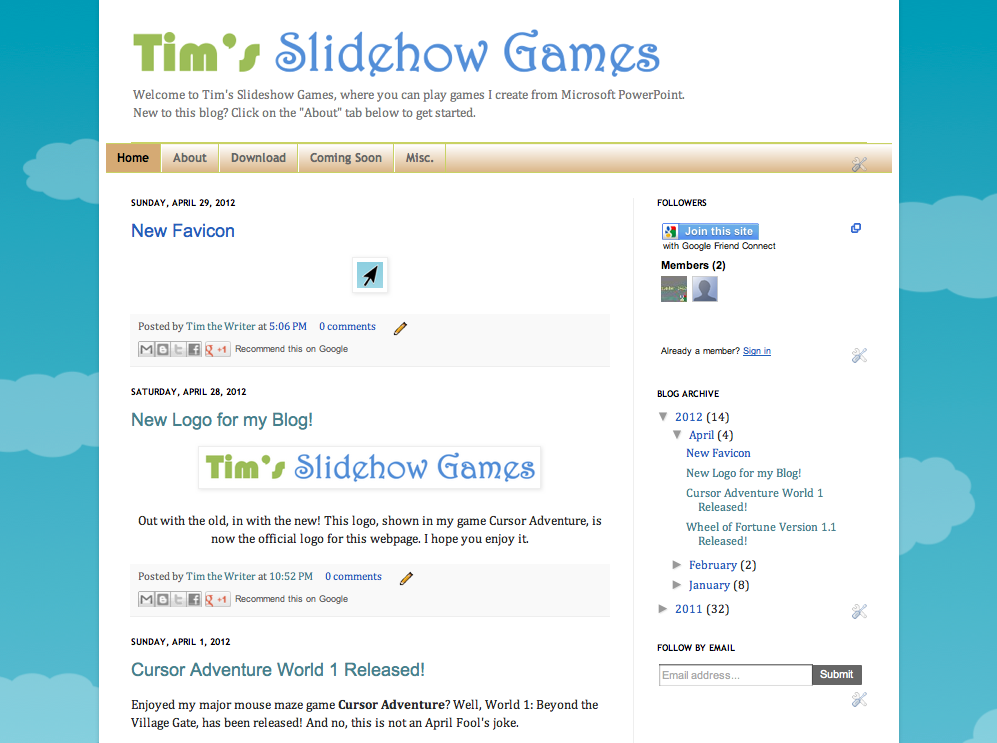

This weekend, I have focused on changing the appearance of my blog to make it look more professional. All the functions operate the same way; just the look is slightly different.

Out with the old...

...in with the new!

Here is a list of all the new looks I have put into my blog.

## 1. New Logo

* The new logo is used in my game Cursor Adventure. I wanted to use it in my blog, but I didn't know how to until now. Doesn't this new logo look much more attractive than the boring one in the old layout?

## 2. New Favicon

* Recently, I have learned some Blogger tricks and found out that you can change the picture shown in the blog URL. Now instead of showing the Blogger logo, you'll see this cursor as the favicon instead!

## 3. Removal of the NavBar

* The next step of the new look is to remove as much of the Blogger branding as possible. I went online and found out the HTML code to remove the Blogger NavBar from this site. This allows more of the webpage to show off my content.

## 4. Description Updates/Changes

* The old description read as this:

_Welcome to Tim's Slideshow Games! In this blog, you can download the slideshow games I create from Microsoft PowerPoint. Have fun!_

_New to this blog? Click on the "About" tab below to get started._

* The new description reads as this:

_Welcome to Tim's Slideshow Games, where you can play games I create from Microsoft PowerPoint._

_New to this blog? Click on the "About" tab below to get started._

* Why did I bother to change the description? Well, in a description, you need to be short and to the point. The new description has less reading to do than the old one while maintaining the "short and brief" part.
* As well as that, I found out how to make the description smaller. This removes clutter and shows more of the important features on my website.

## 5. New Background

* In an effort to make this blog "more of my own," I made my own template (using PowerPoint of course) to replace the old, default background template. The be honest, I find my template peaceful, as it sort of replicates a sky.

## 6. Other Minor Changes

* **The Tab Menu** uses a new font and has a slightly different appearance.
* **The blog** has been widened to show less background and more content.
* **The copyright section** contains less text.

And there you have it! I hope you like the new look!