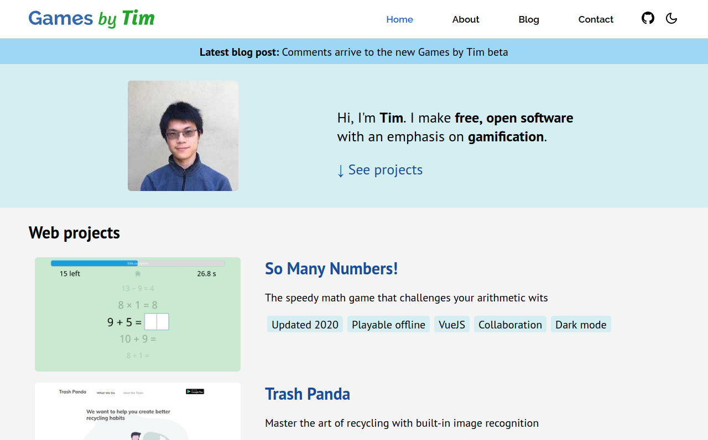
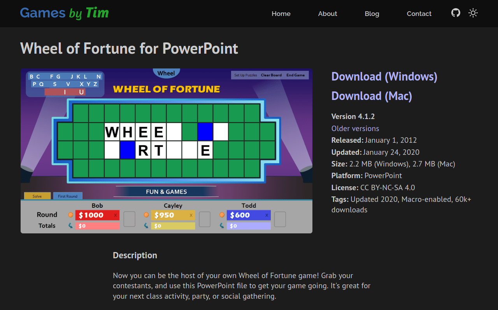

I am pleased to announce the official release of the new Games by Tim website.

Since 2011, I've ran Games by Tim on Blogger, Google's free blogging service. Back then, I hardly knew anything about web development. Now with seven years of web dev experience and an extensive portfolio of web projects, it's about time I remodel this site to something more modern, more flexible, and more representative of my abilities. Introducing the new Games by Tim!

The new Games by Tim is:

### **Fast**

Thanks to modern web techniques like [code minification](https://www.cloudflare.com/learning/performance/why-minify-javascript-code/), [link preloading](https://www.gatsbyjs.org/docs/gatsby-link/), and [image lazy loading](https://developers.google.com/web/fundamentals/performance/lazy-loading-guidance/images-and-video/), the new site feels quicker to browse and navigate.

### Responsive

The new site scales seamlessly, whether you're on an smartphone or a 30 inch monitor. There's no more separate mobile site, and desktops get blessed with larger images and font sizes.

### Optimized

Each project gets a dedicated page, rather than a blog post. In addition, links and blog posts are now properly structured and formatted without Blogger workarounds, potentially boosting search engine optimization (SEO).

### Sleek

Vector graphics, animations*, and gaussian blur** spruce up the new site's appearance. And of course there's a dark mode too!

* Animations are disabled if you've enabled "reduce motion" on your device. ** Gaussian blur does not currently work on Firefox. Firefox will instead use slight transparency for the time being.

### Open source

Want to see how the new site's made? You're more than welcome to [peruse the source code](https://github.com/timtree/games-by-tim). You can even use the site template for your own website if you wish!

[**Click here for the complete, comprehensive list of changes.**](/2020-site-overhaul-release-notes/)

## The tech stack

The new site's hand-coded with [Gatsby](https://www.gatsbyjs.org/), a static site generator designed to build fast, modern blogs. Gatsby incorporates [React](https://reactjs.org/), a JavaScript framework used to build user interfaces.

For writing blog posts, the new site uses [Forestry](https://forestry.io/). Typically, the blog editor you use is tied to a specific platform (ex: the Blogger editor can only be used on Blogger sites). Editors like Forestry on the other hand can be used for multiple platforms, especially custom-made sites. This type of editor is known as a headless CMS.

Whenever I submit blog posts, Forestry converts my writing to markdown files. Gatsby then reads markdown files to dynamically build new webpages with the blog posts. The resulting "compiled" webpages are uploaded to [Netlify](https://www.netlify.com/), a static web hosting service.

Since Gatsby-built sites are static, meaning the content does not change based on who visits the site, I don't need to pay extra for hosting services. This offers a significant advantage over alternate platforms like Wordpress and Squarespace.

## Thank you

I'd like to thank all of you for supporting me and the Games by Tim website over the past 8+ years. Thanks to all of your encouragement, Games by Tim has reached insane levels I would've never imagined possible when I first started the site. Who would've thought a simple blog to store games would lead to hundreds of thousands of views, a barrage of projects and blog posts fueled on feedback, a strong passion for web development, and being able to meet incredible new people?

Enjoy the new Games by Tim. You deserve it!

\~ Timothy Hsu