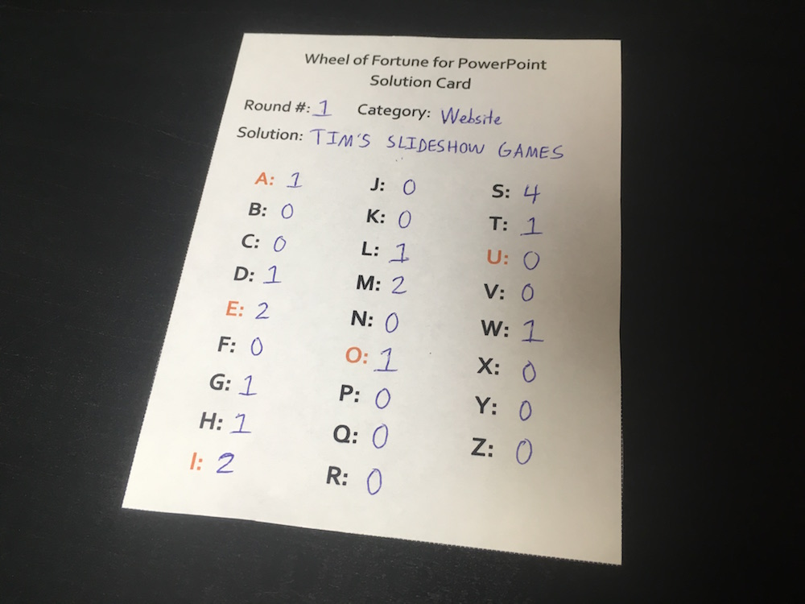

**UPDATE:** Solution cards are no longer needed with newer Wheel of Fortune for PowerPoint versions. [Click here](/wheel-of-fortune-for-powerpoint/) to download the latest version.

***

Instead of stumbling to recall how many M's are in your puzzle in front of everyone, how about you prepare yourself beforehand?

That's where my new Wheel of Fortune for PowerPoint solution cards come in. This handy PDF allows you to prepare your puzzles in advance, as well as providing quick access to the amount of each letter in that puzzle. Need an example? Take a look at this:

By filling out these cards and bringing them with you to your game night, your rounds should flow much more smoothly than before! Try it for yourself, and let me know how it goes.

## [Click here to view PDF.](https://drive.google.com/file/d/0ByTdG9SyZ1imWnlCV0JLMVg4bWs/view?usp=sharing&resourcekey=0-E_P72dQ8IUEY4MdkL1GTuA)