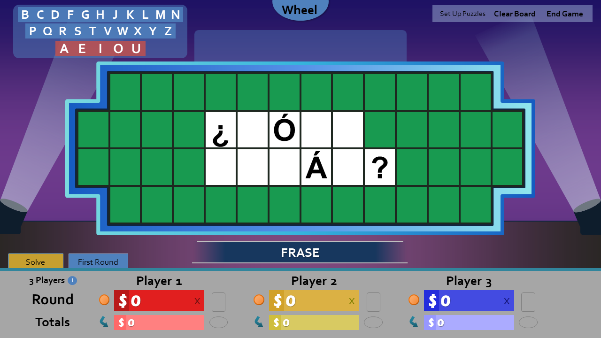
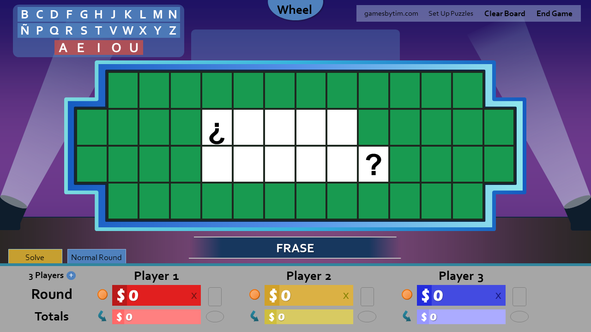
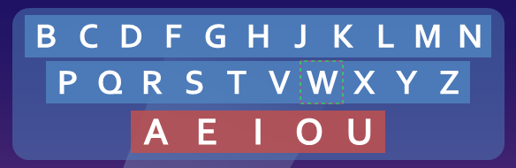

A new version of Wheel of Fortune for PowerPoint has arrived, and guess what, it's a good one. From highly-requested features to busting all sorts of minor annoyances, there's something exciting for everyone.

So hop aboard, let's see what we got.

## Puzzles in foreign languages

You asked for it, and it's finally here. Wheel of Fortune for PowerPoint can now recognize accented letters, opening the doors for foreign language puzzles!

Say you have the puzzle _¿Cómo Estás?_. In previous versions, your puzzle would load like this:

Here's how the same puzzle loads now:

Guessing any letter now additionally checks for accented variations. For instance, guessing A checks for A's, Á's, À's, Â's, and Ä's in the puzzle.

The following foreign languages are currently supported:

* Spanish *
* French
* Portuguese
* Indonesian
* German **
* Italian
* Dutch

\* To use the letter Ñ, enable Spanish Ñ in Settings. 
\** The German Eszett (ẞ) is not supported due to unresolved technical issues. As a workaround, use ss instead.

Please note this is NOT a localization; the game UI remains in English only. This feature is intended for English speakers who want to expand their horizons.

## Letter selector highlighting

The last thing you want as a host is to mis-click the letter your player wants to guess. That's why the letter selector now highlights the letter you're about to click. Never guess X instead of W again!

## Smart puzzle loading

Tired of remembering the next puzzle number to load? I hear you; the puzzle loader now automatically fills in the next puzzle number after the one you've played!

## Improved wheel item handling

In the actual show, wheel items (Wild Card, $10,000 Wedge, Gift Tag) can only be claimed once. That's why giving anyone a wheel item in Wheel of Fortune for PowerPoint now automatically removes it from the wheel!

In addition, the $10,000 Wedge now acts as a removable item, just like how the actual show handles it. Along with the Wild Card and Gift Tag, you now toggle the $10,000 Wedge on the wheel slides, rather than in Settings.

You can switch back to the old wheel item behavior, where they stay on the wheel for others to claim, via Settings.

## Other neat tweaks

* The wheel round descriptions have been rewritten with fewer words, improved clarity, and use of non-binary pronouns.
* "First Round" has been renamed to "Normal Round" after realizing many hosts only use this round, and the word "first" can confuse players.
* The setting "Confirm Solve" is now disabled by default.
* Every setting how comes with a help button that explains what the setting does.
* Various optimizations have been made to reduce file size.
* A gamesbytim.com watermark has been added to the puzzle board. Here's hoping for more exposure!

Convinced by this update's sheer awesomeness? Well you know the drill, [download it now!](/wheel-of-fortune-for-powerpoint/)