This past year has been a whirlwind for Wheel of Fortune for PowerPoint. Throughout the quarantine, I've noticed a surge in downloads from people looking for virtual games. What's more, people started to [broadcast their Wheel of Fortune for PowerPoint games online](/blog/i-joined-someone-s-wheel-of-fortune-for-powerpoint-livestream/). What used to be intended for in-person events transformed into a virtual phenomenon.

With the increased attention and visibility, I've received considerably more feedback than before, directly and indirectly. By observing people other than me use my template, I've noticed several inefficiencies I otherwise wouldn't catch on my own.

The result of all the feedback? This ginormous update. I never saw this coming: **Wheel of Fortune for PowerPoint version 6.0**.

## Puzzle Scribe - write puzzles faster

By far the largest complaint with the template is how long it takes to write puzzles. I get it; it ain't fun to fill in each and every letter one tile at a time.

That's where the new **Puzzle Scribe** comes in. Just type your puzzle in the input box, and presto! Your puzzle automatically writes onto the tiles!

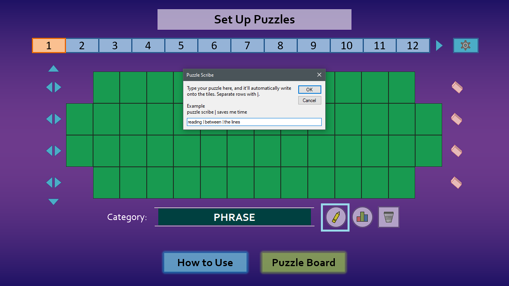

On average, you can expect to **write puzzles three times faster** with Puzzle Scribe.  Here's how much time I saved adding the following puzzles:

**WHEEL OF FORTUNE**

Without Puzzle Scribe: 12.5 seconds 
With Puzzle Scribe: 4.0 seconds

**READING BETWEEN THE LINES**

Without Puzzle Scribe: 18.4 seconds 
With Puzzle Scribe: 5.3 seconds

**CRISPY CHUNKY CHOCOLATE CHIPS**

Without Puzzle Scribe: 26.2 seconds 
With Puzzle Scribe: 7.6 seconds

Remember: Puzzle Scribe is a supplemental feature. You can always edit puzzles the old fashioned way for crossword puzzles and/or aligning puzzles exactly how you want!

## Puzzle Properties - stats for nerds

Ever felt like your puzzles didn't challenge your players enough, realized that bonus round was easier than you imagined, or were plain curious how your puzzles stack by the numbers?

Introducing **Puzzle Properties**: your haven for puzzle analysis.

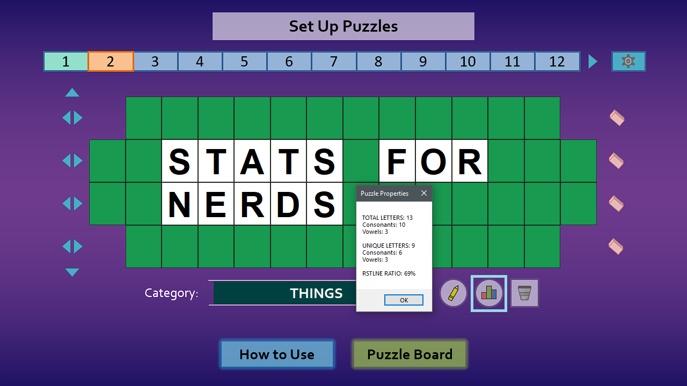

Here, you'll find various stats about your puzzle, including:

* **Total Letters** - The more you have (especially consonants), the more money your puzzle can give out. Useful for when deciding puzzle order, and for your prize wallet's sake.
* **Unique Letters** - The more you have, the easier your puzzle is to guess. Keep this number low if you wish to stump your players (bonus points if the total letters is high).
* **RSTLNE Ratio** - The higher the percentage, the easier the Bonus Round puzzle. Keep this number low for challenging Bonus Rounds (the actual show does this!).

## A simpler wheel

Let's turn our attention to the resolute wheel and its new shiny features, or lack thereof.

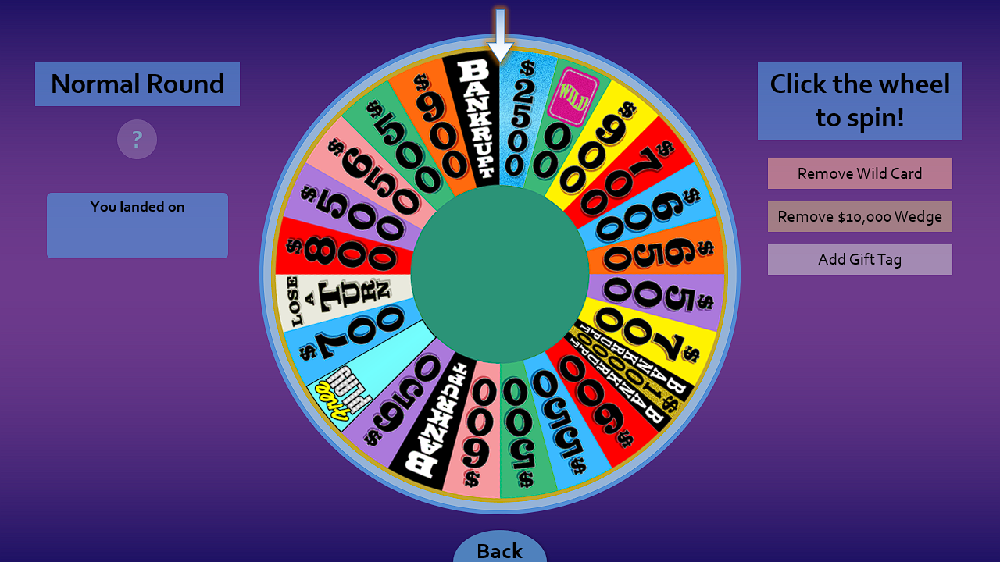

Old wheel default

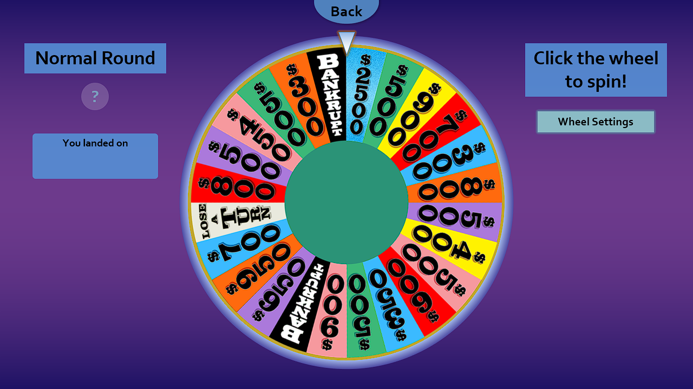

New wheel default

You saw that right: **the Free Play wedge, Wild Card, and $10,000 wedge are now disabled by default.** Long story short, more people got confused with these wheel elements from the show than it was worth. Ultimately, it's more important for people to understand the wheel than to strive for a replica of the actual show.

That doesn't mean these wheel elements are gone for good. Far from it.

## A more robust wheel

Now you can fine-tune your wheel with **Wheel Settings**, a dedicated slide with a wide assortment of toggles.

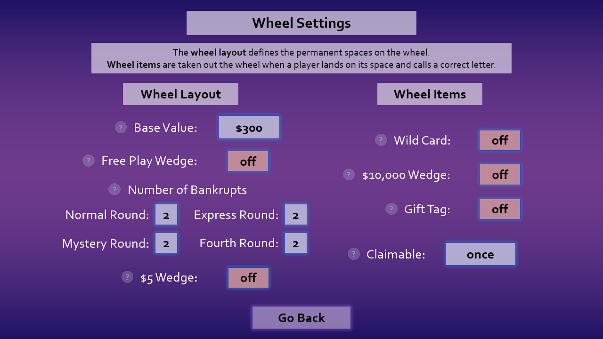

Not only can you can re-enable Free Play, Wild Card, and the $10,000 wedge on the wheel, you can customize the base wheel value and the number of Bankrupts for each round.

Just for fun, I also added a **$5 wedge** setting. Enable it to make a wheel space worth $5, a joke unfortunate and fortunate for the player (at least it's not a Bankrupt)! It even adds strategy to the game, as those who land on it want to make sure there's only one letter they call in the puzzle. (Anything more is money left on the table!)

**While the wheel has less by default, it can do more than ever before.**

## Full-fledged Toss-Ups, finally!

The previous version included rudimentary support for Toss-Up puzzles, albeit in a hidden and convoluted way. Now the kid gloves are off; Toss-Ups are ready for prime time, baby!

To make a puzzle a Toss-Up, append a T to the puzzle number on puzzle load.

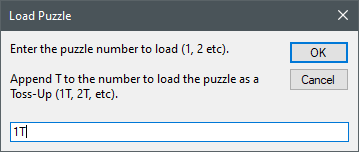

To run the Toss-Up, click "Reveal a Letter", which will randomly reveal letters in the puzzle one by one. You can even add Toss-Up music with the new audio hook in Sound Effect Settings.

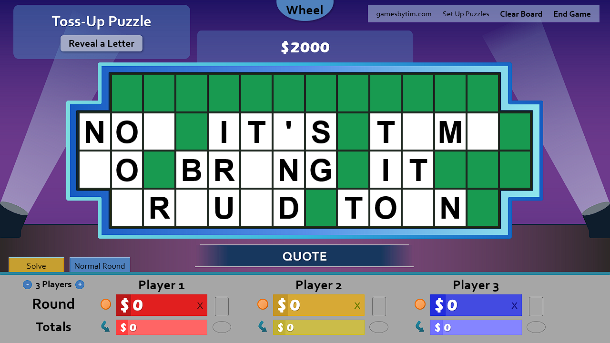

Finally, to end the Toss-Up, click the Toss-Up winner's round score, which will add the Toss-Up value to their score and conclude the round. It's that simple.

In case your muscle memory needs time to adjust, the old method to run Toss-Ups still works for backwards compatibility.

## Two players view - that's all you need!

Now you can display the puzzle board with just 2 player slots.

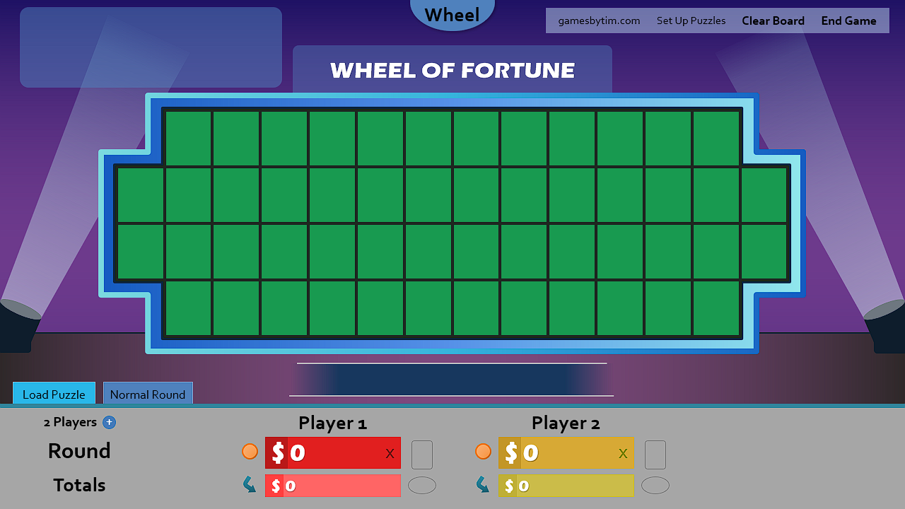

Although it was always possible to run 2-player game by not using the third player slot, you may appreciate the cleaner look. Also, some users didn't know you can play with just 2 players, so offering a dedicated view helps in that regard.

## No more vowels, no more consonants

Just like the actual show, players are now informed if there are no more vowels, or no more consonants in the puzzle.

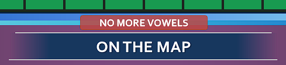

In case you prefer to keep your letter distributions a secret, you can disable this in Settings.

## Final Spin upgrades

Starting the Final Spin got a massive overhaul, with its new full screen banner and alert sound effect.

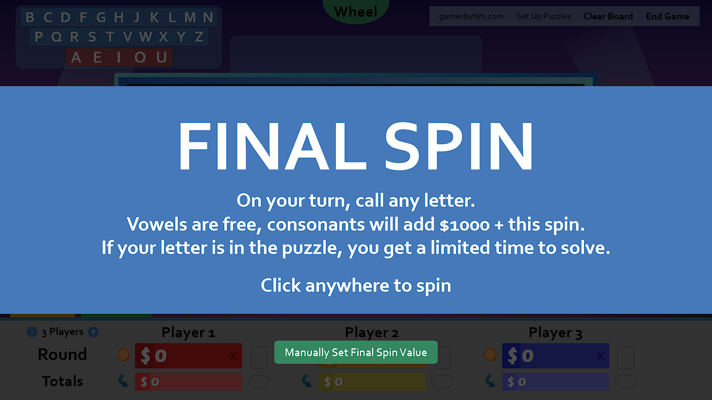

Not only does the new overlay help inform players how the round works, it saves time and clicks for the Final Spin itself. That's because the Final Spin is now guaranteed not to land on Bankrupt, Lose a Turn, or Free Play!

## Editable game name

It's now possible to edit the game name that appears on the puzzle board. Useful it for whatever reason you don't want your game associated with the name WHEEL OF FORTUNE.

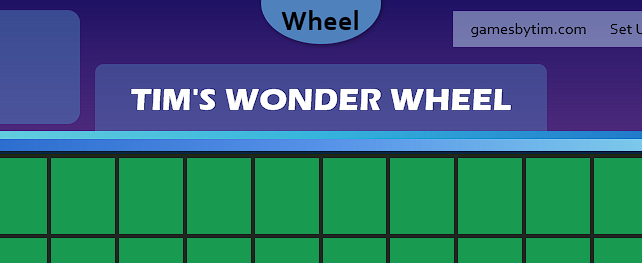

Game names other than WHEEL OF FORTUNE will also hide the Wheel of Fortune logo from the title slide.

## Wipe scores only on exit

On the End Game slide, there's a new button to wipe just the scores, not the puzzles, on exit. This addresses an overlooked use case where you may want to reuse your puzzles for another class period, party group, or cohort.

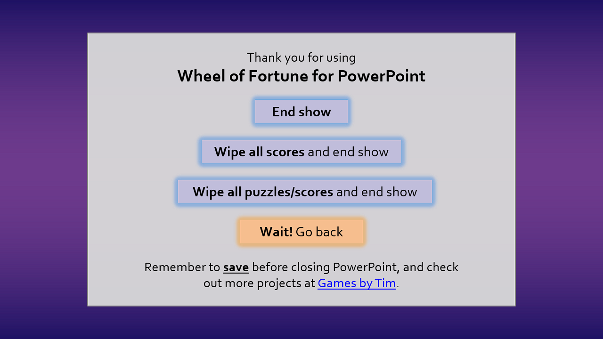

In addition, wiping puzzles/scores will now warn you that this is essentially a reset button. You can also edit a player's Totals scores on the puzzle board by clicking their score directly, in addition to their Totals dollar sign.

## A new winter backdrop

For the first time since its introduction, we have a new backdrop! It's winter-themed, great for seasonal events.

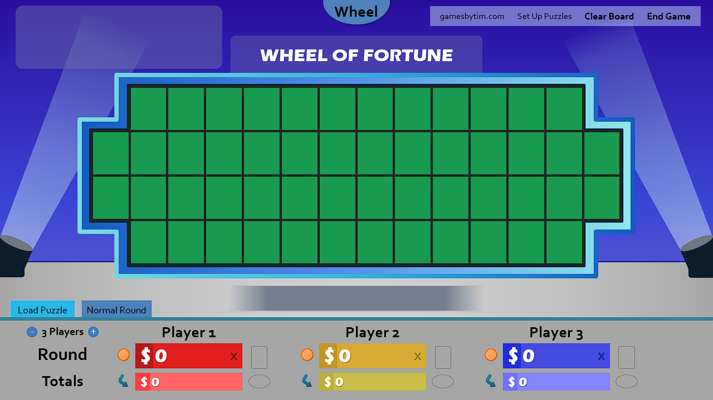

What's more, existing backdrops received slight color adjustments. You can now also switch backdrops on the fly by clicking the right light pillar.

## The glorious grab bag

Of course, a major release wouldn't be complete without the minor adjustments to improve the user experience.

* **Multiple colors in the template receive adjustments** to improve the [WCAG contrast score](https://contrastchecker.com/).
* **The back button on the wheel slide moves to the top** to reduce cursor movement. The wheel also has a new trim.
* **In windowed mode, the cursor no longer disappears on its own.** To ensure this happens, always start the game from the title slide.
* Multiple other minor UI/UX improvements

## Deprecations

The following features have been removed in version 6.0:

* **The Confirm Solve setting.** It's just not useful. Not only is it very unlikely to misclick the Solve button, there's many other spots that are easier to misclick than this. This setting was disabled by default in version 5.2 and is now gone with this version.

And that's it. Since version 6.0 works fundamentally the same as version 5.0, [the latest video guide](https://www.youtube.com/watch?v=QVPlyuG7L7s) works for versions 5 and 6!

## Thank you

Holy smokes, that's _a lot_ of changes! Unlike before where I primarily made changes for myself, many of these changes came from your suggestions and feedback. Thank you so much for using my template for your fun-filled events, and for inspiring me to push this project beyond what I've ever imagined.

Do yourself a favor and **update to version 6.0 now!**