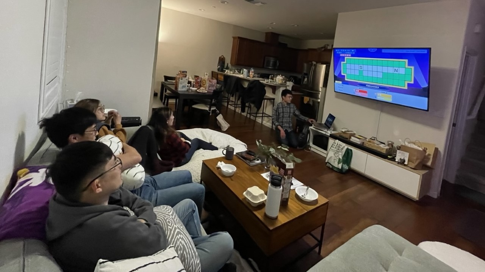
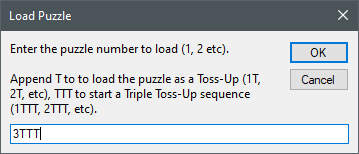
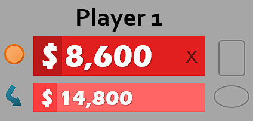
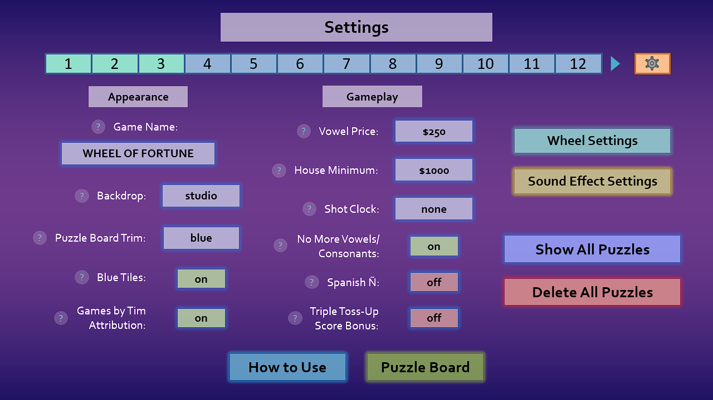
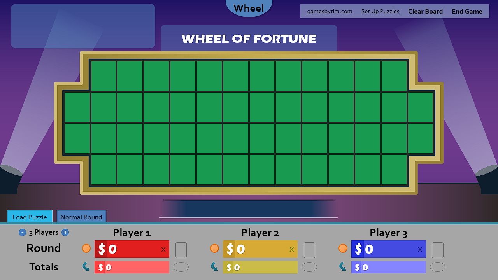
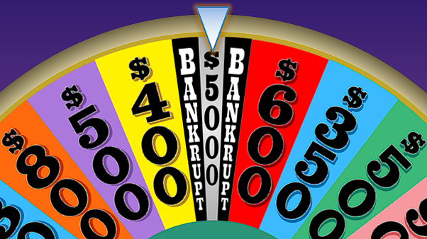

It all started when the bible study group I currently attend needed something to do, and I blurted, "wanna play Wheel of Fortune?"

At the time, I had some ideas floating around for the next Wheel of Fortune for PowerPoint update, but I wasn't in any rush. Now, with an impending game to host, I had just a weekend to implement those changes.

It was a hectic weekend of nonstop development, but I managed to churn out a beta build the night before our game. Even better, we didn't encounter any bugs!

I would like to thank the JM group for motivating me to push this update sooner than later. (The cereal that night was great, too.) With that, here's what new for version 6.2!

## Triple Toss-Up mode

It is now easier to run three Toss-Up puzzles in a row, known in the actual show as the Triple Toss-Up round.

Start a Triple Toss-Up by appending TTT to the starting puzzle number on puzzle load. For example, 3TTT will start a Triple Toss-Up round with puzzles 3, 4, and 5.

Solving each Triple Toss-Up plays a new, unique sound effect like the actual show does, and subsequent puzzles load with just one click. This provides flair and saves a lot of time compared to loading 3 individual Toss-Ups!

Triple Toss-Up mode also supports the $10,000 score bonus for solving all 3 Triple Toss-Ups, introduced 2021 on the actual show. To reduce confusion, the score bonus is an opt-in toggle in Settings.

## Formatted scores

For a cleaner look and to closer align to the actual show, scores are now formatted across the board with thousands separators. For example, "$2000" now appears as "$2,000" ($2.000 if your system region is set to Germany).

## New settings

There's a lot of settings now, enough that I had to split the Settings slide into three columns!

New settings include:

* The Triple Toss-Up bonus opt-in
* The ability to reskin the puzzle board trim to gold, Celebrity Wheel of Fortune style

* The ability to hide the Games by Tim attribution on the puzzle board

I'd like to take this time to reflect on the first iteration of the Settings slide from version 4.0. Good old times, amirite?

## New sound effects

Two new sound effects have been added: Triple Toss-Up Solve and Bonus Countdown.

There's also a new sound effect hook for the Final Spin music. Like the Toss-Up music, this has no sound included by default, so it is up to you to source the appropriate music.

In addition, I managed to reduce the file size of all existing sounds without noticeable quality loss.

## The $5,000 sliver

Introducing the second non-canon wedge I've added to Wheel of Fortune for PowerPoint: The $5,000 sliver!

The wedge looks similar to the $10,000 wedge with the two thin Bankrupts flanking the sides. There are, however, three key rule differences:

* Instead of receiving $10,000 regardless of the number of letters in the puzzle, you get $5,000 per letter occurrence (just like a normal wedge).
* The $5,000 sliver acts a permanent space instead of a removable wheel item.
* Because the $5,000 sliver is permanent, it stays in the Fourth Round.

Please note: the **the $5,000 sliver replaces the $10,000 wedge**!

It wasn't an easy decision, but I am retiring the $10,000 wedge from Wheel of Fortune for PowerPoint because the $10,000 wedge was not well-understood. Before the Value Panel was introduced, many hosts misinterpreted the $10,000 as $10,000 per letter. Even with the Value Panel to enforce the fixed $10,000, it would confuse hosts and contestants as to why $10,000 acted differently.

The confusion made sense. There's no clear distinction between $10,000 and any other money amount in the game, so why would $10,000 break the norm? It didn't help that the $10,000 wedge is a retired wedge that the actual show replaced with the Million Dollar wedge in 2008.

That's why as part of version 6.0, the $10,000 wedge, in addition to all the other wheel items, [were disabled by default](https://www.gamesbytim.com/blog/wheel-of-fortune-for-powerpoint-v6.0-holy-smokes/). But the lack of that kind of wedge took part of the fun and whimsy out of the wheel. From my past personal playthroughs and livestream observations, people liked the $10,000 wedge as a thin, valuable spot to aim for, but it disappointed when they realized the $10,000 was not what they thought it meant.

The $5,000 sliver aims to ease confusion and maintain the essence of what made the $10,000 wedge good. It also allows me to **lift the artificial $9,999 wheel value limit on the Value Panel** because $10,000 no longer has its own rules. I understand that Wheel enthusiasts may not approve of replacing an official wedge with something non-canon, but I believe it's better to prioritize accessibility and fun over staying accurate to the show.

## Grab bag

Version 6.2 also ships with these smaller changes:

* If there are no more vowels or consonants in the puzzle, every remaining vowel or consonant will disappear from the Letter Selector.
* Solving a puzzle in the Bonus Round no longer plays the solve sound effect, as a user reported it sounds out of place if the player does not solve the puzzle.
* It is now possible to complete a Toss-Up puzzle by first clicking Solve, then rewarding the money to the Toss-Up winner.
* Transferring totals after a Toss-Up or Triple Toss-Up now overrides the House Minimum, allowing for Toss-Ups worth below the House Minimum.

## A note on PowerPoint 2011 for Mac support

Due to increasing development burden and that it no longer runs on the latest macOS, **version 6.2 is the final release I am testing on PowerPoint 2011 for Mac**. Future versions may run on PowerPoint 2011 for Mac, but I will not test nor provide support for PowerPoint 2011 for Mac specific issues moving forward.

PowerPoint 2010 on Windows remains fully supported.