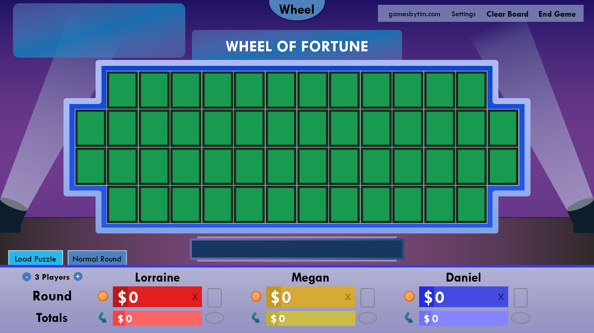

In honor of Lorraine, my brother-in-law's friend, who killed it on the actual show last night, I am thrilled to bring to you a complementary treat: Wheel of Fortune for PowerPoint version 6.3!

While the new Wheel of Fortune season 40 didn't come with major gameplay or wheel value changes, it did update the look and feel of the set. So I took a hard look at Wheel of Fortune for PowerPoint and thought, you know what, I can spruce up the design a bit.

What started as gradual tweaking evolved to a final product that looks quite different to what I originally envisioned.

## The new look

Of course, a picture is worth a thousand words, so here it is. As Pat Sajak [said it in 1997](https://youtu.be/aGCthn7-dcY?t=178), presenting, our new puzzle board!

<i>"Ah, ah, I'm so goosebumpy!"</i>

Let's break down the new design elements:

### New puzzle board

The puzzle board tiles are now slightly separated from each other, just like the actual show. The puzzle board frame increased in thickness, but not so thick that it overlaps the Letter Selector.

### New graphics

The category box has been tweaked to look more like the new season 40 style.

The same can be said for the no more vowels/consonants graphics.

### New Value Panel/Letter Selector

The Value Panel and Letter Selector glow brighter, in a fusion style. Consonants in the new Letter Selector appear larger and are no longer enclosed in a blue box.

### New font

Say goodbye to the trusty ol' Corbel/Arial/Eras Bold ITC, and hello to our new overlord: **TW Cen MT**!

At first, I was only going to use the new font for the puzzle board itself. Then I decided to try the font for fun on the player names. Then the scores. Then the Letter Selector. At that point, I went screw it: _I'm using the new font everywhere!!_

It's kind of scary to change the template's main font after how well Corbel/Arial/Eras Bold ITC served since 2015's version 2.0. But as my brother-in-law says, change is scary but often good. The new font may look weird at first, but after getting used to it, you ain't going back!

## New backdrops

A new look isn't complete without a fresh set of backdrops, so here's two to keep you company.

Feast your eyes on **Red Velvet**, the finest, striking shade of luscious dark red.

Wanna feel like the world's your oyster? Hop aboard **Gold Haven**, where everyone deserves to be rich.

The gold haven backdrop works best with the gold puzzle board frame, which leads to the next major change:

## Color Schemes

The last update added the ability to change the puzzle board frame from blue to gold. This served as a way to make your game look more like the venerable Celebrity Wheel of Fortune.

But then I noticed the Celebrity Wheel of Fortune set also makes the category box gold. As I reskinned the category box with the gold puzzle board trim setting, I fell victim to a crazy idea:

_What if everything is gold??_

I was on a roll, when another crazy idea slammed onto my face:

_What if there's more colors than blue and gold??_

**Say hello to color schemes!**

Now you can customize the color scheme of the puzzle board elements. Choose between the tried and tested **blue**, the bold and expressive **gold**, or the calm and subdued **silver**.

You can toggle the color scheme in Settings, or by clicking the puzzle board frame. Have fun matching color schemes with your favorite backdrops!

Color schemes replace the previous puzzle board trim setting. Also due to this change, backdrops no longer affect the category box, Letter Selector, and Value Panel colors.

## Circular graphic for called letter

In the actual show, when a contestant calls a letter, that letter appears onscreen as a circular graphic. Now that graphic appears on Wheel of Fortune for PowerPoint!

The graphic comes when selecting a letter, and goes after revealing a blue tile, spinning the wheel, or solving the puzzle.

Now onto the non-design related changes!

## The example puzzle

Ever wanted to try out the puzzle board before adding any puzzles? Now you can! When loading a puzzle when there's nothing in Set Up Puzzles, the game will offer to load an example puzzle.

Protip: You can also load the example puzzle after adding puzzles by loading puzzle 0.

Alright, I'll admit it - I _really_ added this feature because I wanted to save time generating game screenshots. But hey, I'm a happy guy if it helps new users get their feet wet before committing to a real game!

## Category randomizer

Speaking of helping out, can't think where to start for your next puzzle? Use the new category randomizer in Set Up Puzzles to kickstart your creative juices!

## Edit puzzles with Puzzle Scribe

Puzzle Scribe just got that much more useful. In addition to inscribing new puzzles, it can now edit existing puzzles, allowing you to add words, rearrange words, and/or fix typos with ease. Begone, Puzzle Scribe overwrite warnings!

## Grab bag

Version 6.3 also ships with these smaller changes:

* On the top-right menu of the puzzle board, the Set Up Puzzles link has been replaced with Settings.
  * This reduces the amount of clicks to access Settings while not increasing the clicks to set up puzzles. My hope is that more people will take advantage of the settings pane as a result.
* During the Final Spin round, the Final Spin music now starts after the final spin instead of after guessing the first letter.
* You can now go back to the title slide from Settings.
* The default wheel values range has reverted back to $500-$900.
* Puzzle rounds are now preserved when escaping out of the slide show.
* The About/Credits slide has been slightly reformatted.

## Bug fixes

Version 6.3 fixes the following bugs:

* An issue with loading Portuguese puzzles that use the à and Õ letters
* An issue with the Toss-Up or Final Spin music continuing to play after solving a puzzle if the solve puzzle chime is disabled
* An issue with the Bonus Round Countdown music going out of sync when changing various settings while the countdown is running
* An issue with the player's Wild Card and Gift Tag indicators appearing closer to the next player when in 4 players view
* An overlooked use of he/she instead of the non-binary pronoun they
* The invalid ability to bring already-guessed Bonus Round letters back to the Letter Selector

## Deprecations

The following features have been removed in version 6.3:

* **PowerPoint 2011 for Mac support**
  * As stated in the [v6.2 blog post](/blog/wheel-of-fortune-for-powerpoint-v6.2-tripling-down/), PowerPoint 2011 for Mac is no longer supported. 2011 for Mac users, or anyone not yet ready for the changes in v6.3 can download the [newly-released v6.2.1](/wheel-of-fortune-for-powerpoint-older-versions/).
* **The Valentine's backdrop**
  * The awkward pink backdrop meant for one specific day of the year has been replaced with the superior Red Velvet. You're welcome.
* **ActiveX controls on the Windows version**
  * Here's a big one. Starting with this version, the Windows and Mac PowerPoint files are identical. The only difference is that the Mac version is zipped to contain the file with spaces, to resolve a baffling hyperlink bug.
  * This means the ability to directly type into the Set Up Puzzles editor without input boxes no longer exists on the Windows version.
  * I made this change to save on development resources. I believe Puzzle Scribe, especially with its new ability to edit puzzles, is a viable if not superior alternative to direct typing. The new font doesn't work with ActiveX controls either, which was the last straw.

***

Lorraine, if you're reading this, thanks for giving me the nudge I needed to push this update out. And major kudos for making it on the actual show, especially with your big win! Now do me a favor and enjoy your ski trip at Mirror Lake Inn. I'll hold you accountable for that - _you mark my words_!