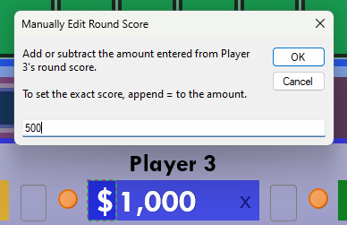
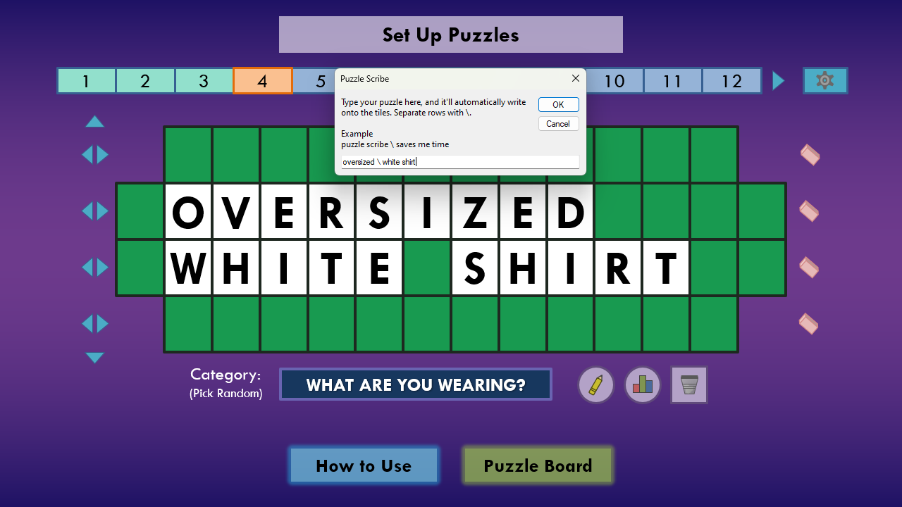
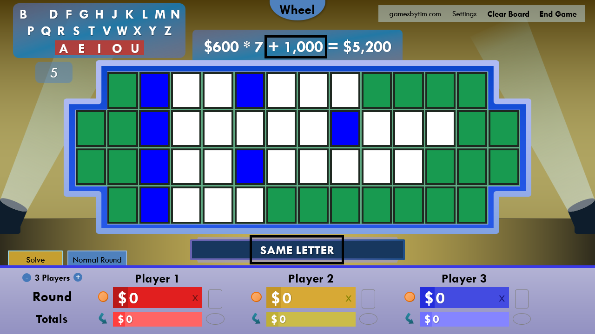
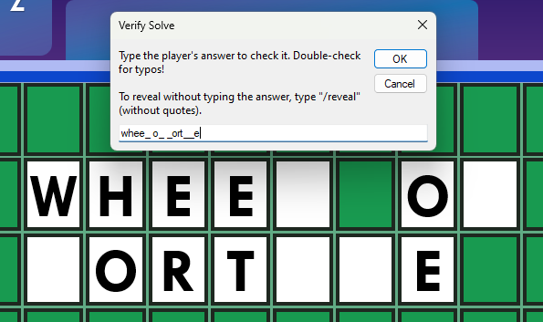

The next update to Wheel of Fortune for PowerPoint is here, which includes a few touch-ups I wanted to make following the [previous update's redesign](/blog/wheel-of-fortune-for-powerpoint-v6.3-all-spruced-up/).

I also have an important note about the future of the project, so be sure to read to the end!

## Changes to manually editing round scores

The default behavior when manually editing a player's round score has changed. Now, **the value entered in the input box will add or subtract to the existing score.**

For example, if Player 1's round score is **$2,000**, typing **1000** in the input box will update Player 1's round score to **$3,000**. Likewise, typing **-500** will update Player 1's round score to **$1,500**.

Previously, the value entered overwrote the existing score, which is now done by appending **=** to the value entered (ex: **=3000**). I adjusted the default behavior because I found whenever I needed to manually adjust a score during my games, I thought more in terms how much to increase/decrease the score than what exact score to set.

## A more efficient Puzzle Scribe

Puzzle Scribe now uses **\\** for row separators, so you no longer need to use the shift key to make puzzles. (Using **|** for row separators remains supported.)

## Update to Toss-Up puzzles

Now, when revealing the last letter in a Toss-Up puzzle, the Toss-Up UI disappears, the wrong sound effect plays, and the Toss-Up money is forfeited, similar to the actual show.

## $1,000 bonus for guessing Same Letter

In the actual show, guessing the same letter in a Same Letter puzzle grants the player an additional $1,000 bonus. (For example, guessing **C** if the category is **Same Letter** and the puzzle is **Cupcake Cheesecake Chocolate Cake**.)

This score bonus is now applied in Wheel of Fortune for PowerPoint when the new setting, **Special Score Bonuses**, is enabled. The new setting encapsulates the Triple Toss Up Bonus from previous versions.

## Verify puzzle solve

Sometimes, you don't want the host to know the puzzle solutions. That's where the new setting, **Solve Button**, comes in!

By default, clicking Solve will reveal the puzzle. Or, you can have it show an input box so the host has to type to verify a player's response.

Credits to [JapanYoshi on GitHub](https://github.com/JapanYoshi) for suggesting the idea and providing code.

## Bug fixes

Version 6.4 fixes the following bugs:

* An issue where adding to a player's score in the middle of a bonus round gives the empty Value Panel error despite a value present on the Value Panel
* An issue where selecting letters after changing rounds in the middle of a bonus round would not function as intended
* Various number formatting issues on regions that use the decimal as a thousands separator
* Misalignment of the bonus round module if the Games by Tim Attribution setting is disabled

## Deprecations

The following features have been removed in version 6.4:

* **Circular graphic for called letter**
  * It added too much complexity to the codebase, so I opted to remove it.

## The future of Wheel of Fortune for PowerPoint

Due to evolving interests and a desire to move on from game show templates, **I am ending development on Wheel of Fortune projects.** This means I will no longer work on new features or adjust wheel values for future seasons of the show. The web version of Wheel of Fortune is also officially cancelled. For the time being, I will still release bug fixes as needed.

I know I said I'd stop working on Wheel of Fortune for PowerPoint [before](/blog/wheel-of-fortune-for-powerpoint-version-4.1/), but this time, I truly mean it. Over the past couple of years, I noticed my passion shift away from game development in favor of going out and joining social events. Part of it is that I'm not pursing a game dev career anymore, and I want to catch up on experiencing life after admittedly spending much of it sheltered coding games. I meant to announce this a while ago, but I wanted to get this update out first, and it took until now to motivate myself to complete it.

Wheel of Fortune for PowerPoint had an amazing near-12-year run, from its early days of manual letter input/scorekeeping to the juggernaut it stands now. It's time for the project to live its well-deserved legacy.

Remember that Wheel of Fortune for PowerPoint is **CC BY-NC-SA 4.0 licensed**, so those interested can continue to build on this project as long as Games by Tim is credited for the original work and the project is distributed free of charge.

I'd like to thank everyone who downloaded, hosted, participated in, recommended and/or supported otherwise with Wheel of Fortune for PowerPoint over the years. This project will forever mean a whole lot to me, and I'm really proud of the impact it made for classrooms, parties, churches, retirement homes, virtual gatherings, and much more.

*Keep on spinning,* 
*Timothy Hsu*