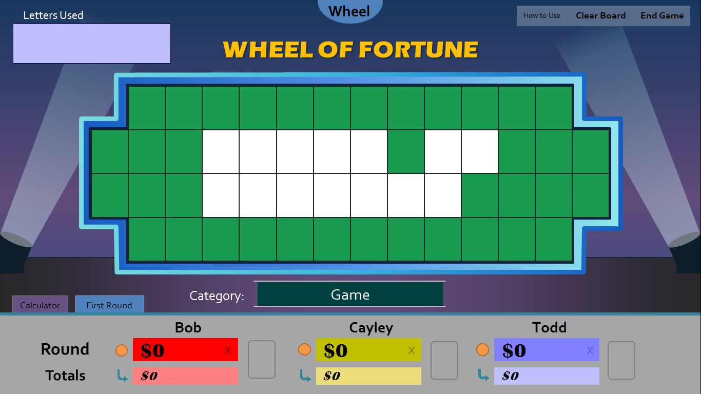
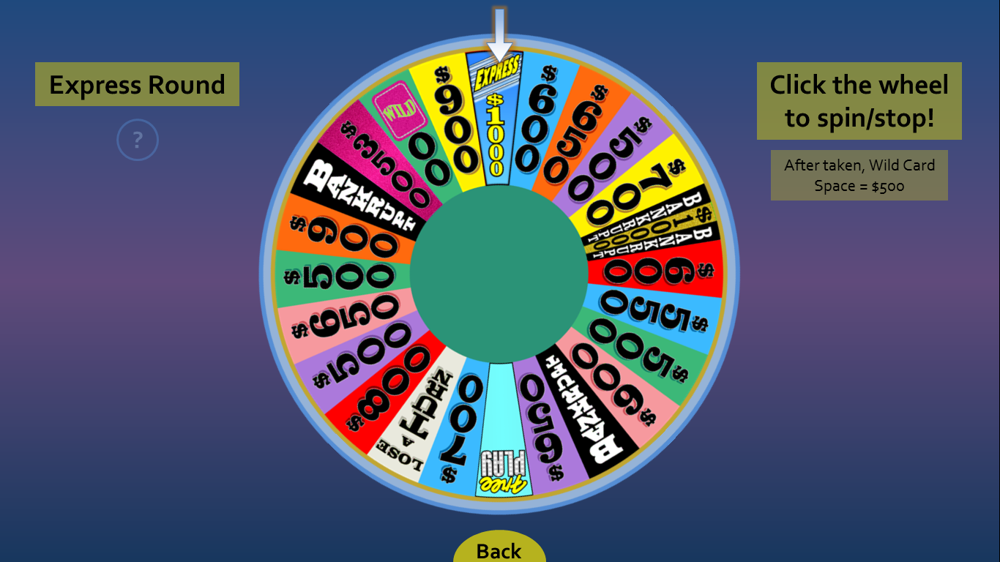
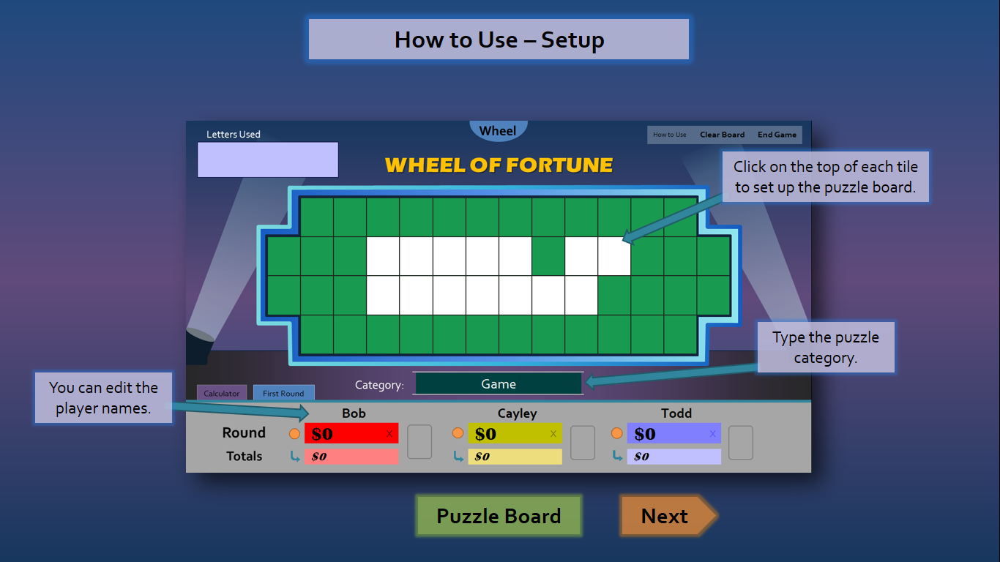

And here it is: a brand new Wheel of Fortune for PowerPoint update! It all started as I was watching this year's season premiere when I thought, "I should probably update the wheel values for my Wheel of Fortune for PowerPoint template." Then, when I opened up my project for the first time in a long while, many more ideas suddenly circulated around my head. The result? A much larger overhaul of the template than what I've originally imagined. Introducing version 3.0!

## What's Changed

* **White tiles** - In the previous version, you had to set up the puzzle board by typing underscores, which, while functional, would take a while to type out and didn't look too pretty. Now, with the inclusion of white tiles, we can kill two birds with one stone. Simply click the top of each puzzle tile to toggle green and white, and presto: a more realistic puzzle board that takes less effort on your part!

* **Graphical improvements** - Not only can the puzzle tiles turn white now, the puzzle board border has transformed into gradient blue, much like the actual game show aesthetic. Various aspects of the menus should be easier to read now, and there are several alignment adjustments across the board to deal with those pesky pixel inaccuracies.
* **Updated wheel with season 34 values** - Courtesy of wheelgenius from Deviantart, we have a brand new wheel that not only is up to date but also looks dramatically more pleasing than the previous version's. wheelgenius, if you are reading this, thank you so much for allowing all of us to bask in the glory of your designs!

* **Multiple rounds support** - Wheel of Fortune for PowerPoint now provides four different wheels, each corresponding with the ones from the actual game show. That means for the first time ever, you can play the **Mystery Round** and the **Express Round**! For the Mystery Round wheel, there is a new Mystery button that randomly determines if the contestant wins $10,000 or falters with a Bankrupt. Click the new tab next to Calculator to switch rounds.
* **Easier to follow How to Use slides** - The previous version's How to Use slide was quite cluttered and overwhelming. Therefore, I've divided the tutorial down into four manageable sections. Hopefully for new users, this should make learning the ins and outs a more efficient experience.

* **Various bug fixes**
  * Fixes player 1's blue text on the round dollar amount when viewed on Windows XP
  * Fixes broken functionality buttons when played with non-updated versions of PowerPoint 2007 or 2010
  * Improves error handling when clicking on the "buy a vowel" button when there are non-numeric characters in the player box

The following features have been removed from this release:

* **The Bliss and Beta themes** - As interesting as they were, I didn't want to spend three times the amount of development converting these themes that I don't think many people use to the new puzzle board/alignment. If you really want these themes back, let me know in the comments, and I'll consider reviving them if there's enough interest.
* **The Free Spin toggle** - The Free Spin button, which was phased out from the actual show in 2009, is no longer compatible with the new wheel values. Therefore, I opted to replace it in favor of the multiple rounds tab. If you still desire the Free Spin button, you'll need to keep using version 2.0.1 or earlier, which you can find in the [Archive](/wheel-of-fortune-for-powerpoint-older-versions/).

I hope you enjoy the new and improved Wheel of Fortune for PowerPoint experience. Definitely let me know what you think!