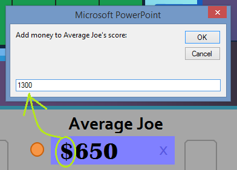

Alright, time for a maintenance update to Wheel of Fortune for PowerPoint, along with some other improvements. Behold, the outcome of play-testing the game with my family this Christmas and researching some visual basic (the Microsoft Office programming language) for countless hours the following day!

## What's Changed

* **Clicking the dollar sign of a player's round total** allows you to add money for that player more efficiently. To understand why this feature is so useful, let's take the following scenario:
  * Player 3 with $1,950 just earned $650.
  * That's tough to add mentally.
  * So you use the Calculator button to add 1,950 and 650.
  * The calculator prints 2,600.
  * You then close the calculator and type 2,600 to Player 3's round total.

  That's a lot of steps, not to mention that it detracts valuable time away from actual gameplay. Starting now, here's what you could do instead:
  * Player 3 with $1,950 just earned $650.
  * That's tough to add mentally.
  * So you click the dollar sign next to Player 3's round total. You type 650 to the input box that appears.
  * The program automatically adds 1,950 and 650, updating Player 3's round total to $2,600.

* Much better, right? That's less mental strain on your part and more time to enjoy the actual game!  
    
  
* **Transferring totals** will transfer the house minimum of $1,000 if the winner made less than that amount. This adjustment adheres to the actual game show's conventions.
* **More graphical improvements**.
  * I was previously unfamiliar with macros, functions that can be run inside of PowerPoint. Before, I thought the only way to run visual basic was through ActiveX objects that can be a cumbersome to use. It turns out, however, that it is actually possible to run visual basic functions through native PowerPoint shape action commands.
  * In previous versions, the functionality buttons were ActiveX objects that served as JPG images, due to the ActiveX object limitations. Now, because of what I learned above, **these buttons have been converted to their native PowerPoint shapes.** This not only results in a higher fidelity, it also helps **reduce the file size of the presentation.**
  * Another annoying limitation of ActiveX objects is that they will always display above normal PowerPoint shapes. That's why when using the Mystery round's help tip, the Mystery button would overlap the overlay. Now that we don't have to use ActiveX objects here anymore, this overlapping problem has been resolved.
  * Since there are fewer ActiveX objects on the puzzle board slide at once, this should **improve the stability of the presentation from version 3.0.**  
      
    If these set of notes confused you, just understand that I fixed some under-the-hood stuff so that things should run more smoothly than before.

Happy holidays, guys! Hope this update will further improve your hosting skills and your contestants' playing experience coming to the new year.