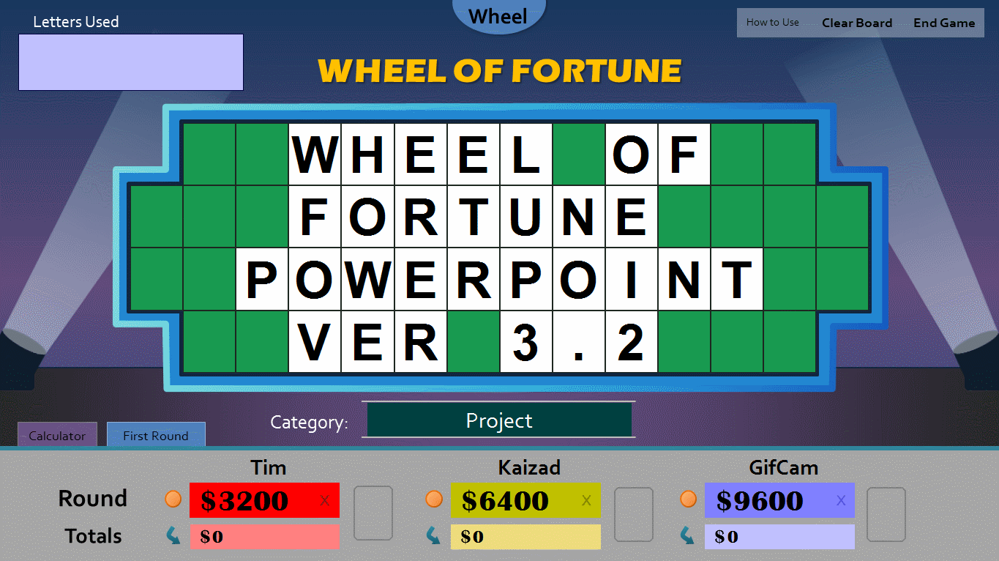
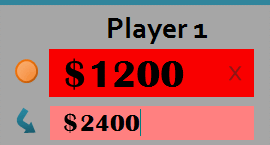
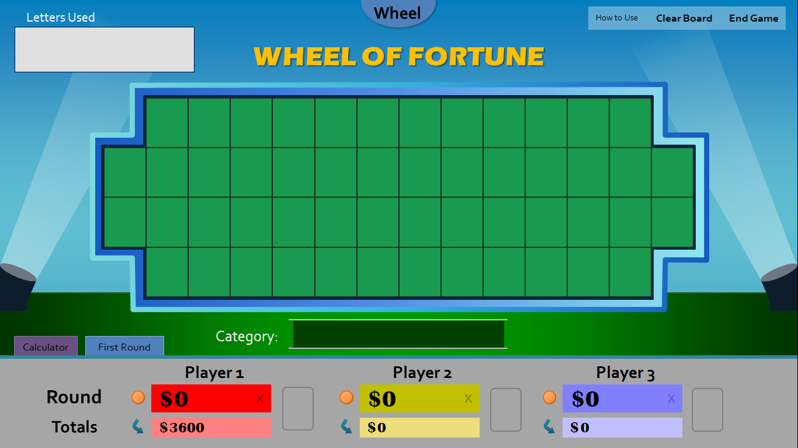
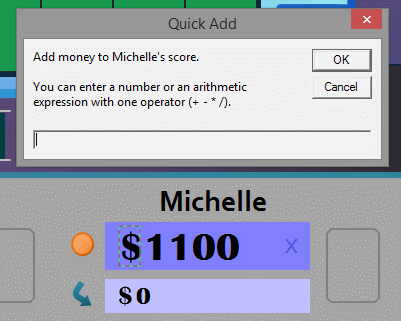

As the new season of of the popular game show premieres, I am proud to unveil to you the all new version of Wheel of Fortune for PowerPoint! Buckle up guys, because this energetic update is jam-packed with all sorts of goodies.

## What's Changed

* **Animations galore!**  
  As you get ahold of this new version, you may notice that things feel more lively than before. The buttons you're used to pressing now jump, spin, and teeter to deliver that extra "oomph!" to the show experience. For instance, take a look at this new transfer totals animation. Doesn't it feel more whimsical to use?

The animations don't stop there. The studio stage lights, which used to just be decoration, are now interactive and can produce various stage effects. Clicking the left stage light illuminates the puzzle board as if a puzzle is just solved, shown in the top screenshot (click it again to stop). I'll let you figure out what clicking the right stage light does.

* **Introducing backdrops**  
  Missed the themes feature from the good old days? Well, it's back in an all-new form. Say hello to backdrops!  
    
  Previously, you had to access a menu to switch themes, and every time you switched, you'd lose your entire puzzle board. Now, with a click of the top Wheel of Fortune button, the background of the stage set _dynamically_ transforms, leaving your puzzle board and players' score perfectly in tact! No need to reset; toggle backdrops on the fly!  
    
  As of now, there are four different backdrops, including the existing studio theme. Here's a screenshot of one of the new backdrops, based off a stadium.

I look forward to adding new backdrops in future versions. If you have any ideas, I'd love to hear from you.

* **Quick Add gets mathematical**  
  The previous version added a feature that helped quickly add money to a player's score. Through an input box, you'd type a number, and that number would automatically be added to the player's round total. Through enhancements to the code, this feature is now known as Quick Add and taken to the next level.  
    
  Say that player Michelle lands on $650, and there are three of her guessed letters in the puzzle. What's 650*3? And what's that answer added to her current score of $1,100? That's a lot of mental math, right? And you, as the host, would rather not do that while Michelle stares impatiently at you.  
    
  Now, with the upgraded Quick Add, you can type arithmetic expressions to the input box. So you can enter things like 600+600 and 650*3, and you can expect Quick Add to automatically compute the math (1,200 and 1,950) and add that to the score without going through mental gymnastics! All four functions, **+**, **-**, __*__ or **x**, and **/**, are supported.

With Quick Add being so advanced, there's no need to use the old Calculator anymore. That's why starting with this release, **the Calculator tab is deprecated**. It's no longer referenced in the How to Use slides, and it may disappear in future updates.

* **Other improvements worth mentioning**
  * It's now easier to see if your version of Wheel of Fortune for PowerPoint is up to date. In the title slide, simply click "**Check for Updates**," and the update checker will appear on your Web browser. It can detect your current version.
  * This release **shaves over a megabyte** from the previous version. How was I able to pull that off with all these new features? It turns out that the bulk of the game's size comes from the images, particularly the wheels. With more efficient use of the wheel graphics, I was able to trim the amount of storage it uses without any loss to image quality. Hope your hard drive appreciates it!
  * I've gotten better at visual basic, and it shows with my **rewritten code**. For instance, instead of writing duplicate functions for each of the three players, there are now individual functions that can detect which player's button you pressed. Other technical improvements include the use of for loops and variables. If you're eager to view my _open source code_, you'll notice **there's an easy way to edit the vowel price and house minimum**. Try it; you'll learn something new!

Well that was fun, right? I hope you and your contestants feel that way through this new subset of features. Ready to try the update? Go for it! _(requires PowerPoint 2007 or newer for Windows)_