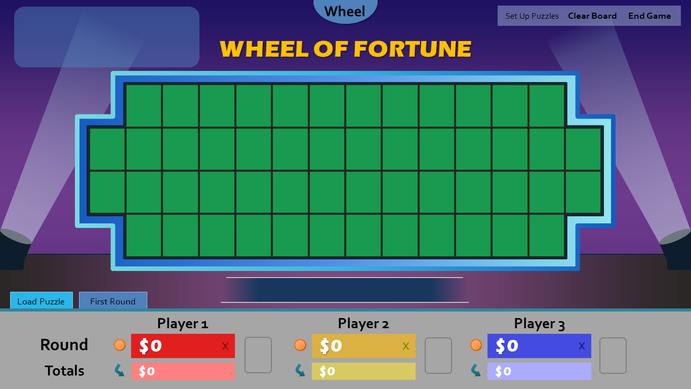

**Update (Nov. 20):** Beta 1.1 has been released. This is a bug fix release; no new features have been added. Here's what's fixed:

* Load Puzzle no longer clears the entire puzzle board if a puzzle isn't found.
* If the entire puzzle is already up on the puzzle board, clicking the Solve button will no longer display a confirmation box.
* "Wipe all puzzles/scores and end show" now wipes the Mystery indicator.
* The puzzle editor category box is now wider so that it's more compliant with how much space you get on the actual puzzle board.
* Fixes a center alignment issue with player names.
* Increases the size of the player name boxes to fit longer names.
* Works around [a bug in PowerPoint 2007](http://www.pptalchemy.co.uk/PowerPoint_Screen%20_Refresh.html) that prevented the game from highlighting filled puzzles in the puzzle editor.

***

Introducing **Wheel of Fortune for PowerPoint Version 4.0 beta 1**. Brace yourself, as this release essentially redefines the way you play the game.

In previous versions, you had to remember the solutions to your Wheel of Fortune puzzles in your head (or on a solution card). There was friction between you and your contestants as you fumbled trying to remember how many M's were in your puzzle and where they were located. Starting with this release, I am proud to state that those days are numbered. Introducing **Set Up Puzzles**, a new method to prepare your puzzles in advance!

You might be wondering, "Tim, this isn't new! Someone else already came up with this for another WoF template!" While it's true that I'm not the first to come up with this premise, I have devised a unique implementation, one that I , dare I say, believe is the most efficient of them all.

Here's how it works: when you enter Set Up Puzzles, you'll find 12 puzzle slots to input puzzles to. Click on one of the numbers to access the puzzle editor.

Here, simply type in your puzzle. The editor will automatically capitalize your letters and highlight the board tiles. You can also clear individual rows using the erasers on the right, or delete the entire puzzle using the trash can. Is that easy enough?

Once you have enough puzzles prepared, you're ready to go to the Puzzle Board.

Hmm...this is certainly different. The Calculator tab is gone (which I've hinted with the previous release), but the Letters Used box. What happened to that? Hold your horses, let's load one of the puzzles with the new **Load Puzzle** tab so you can see for your yourself.  
  
  
As you can see, the puzzle loaded exactly the way I set it, just without the letters. Your contestants will fill in these missing letters using the new top left letter selector that just appeared.

It's Oswald's turn, and he guesses the letter D. Remember, you as the host no longer have to recall where the D's are in the puzzle. Just click on the letter D on the letter selector.

Ding! Just like the actual game show, the puzzle board tiles for the letter D have been highlighted in blue. Click the blue tiles, and the letter D will appear in each of them. Also notice how the letter D has been removed from the letter selector. There's no need for a convoluted Letters Used box anymore because now everyone can see all the available letters instead!

To wrap up the round, click the **Solve** tab to reveal the solution. The Load Puzzle tab will then reappear for you to load the next puzzle.

There are also several other changes with this release I haven't discussed here. For instance, what does that gear button do at Set Up Puzzles? You'll have to download the beta to find out!

So what do YOU think of Set Up Puzzles? Do you prefer it to the old puzzle preparation method? What can use some refining? That's why I decided to release this version first as a beta: to perfect this system as much as possible before the official release.