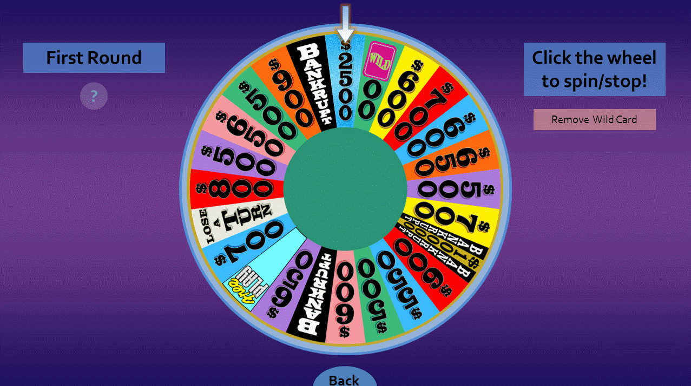

Missed out on beta 1? Here are the [beta 1 release notes](/blog/wheel-of-fortune-for-powerpoint-version-4.0-beta-1/).

***

Beta 1 turned out to be more successful than I thought. Many users I've talked to preferred the new puzzle setup system, and it showed when I ran a game during Thanksgiving break. The rounds went by more smoothly, and best of all, I didn't have to stress out placing a letter in the wrong tile.

That said, there's still a lot of room for improvement. Using beta 1 for an actual game has helped me think of feature ideas that otherwise wouldn't have popped up with testing alone. Some of those ideas have landed here in **version 4.0 beta 2**. So let's go through the new features, shall we?

* Have you ever typed a brilliant puzzle to the Set Up Puzzles editor, only to realize your puzzle is way off alignment? Starting with beta 2, **you can now shift puzzle solutions left and right.** All you have to do is press the new arrows to the left, and there you have it! You no longer need to re-enter the entire puzzle to fix alignment issues.

* Now that Wheel of Fortune for PowerPoint has a settings panel, I'm hoping to add all sorts of toggles for hosts to customize the game to their liking. Beta 1 started things off with the ability to edit the vowel price and house minimum. **There are new settings to toggle blue tiles and solve confirmation.** These toggles can be useful if you'd rather not deal with clicking blue tiles that appear on the puzzle board or the confirmation box that appears every time you want to reveal the puzzle.

  
* **It is now possible to remove the wild card and mystery wedges from the wheel.** That's right, no more "After taken, wild card space = $500"! Actually being able to remove wedges makes the wheel feel more interactive and allows us to play the Mystery round the way the actual game show intended it to be.

  

The realization of removing wedges opens up several interesting ideas for the wheel. For instance, maybe I can add an option to display the 1/2 car cards like in the actual game show. Or I could add a prize wedge, in which the host decides what that prize is. Who knows, let me know what you think!

Now here's something that'll blow you away:

## PowerPoint for Mac support

For the past nearly six years, Mac users missed out on the Wheel. It was always unfortunate to see someone I know interested in the game, only to realize it wouldn't run on their MacBook.

I spent way too long thinking Mac support wasn't possible. But the past few months of learning VBA have opened my eyes. It turns out there was indeed a method to edit text within a PowerPoint for Mac slideshow. It requires input boxes unlike direct typing in Windows, but it's still something. With the new puzzle set up method and Quick Add reducing the need to directly edit text, it's very well possible to play Wheel of Fortune on PowerPoint for Mac without too many compromises.

So behold, the screenshot I've been dreaming of since the beginning of this project!

### Differences from the Windows version

* Anything that involves editing text requires input boxes. This includes the Set Up Puzzles editor, player names, etc.
* Some fonts are different so they work on macOS
* You can run animation triggers, but you can't edit them. In order to fully edit Wheel of Fortune for PowerPoint, you'll still need PowerPoint for Windows.

Everything else should be feature identical with the Windows version for now. But since PowerPoint for Windows has more features than the Mac, there may be feature divides in the future. I'll have to figure out how to handle that if the need ever arises.

Have fun testing this new beta, especially on PowerPoint for Mac! I was only able to test the Mac version on PowerPoint 2011, so if you're using 2016, let me know if everything works.

**UPDATE (Nov. 30):** I have re-released beta 2 to fix various bugs related to the wedge removal feature. If you downloaded beta 2 yesterday, updating to the new build is highly recommended.