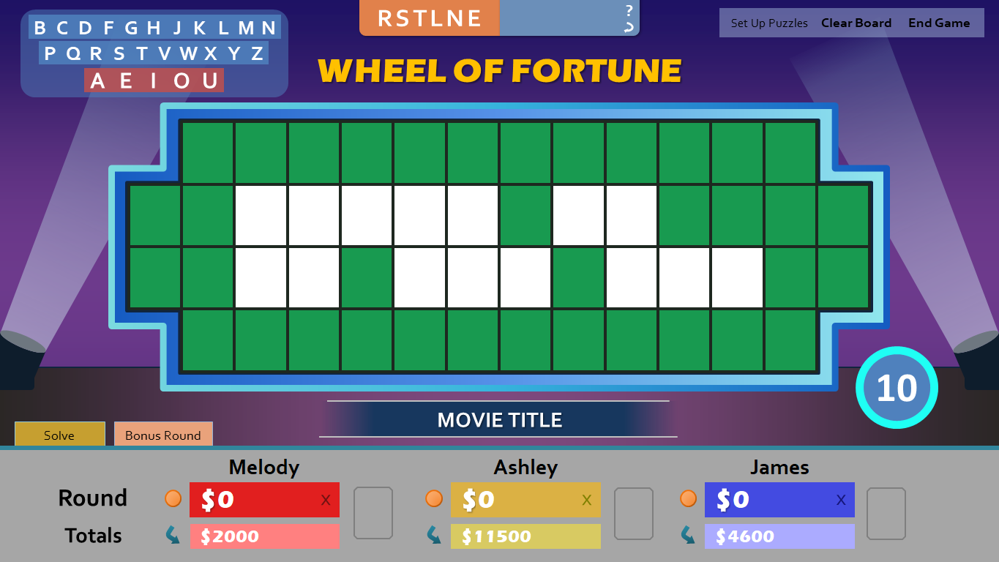
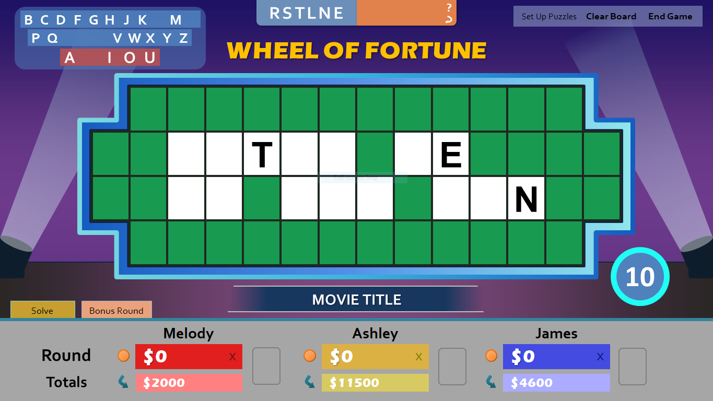
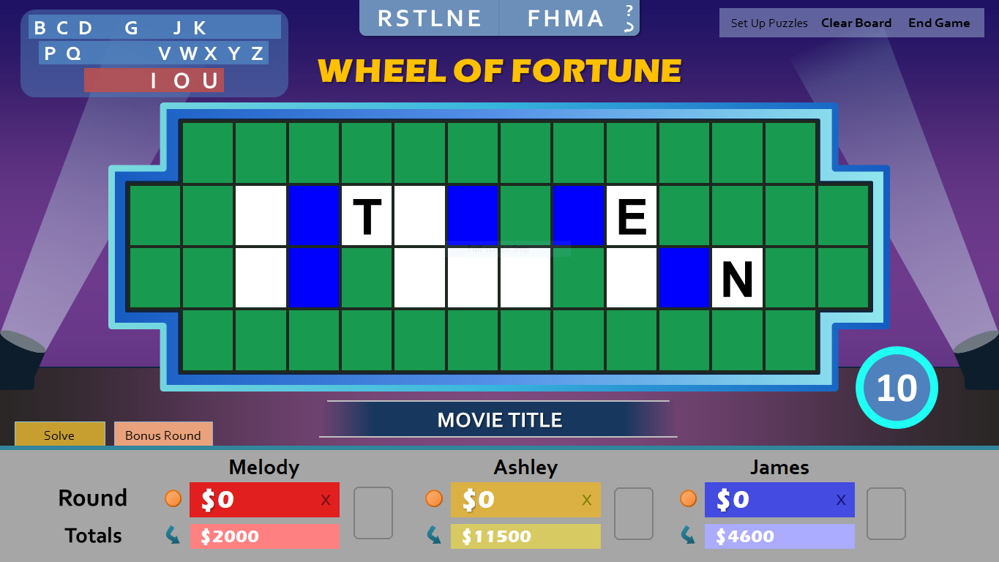

Missed out on the previous betas? Here are the [beta 1](/blog/wheel-of-fortune-for-powerpoint-version-4.0-beta-1/) and [beta 2](/blog/wheel-of-fortune-for-powerpoint-version-4.0-beta-2/) release notes.

***

Beta 3 is ready for testing, and it focuses on one major new feature: **bonus round support.**

As you probably already know, the bonus round in Wheel of Fortune is when the winning contestant tries to solve one more puzzle with a limited amount of letters for a chance at a big prize. My PowerPoint implementation attempts to streamline this process. Access the bonus round by cycling through the round tabs.

Click RSTLNE to reveal those letters in the puzzle.

The contestant then chooses three consonants and a vowel (four consonants if he/she has a wild card). Use the letter selector to input these letters. You can remove letters if necessary with the spiral arrow button.

Now click these letters to reveal them in the puzzle, if they exist.

Once all the letters are up, the contestant has ten seconds to guess the puzzle. Click the timer on the bottom right to start the countdown.

Click the timer again to reset it back to the beginning.

**This is the last planned beta** and marks the feature freeze for version 4.0. The final release, targeted for the first half of January 2018, will focus on bug fixes, last minute optimizations, and a new video guide. I'd like to hear how the bonus round works for you and any bug reports if found.